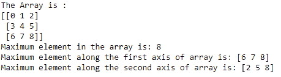

# NumPy `amax()`函数

> 原文：<https://www.studytonight.com/numpy/numpy-amax-function>

在本教程中，我们将介绍 Numpy 库的`numpy.amax()`功能。

这是 NumPy 库的一个统计函数，用于返回一个数组的**最大元素或一个轴上的最大元素。**

为了找到数组的最小值，我们使用 [numpy.amin()函数](https://www.studytonight.com/numpy/numpy-amin-function)。

### `numpy.amax()`的语法:

使用该函数所需的语法如下:

```py
numpy.amax(a, axis, out, keepdims=<no value>, initial=<no value>, where=<no value>)
```

**参数:**

现在是时候讨论这个函数的参数了，如下所示:

*   **a**
    该参数表示以数组形式输入的数据。

*   **轴**
    它是一个**可选的**参数，指示要沿其操作的一个或多个轴。该参数的值可以是`int`或一组`int`值，默认值为**无**。

*   **输出**
    该**可选的**参数用于指示存储结果的替代输出数组。该参数的值采用数组的形式。

*   **保留**
    借助这个**可选的**参数(具有布尔值)，结果将根据输入数组正确广播。如果该选项设置为**真**，减少的轴将作为尺寸为 1 的尺寸留在结果中。

*   **初始**
    这是一个标量和**可选的**参数，用于指示输出元素的最大值。

*   **其中**
    这是一个**可选的**参数，用于指示要比较的元素的最大值

**返回值:**

该函数用于返回一个数组的**最大值**。如果**轴**为**无**，则结果为标量值。如果给出**轴**，则结果是维度`a.ndim - 1`的数组。

## 例 1:

我们现在将介绍一个使用该函数的基本示例:

```py
import numpy as np  

a = np.array([[2,15,20],[80,43,31],[22,43,10]])  
print("The original array:\n")  
print(a)  

print("\nThe maximum element among the array:",np.amax(a))  
print("\nThe maximum element among the rows of array",np.amax(a,0))  
print("\nThe maximum element among the columns of array",np.amax(a,1)) 
```

### 输出:


## 例 2:

另一个代码示例如下:

```py
a = np.arange(9).reshape((3,3))

print("The Array is :")
print(a)

print("Maximum element in the array is:",np.amax(a))         
print("Maximum element along the first axis of array is:",np.amax(a, axis=0))  
print("Maximum element along the second axis of array is:",np.amax(a, axis=1))
```

### 输出:



## 摘要

在本教程中，我们介绍了 Numpy 库的`numpy.amax()`统计函数及其语法、参数和返回值，以及一些代码示例。

* * *

* * *