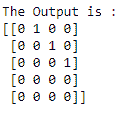

# NumPy `eye()`函数

> 原文：<https://www.studytonight.com/numpy/numpy-eye-function>

在本教程中，我们将介绍 Numpy 库的`numpy.matlib.eye()`功能。

`numpy.matlib.eye()`函数用于**返回一个矩阵**，所有的**对角元素初始化为 1** ，其他地方的**为零**值。

`numpy.matlib`是用来配置矩阵的**矩阵库**，而不是**数组**对象。

### `matlib.eye()`的语法:

使用该函数所需的语法如下:

```py
numpy.matlib.eye(n, m, k, dtype,order) 
```

**参数:**

现在让我们介绍一下该函数使用的参数:

*   **n**
    此参数用于表示结果矩阵中的行数。

*   **m**
    此参数用于表示列数，默认值为`n`。

*   **k**
    该参数用于表示对角线的指数，默认情况下该参数的值为 0。如果 k >的值为 0，则表示对角线高于主对角线，反之亦然。

*   **数据类型**
    该参数用于表示矩阵的数据类型。该参数的默认值为`float`。这是一个**可选的**参数。

*   **顺序**
    这是一个**可选的**参数，用于指示矩阵的插入顺序。主要表示是以 **C-还是 Fortran-contact 顺序**存储结果，默认值为**‘C’**。

**返回值:**

此方法将返回一个 ***n* x *M* 矩阵**，其中所有元素都等于**零**，除了 ***kth* 对角线**，其值等于**一**。

## 例 1:

下面给出了理解这个函数的一个基本例子:

```py
import numpy as np  
import numpy.matlib  

x = numpy.matlib.eye(n = 4, M = 3, k = 0, dtype = int)
print("The Output is :")
print(x)
```

输出为:
【【100 0】
【010】
【001】
【000】】

## 例 2:

我们再举一个例子，创建一个不同维度的矩阵。

```py
import numpy as np  
import numpy.matlib  

x = numpy.matlib.eye(n = 5, M = 4, k = 1, dtype = int)
print("The Output is :")
print(x)
```

上述代码的输出:

## 

## `eye()`和`identity()`的区别:

[# NumPy `identity()`函数](https://www.studytonight.com/numpy/numpy-identity-function)和`eye()`函数之间有区别，也就是说，identity 函数**返回一个主对角线上有 1 的正方形矩阵**，如下所示:


虽然`eye()`函数返回的矩阵在对角线上有 **1** ，在其他地方有 **0** 关于 **K** 参数的值，如果 **K > 0** 的值，那么它意味着主对角线之上的**对角线，反之亦然。**


## 摘要

在本教程中，我们学习了 Numpy 库的`numpy.eye()`数学函数。我们还介绍了它的语法、参数以及这个函数返回的值，还有几个例子。

* * *

* * *