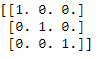
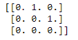

# NumPy 标识()函数

> 原文：<https://www.studytonight.com/numpy/numpy-identity-function>

在本教程中，我们将介绍 Numpy 库的`numpy.matlib.identity()`功能。

`numpy.matlib.identity()`函数用于返回给定大小的**单位矩阵**。让我们先了解下恒等式矩阵的概念。

一个**单位矩阵**是一个所有**对角元素初始化为 1** 并且**其余所有元素为零的矩阵。**

### `matlib.identity()`的语法:

使用该函数所需的语法如下:

```py
numpy.matlib.identity(n, dtype)
```

**参数:**

现在让我们介绍一下该函数使用的参数:

*   **n**
    此参数用于指示返回的身份矩阵的大小。

*   **数据类型**
    该参数用于表示矩阵的数据类型。该参数的默认值为`float`。

**返回值:**

该方法将返回一个主对角线元素设置为 1，所有其他元素设置为零的**n×n**矩阵。

## 例 1:

下面是这个方法的一个基本例子:

```py
import numpy as np  
import numpy.matlib  

a = numpy.matlib.identity(4)
print("The Identity matrix as output is :")
print(a)
```

作为输出的身份矩阵为:
[[1。0.0.0.】
【0。1.0.0.】
【0。0.1.0.】
【0。0.0.1.]]

## 例 2:

下面给出了一个基本的例子，我们将提到数组元素的`dtype`

```py
import numpy as np  
import numpy.matlib  

a = numpy.matlib.identity(6, dtype = int)
print("The Identity matrix as an output is :")
print(a)
```

作为输出的身份矩阵为:
[[1 0 0 0 0 0]
[0 1 0 0 0]
[0 0 1 0 0]
[0 0 1 0]
[0 0 0 1 0]
[0 0 0 0 1]]

## `identity()`和`eye()`的区别:

`identity()`和 [Numpy eye()函数](https://www.studytonight.com/numpy/numpy-eye-function)有一个区别，那就是恒等式函数**返回一个正方形矩阵**，主对角线上有一个像这样的矩阵；



而`eye()`函数返回对角线上有 **1** 和其他地方有 **0** 的矩阵，该矩阵基于 K 参数的值。如果 **K > 0** 的值，则表示主对角线上方的**对角线，反之亦然**



## 摘要

在本教程中，我们学习了 Numpy 库的`numpy.matlib.identity()`数学函数。我们介绍了它的语法、参数以及这个函数返回的值，还有一些代码示例。

* * *

* * *