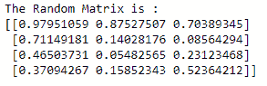
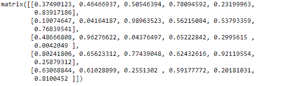

# NumPy rand()函数

> 原文：<https://www.studytonight.com/numpy/numpy-rand-function>

在本教程中，我们将介绍 Numpy 库的`numpy.matlib.rand()`功能。

`numpy.matlib.rand()`功能用于**生成一个矩阵**，其中所有条目用**一些随机值**初始化。

`numpy.matlib`是一个**矩阵库**，用来配置矩阵而不是数组对象。

该功能有助于创建一个给定形状的矩阵，并填充范围`[0, 1)`内的随机值。因此，我们可以使用这种方法创建一个给定形状的随机值矩阵。

### `matlib.rand()`的语法:

使用该函数所需的语法如下:

```py
numpy.matlib.rand(*args)
```

<u>**注意:**</u> 在上面的语法中 ***args** 代表参数，它表示输出的形状。如果 ***args** 给出为 **N 个整数**，那么每个整数指定一个维度的大小。如果 ***args** 作为元组给出，那么这个元组给出完整的形状。

**返回值:**

该方法将返回一个随机值矩阵，其形状由 ***args** 给出。

## `matlib.rand()`基本示例:

下面给出了如何使用上述方法**创建随机矩阵**的基本示例:

```py
import numpy as np  
import numpy.matlib  

x = numpy.matlib.rand(4,3)
print("The Random Matrix is :")
print(x)
```

上面代码的输出:



## 例 2:

在下面的例子中，我们将以**元组**的形式使用一个参数，这里需要注意的是，如果一个参数是元组，那么该方法将忽略其他参数:

```py
import numpy as np
import numpy.matlib

x = numpy.matlib.rand((5, 6), 4)
print(x)
```

上面代码的输出:



## 摘要

在本教程中，我们学习了 Numpy 库的`numpy.rand()`数学函数。我们还介绍了它的语法、参数以及这个函数返回的值和一个代码示例。

* * *

* * *