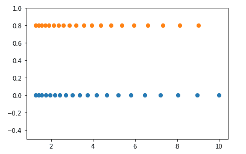

# NumPy logspace()函数

> 原文：<https://www.studytonight.com/numpy/numpy-logspace-function>

在本教程中，我们将介绍 Numpy 库的`numpy.logspace()`功能。

Numpy 中的`numpy.logspace()`函数用于通过使用对数刻度上均匀分隔的数字**来创建数组。**

### `numpy.logspace()`的语法:

使用此函数的语法如下:

```
numpy.logspace(start, stop, num, endpoint, base, dtype) 
```

**参数:**

该函数的参数如下:

*   **开始**
    该参数用于表示**开始值**的区间基数。

*   **停止**
    该参数用于表示基地区间的**停止值**。

*   **num**
    该参数用于表示**范围内的数值数量**。

*   **端点**
    该参数的值在**布尔**中，用于将 stop 表示的值作为区间的最后一个值。

*   **基数**
    这个参数用来表示原木空间的基数。

*   **数据类型**
    该参数用于表示数组项的数据类型。

**返回值:**

该函数将返回指定范围内的数组。

现在是时候看几个例子来理解这个函数了。

## 例 1:

下面是我们将使用这个函数的代码片段:

```
import numpy as np  

arr = np.logspace(20, 30, num = 7,base = 4, endpoint = True)  
print("The array over the given range is ")
print(arr)
```

给定范围内的数组为
【1.09951163 e+12 1.10823828 e+13 1.11703419 e+14 1.12589991 e+15
1.13483599 e+16 1.14384301 e+17 1.15292150 e+18】

## 例 2:

在下面给出的例子中，我们将使用 matplotlib 描述`numpy.logspace()`函数的图形表示:

```
import numpy as np
import matplotlib.pyplot as plt

N = 20
x1 = np.logspace(0.1, 1, N, endpoint=True)
x2 = np.logspace(0.1, 1, N, endpoint=False)
y = np.zeros(N)

plt.plot(x1, y, 'o')
plt.plot(x2, y + 0.8, 'o')
plt.ylim([-0.5, 1])
plt.show()
```

输出以下代码:



## 摘要

在本教程中，我们介绍了 Numpy 库的`numpy.logspace()`功能。我们学习了它的语法、参数以及这个函数返回的值和多个代码示例。

* * *

* * *