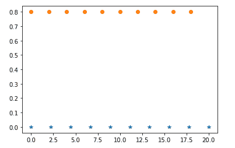
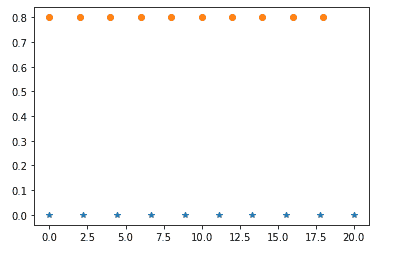

# NumPy linspace()函数

> 原文：<https://www.studytonight.com/numpy/numpy-linspace-function>

在本教程中，我们将介绍 Numpy 库的`numpy.linspace()`功能。

该函数用于返回指定间隔内均匀分布的数字。

*   该函数类似于 [Numpy arange()函数](https://www.studytonight.com/numpy/numpy-arange-function)，唯一的区别是**不是步长，而是使用`num`参数指定间隔之间的均匀间隔值的数量**。

*   借助该功能，隐式计算**步长**。

*   在该功能中，区间的**端点可以选择排除**。

*   在最新版本的 NumPy 中，该函数支持启动和停止参数的非标量值(用于定义间隔)。

### `numpy.linspace()`的语法:

使用该函数所需的语法如下:

```py
numpy.linspace(start, stop, num, endpoint, retstep, dtype) 
```

**参数:**

上述函数的参数如下:

*   **开始**
    这个参数用来表示区间的开始值。

*   **停止**
    该参数用于表示区间的停止值。

*   **num**
    该参数表示要生成的间隔内均匀间隔样本的数量。该参数的**默认**值为 **50** 。

*   **终点**
    该参数的真值用于表示区间中包含停止值。

*   **retstep**
    该参数的值是一个布尔值，用于表示连续数字之间的步长和样本。

*   **数据类型**
    该参数用于表示数组项的数据类型。

**返回值:**

该函数将返回指定范围内的数组。

如果`retstep`参数为**真**，该函数将返回步长值，该值通常表示样本之间的间距大小。

现在是时候看看使用这个函数的例子了。

## 例 1:

下面是解释如何使用这个函数的代码片段:

```py
import numpy as np  

a = np.linspace(20, 40, 8, endpoint = True)  
print("The array over the given range is ")
print(a) 
```

给定范围内的数组为
【20。22 . T2 31 . 44860 . 48868686861]

## 例 2:

下面是使用 Matplotlib 库的函数[的图解代码片段:](https://www.studytonight.com/matplotlib)

```py
import matplotlib.pyplot as plt

N = 10
y = np.zeros(N)
x1 = np.linspace(0, 20, N, endpoint=True)
x2 = np.linspace(0, 20, N, endpoint=False)
plt.plot(x1, y, '*')
plt.plot(x2, y + 0.8, 'o')
plt.show()
```

 

## 摘要

在本教程中，我们介绍了 Numpy 库的`numpy.linspace()`功能。我们介绍了它的语法、参数以及这个函数返回的值，并提供了多个代码示例。

* * *

* * *