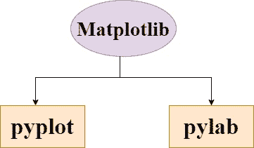

# Matplotlib 简介

> 原文：<https://www.studytonight.com/matplotlib/introduction-to-matplotlib>

在本教程中，我们将介绍 Python 中 **Matplotlib 库**的基本介绍，Matplotlib 中的重要模块，如何**安装 Matplotlib 模块**，并且我们将了解该库对于**数据可视化**的用处。

## 什么是 Matplotlib？

Matplotlib 基本上是建立在 **NumPy 数组**上的数据**多平台可视化库**。该库旨在与**更广泛的 SciPy 堆栈**合作，该堆栈包括用于机器学习和数据科学的不同 Python 模块。

*   **Matplotlib** 是默认的(排序) **Python 数据可视化包**。

*   由于 **Matplotlib 是一个**可视化库，这些可视化让我们**能够像图表和绘图**一样以可视化的形式表示大量的数据。

*   Matplotlib 在从数组中的**数据创建 2D 图**时很有用。

*   **Matplotlib 库**的灵感来源于 **MATLAB 编程语言**，它还提供了类似于**的 MATLAB 图形**界面。

*   该库可轻松与用于**数据操作**的[Pandas包](https://www.studytonight.com/pandas/introduction-to-pandas) 集成。

*   Pandas和马特洛特利布 **的**组合，数据角力**可以和可视化**一起**完成，人们可以**从数据**中获得有价值的见解。**

*   Python 中的 Matplotlib 库主要被称为 **Grammer of Graphics** ，是 Python 中最常用的**库，用于创建图表和绘图**。

*   Matplotlib 可以与 **Jupyter 笔记本**、 **web 服务器应用**和**IPython shell**一起使用。

由**约翰·d·亨特在 2003 年**写成，诞生了 **0.1** 版本。Matplotlib 在被**太空望远镜科学研究所**采用为首选的**绘图包**时，获得了**的早期提升**。

目前稳定版本为 **2.2.0** ，发布于 2018 年。

## Matplotlib 中的重要模块

Matplotlib 库中有两个重要模块，如下所示:



### 1\. pyplot

*   它是 Matplotlib 中的一个重要模块。在**代码示例**的后续教程中，您将经常看到`matplotlib.pyplot`被使用。

*   这个模块主要是**给我们提供了一个界面**，允许我们自动隐式**创建人物及其轴**到**实现想要的剧情**。

*   这是一个很棒的模块**，当你快速想要在没有实例化**任何图形或任何轴**的情况下绘制一些东西**。

### 2.派尔巴

*   它是 Matplotlib 的另一个重要模块。

*   您需要**将该模块安装在 matplotlib** 模块旁边。

*   模块 **pylab 帮助导入 NumPy 和 pyplot** ，建议当需要使用**数组，进行数学运算**，需要**访问绘图功能**时使用。

*   不建议在使用 IPython 内核的情况下使用。

## 安装 Matplotlib

matplotlib 的**相关包**和 Matplotlib 本身以轮包的形式在**标准 Python 包存储库**中可用。因此，它可以很容易地安装在苹果操作系统，窗口，Linux 等。使用**画中画包管理器**。

**注意:**你必须在你的机器上安装 Python，才能安装 matplotlib 模块。这是我们的 [Python 安装指南](https://www.studytonight.com/python/getting-started-with-python)。

您只需要打开命令提示符，编写以下给定命令:

```py
python -m pip install -U matplotlib
```

如果您正在使用 Jupyter Notebook，那么需要注意的是，Jupyter Notebook 附带了许多预安装的库，如 Numpy、Pandas、Matplotlib、Scikit-Learn，因此您不必担心单独安装这些模块/库。

## 总结:

因此，在本教程中，我们学习了什么是 matplotlib 模块，为什么它如此受欢迎，matplotlib 的不同模块是有用的，然后我们还学习了如何安装 matplotlib 模块。

* * *

* * *