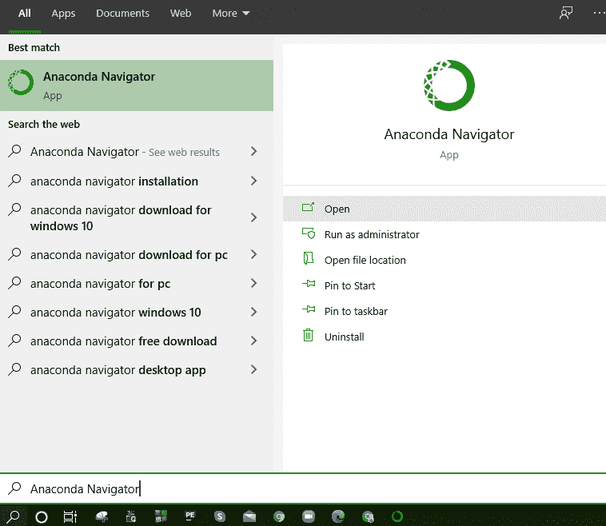
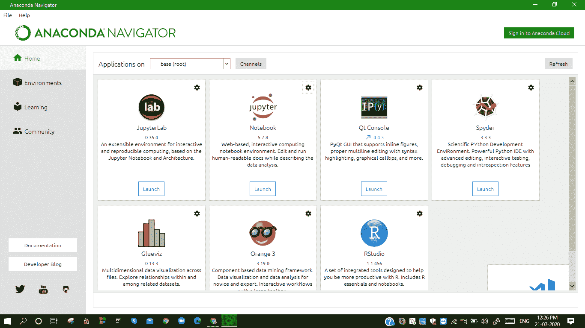
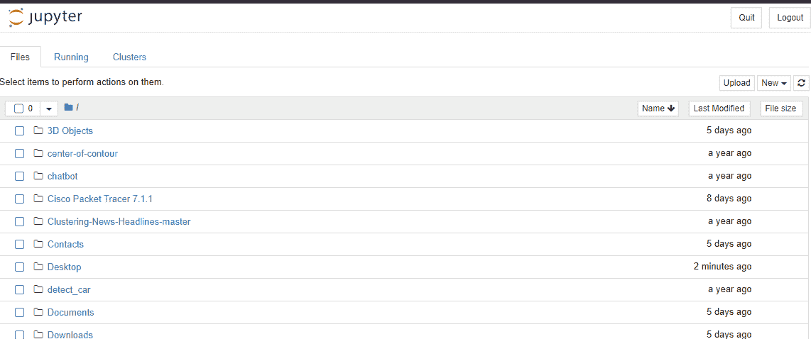
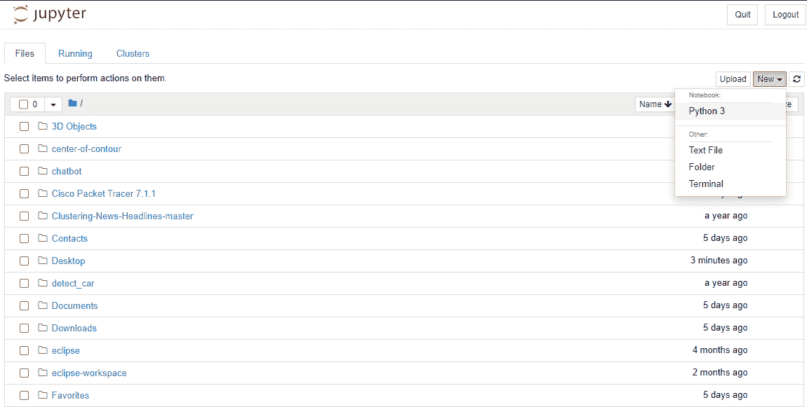

# Jupyter 笔记本电脑中的 Matplotlib

> 原文：<https://www.studytonight.com/matplotlib/matplotlib-with-jupyter-notebook>

在本教程中，我们将介绍 Jupyter 笔记本，其中我们将使用 Matplotlib 模块创建可视化，我们还将介绍 Jupyter 笔记本的主要功能。

Jupyter Notebook 是一款**开源网络应用**，借助它可以创建和共享包含**实时 python 代码**、**可视化**和**代码解释**的文档。

*   Jupyter Notebook 用于**数据清理**、**数据可视化**、**机器学习**、**数值模拟**，还有更多这样的用例。

*   Jupyter 主要代表 **Ju** lia、 **Pyt** hon、 **R** uby，最初 **Jupyter Notebook** 是为这三个开发的**，但后来开始**支持很多其他语言**。**

*   **Ipython** 由 Fernando Perez 于 **2001 年开发，作为**命令外壳**用于**交互计算**在**多种编程语言**中以 **Python** 开始。然后在 2014 年，**费尔南多·佩雷斯**宣布了一个分拆项目，该项目被称为**Jupyter**项目。**

*   nd 正如我们今天所知， **IPython 作为 Python shell** 和 Jupyter 的内核继续存在，而 IPython 的笔记本和其他语言部分则转移到了 Jupyter 的名字下。

*   Jupyter 还增加了对 **Julia、R 和 Ruby** 的额外支持。

## Jupyter(IPython)笔记本的特点

让我们讨论一下 Jupyter Notebook 的特性，然后我们将讨论如何启动它，并将其与 Matplotlib 库一起使用:

*   Jupyter Notebook 是一个非常**灵活**并且非常**有助于分享代码**的工具，有完整的解释、评论、图片等。在一起，如果您正在学习编码，这将非常有帮助。

*   需要注意的是 **Jupyter 笔记本**通过**网络浏览器**运行，笔记本本身可以托管在您的**本地机器**或**远程服务器**上。

*   在 Jupyter 笔记本的帮助下，**查看代码**、**执行代码**、**以及直接在你的网页浏览器中显示结果**变得很容易。

*   借助 Jupyter 笔记本，您可以与他人共享您的代码。它允许**对共享代码和数据集进行交互更改**。

*   假设有一段代码，你想逐行解释它是如何工作的，通过**实时反馈**，你可以简单地将代码嵌入到 Jupyter 笔记本中。最好的是代码会**保持全功能**，你可以**随着**加入互动，解释、展示、讲述同时进行**，这是有益的**。

让我们从 Jupyter 笔记本开始。首先您需要**打开 Anaconda 导航器**(这是 Anaconda 中包含的桌面图形用户界面，允许您启动应用程序并轻松管理 **Conda** 包、环境和通道，而无需使用命令行命令)。

现在在你的机器上搜索 Ananconda Navigator(如果你想使用 Jupyter Notebook-[https://docs.anaconda.com/anaconda/navigator/install/](https://docs.anaconda.com/anaconda/navigator/install/))，你应该提前安装它:

在**打开蟒蛇导航器**后，你会看到**在其分布**中安装的组件。让我们向您展示:

现在你只需要**启动 Jupyter 笔记本**就可以开始使用 Matpotlib 了。只需**点击推出**，它就会**推出 Jupyter 笔记本**。

正如我们在上面提到的 **Jupyter Notebook 通过网络服务器**运行。

启动后，您将看到以下内容:

如果你想从制作一个可以轻松完成任务的**新笔记本**开始，只需点击“**文件选项卡**中的“**新建按钮**”即可轻松完成。

在那里你会看到很多选项，比如**制作一个终端**、**制作一个常规文本文件**、**制作一个文件夹**，最后但同样重要的是，你还会看到制作一个 **Python 3 笔记本**的选项。让我们向您展示一个**图示**以供您清楚理解:

## 总结:

在本教程中，我们学习了如何安装 Jupyter notebook，如何使用它以及关于 Jupyter Notebook 的其他细节。我们正在讨论 Jupyter 笔记本，因为我们将把它与 Matplotlib 模块一起用于绘图和可视化。

* * *

* * *