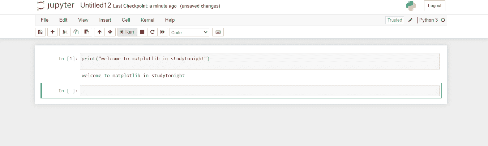

# Matplotlib PyPlot API

在本教程中，我们将详细介绍 Matplotlib 中的 Pyplot API**，帮助您了解 Pyplot API 在 Matplotlib 中的使用。**

`matplotlib.pyplot`基本上是**命令风格函数的集合**，这有助于使 **Matplotlib 像 MATLAB 一样工作**。

*   `pyplot`主要是**打算在 Matplotlib** 中制作**互动剧情**和**简单案例**的程序化剧情生成。

*   pyplot 中的各个**功能对图形做了一些改变，比如有**创建图形**的功能，有**在图形**中创建绘图区域的功能，有**在绘图区域**中绘制一些线条的功能，有**用标签**装饰图形的功能等等。**

## Jupyter 笔记本中的新笔记本

如果你想在 Jupyter 笔记本中创建一个新的笔记本来存放你的作品，那么我们在之前的教程中已经向你展示了这个选项。现在，当你点击“新建”按钮时，你可以选择 Python3、终端、文件夹等。

只需点击 **Python3** ，就会有一个 Python 笔记本为你保存，扩展名为(`.ipynb`)。

让我们给你看一张图片，然后你就会明白:

现在在这个笔记本中，你可以运行你的命令，可以使用 Matplotlib 绘制任何类型的图、直方图或任何你想要的东西，运行它，然后保存它。

## 不同类型的地块

现在让我们讨论可以借助 Matplotlib 库可视化的不同类型的图:

1.  **酒吧**
    这将创建一个酒吧情节。

2.  **hist**
    这将创建一个直方图。

3.  **hist2D**
    这将创建一个二维直方图。

4.  **饼图**
    这将创建一个饼图。

5.  **方块图**
    这将创建一个方块和触须图。

6.  **剧情**
    这有助于剧情主线。

7.  **散点**
    这将用于绘制`x`对`y`的散点图。

8.  **堆叠地块**
    这是用来绘制堆叠区域地块的。

9.  **箭袋**
    这将有助于绘制一个二维的箭场。

10.  **梗**
    这就画一个梗的剧情。

11.  **极地**
    这将绘制一个极地的剧情。

12.  **步**
    这就画个梗图。

## 不同类型的图形函数

让我们讨论一些与 Matplotlib 中的图形相关的函数，如下所示:

1.  `figure`
    这将创建一个新的图形。

2.  `figtext`
    这是用来给图中添加文字的。

3.  `savefig`
    用于保存当前图形。

4.  `show`
    这是用来显示身材的。

5.  `close`
    这是用来关闭图的窗口。

## 不同类型的图像函数

让我们讨论一下 Matplotlib 中与图像相关的一些函数:

*   `Imread`
    该功能用于将文件中的图像读入数组

*   `Imsave`
    该功能用于保存图像文件中的数组。

*   `Imshow`
    用于显示坐标轴上的图像。

## 不同类型的轴功能

让我们讨论一下 Matplotlib 中与轴相关的一些函数:

*   **斧头**
    这是用来给图中添加斧头的。

*   **文本**
    这是用来给轴添加文本的。

*   **标题**
    用于设置当前坐标轴的标题

*   **XLabel**
    用于设置当前轴的 x 轴标签

*   **YLabel**
    用于设置当前轴的 y 轴标签

*   **坐标**
    用于获取或设置当前刻度位置和标签的 x 限制。

*   **YTicks**
    这用于获取或设置当前刻度位置和标签的 y 限制。

*   **XScale**
    这是用来设置 x 轴的缩放比例。

*   **y 缩放**
    这是用来设置 y 轴的缩放。

*   **XLim**
    这用于获取或设置当前轴的 x 轴限制

*   **YLim**
    用于获取或设置当前轴的 y 轴限制

## 总结:

在本教程中，我们介绍了 Matplotlib 库中 **Pyplot** API 的各种有用功能和属性。

* * *

* * *