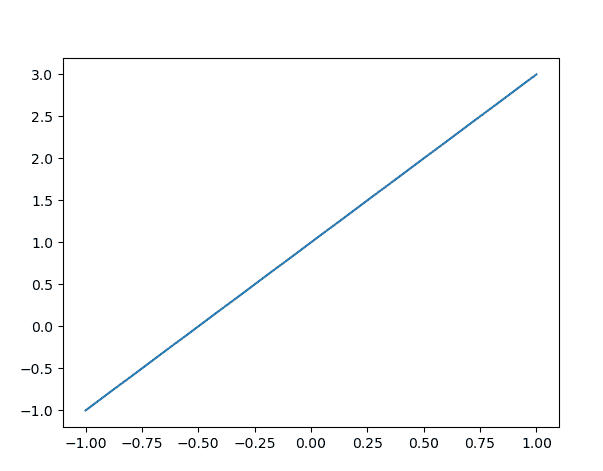
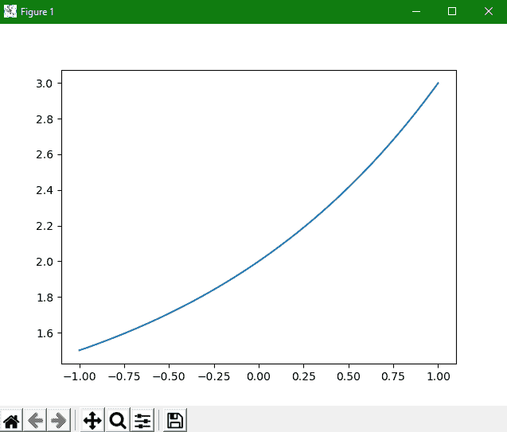

> 哎哎哎:# t0]https://www . studytonight . com/matplot lib/matplot lib-simple line plot


# Matplotlib 简单线出图

在本教程中，我们将介绍 Matplotlib 中的**简单线图**。

**单线功能**即`y=f(x)`的可视化是所有功能中最简单的。让我们看一下创建这种类型的简单情节。在本教程中，我们将介绍以下简单的线图:

1.  `y=f(x)`型直线

2.  正弦函数的图形

3.  用多条线创建单个图形(正弦和余弦函数)

4.  曲线

现在第一步也是最重要的一步是**设置用于绘图的笔记本**和**导入我们将使用的那些功能**:

### 1.正在导入 Matplotlib

要导入 Matplotlib，您只需要编写以下命令:

```
import matplotlib.pyplot as plt
```

为了方便起见，我们将导入一个别名为 **plt** 的 matplotlib。

### 2.正在导入 Numpy

我们将绘制数字；所以为了绘制数字**，我们需要一个数组**。在 Python 的 **Numpy 模块**中，有**很多创建数组**的功能。所以我们也会在代码中**导入 Numpy** 。为了方便起见，我们将使用别名 **np** 导入 Numpy。

其命令如下:

```
import numpy as np
```

## Matplotlib 中`y=f(x)`类型的图形

让我们看看最简单等式的代码片段:

```
import matplotlib.pyplot as plt
import numpy as np

x = np.linspace(-1, 1, 50)
print(x)
y = 2*x + 1

plt.plot(x, y)
plt.show()
```

在上面的代码示例中，`plot(x, y)`函数主要用于绘制直线。这个代码片段的输出如下所示:



## Matplotlib 中正弦波的图形

现在我们将向您展示使用 matplotlib 可视化正弦波。其代码片段如下所示:

## 代码说明

让我们看一下代码的简要解释:

1.  第一步是导入别名为 **plt** 的`matplotlib.pyplot`。

2.  下一步是**用 np** 的别名**导入 Numpy** ，以便使用与其相关的数组和函数。

3.  然后我们导入了**数学模块**，用于可视化中所需的**数学计算**。

4.  现在使用`arange()`功能从 **NumPy 库**获得 **0 和 2(饼图)**之间的**标准角度对象**。

5.  为了绘制两个数组的值，我们使用了`plot()`函数。

6.  在后面的两行中，我们已经设置了图形的 **x 和 y 标签。**

7.  之后在下一行，我们已经借助`title()`功能为图形设置了**标题。**

8.  为了显示图形，我们使用了`show()`功能。

## 用多条线创建单个图形

如果你想创建一个包含多条线的单一图形，那么你只需要**多次调用绘图函数**。

其代码如下:

## 用曲线创建图形

在 Matplotlib 中使用`plot()`方法绘制任意一条线。没有必要总是一条直线，就像我们刚刚在上面的例子中看到的，我们如何绘制一个波。我们也可以画一条曲线。

让我们举一个 Matplotlib 中的简单曲线的例子:

```
import matplotlib
import matplotlib.pyplot as plt
import numpy as np

x = np.linspace(-1, 1, 50)
y = 2**x + 1

plt.plot(x, y)
plt.show()
```

其输出如下所示:



在本教程中，我们已经介绍了**如何绘制直线**、**如何绘制曲线**、**单正弦波**，我们还介绍了**绘制多条线**。

这都是关于在 Matplotlib 中绘制简单函数。现在在我们的后续教程中，我们将使用 matplotlib 讲述更多神奇的事情。我们将深入探讨如何控制轴和线的外观的更多细节。

* * *

* * *