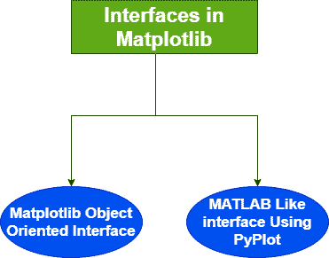
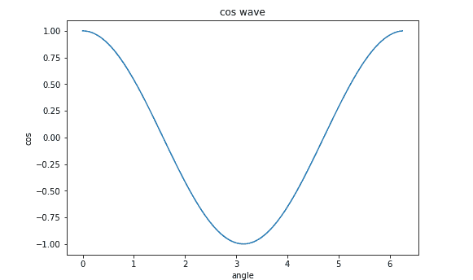

# 面向对象接口

> 原文：<https://www.studytonight.com/matplotlib/matplotlib-object-oriented-interface>

在本教程中，我们将介绍 Matplotlib 中的面向对象接口。

## Matplotlib 接口

Matplotlib 中有两种类型的可视化界面，如下所示:



### 1.使用 Pyplot 接口的类似 MATLAB 的接口

只需导入`matplotlib.pyplot`模块，即可在 matplotlib 库中使用 pyplot 模块轻松**生成地块。**

*   pyplot 界面也是一个基于**状态的界面**。

*   基于状态的界面的主要品质是，它允许我们在需要的时候，根据需要**添加元素和/或修改绘图**。

*   Pyplot 界面**在语法和方法上与 MATLAB** 有很多相似之处。

这个接口也有一些缺点，这就是为什么 Matplotlib 的面向对象接口开始发挥作用。当需要制作多个地块或者当我们必须制作需要大量定制的地块时，`pyplot`界面并不能很好地扩展。

### 2.Matplotlib 中的面向对象接口

为了更好地控制使用 matplotlib 创建的图，为了更好地定制图，我们使用 matplotlib 的面向对象界面。

*   面向对象的界面可以很容易的被**访问，也允许我们重用对象**和 **matplotlib 内部使用的这个面向对象的界面**。

*   当需要在画布上绘制多个图时，面向对象的方法有时更好**。**

*   这个界面背后的 ides 是**创建图形对象**，然后只需要**调用该对象的方法或属性**。

*   在 matplotlib 中的**面向对象界面中， **Pyplot** 仅用于图形创建等少数功能**，用户也明确创建图形**、**跟踪图形和轴对象**。**

*   在这种情况下，用户使用 Pyplot 创建图形，在这些图形的帮助下，**也可以创建一个或多个轴对象**。大多数打印操作都可以使用轴对象。

matplotlib 中的图主要分为两部分:

**1。图形对象**:

图形对象包含一个或多个轴对象。

让我们尝试运行一些代码:

```py
import matplotlib.pyplot as plt
fig = plt.figure()
print(type(fig))
```

其输出如下:

<类>

**2。轴对象**:

坐标轴代表图形内部的一个图

让我们尝试下面给出的 axes 对象的一些代码:

```py
from matplotlib import pyplot as plt
import numpy as np
import math
x = np.arange(0, math.pi*2, 0.05)
y = np.cos(x)
fig = plt.figure()
ax = fig.add_axes([0,0,1,1])
ax.plot(x,y)
ax.set_title("cos wave")# used to set the title
ax.set_xlabel('angle')# used to set label for x-axis
ax.set_ylabel('cos') #used to set label for y-axis
plt.show() # used to display the plot
```

上述代码中使用的功能描述:

**1 .plt.figure()**

该函数将创建一个**图形实例，提供一个空画布。**

**2。图 add_axes([0，0，1，1])**

**add _ axes()**方法需要一个由 4 个元素组成的**列表对象，这些元素对应于图形**的左侧、底部、宽度和高度。需要注意的是，每个数字必须介于 0 和 1 之间。

上述代码的输出如下:



## 总结:

在本教程中，我们已经介绍了 Matplotlib 模块的各种接口和类。

* * *

* * *