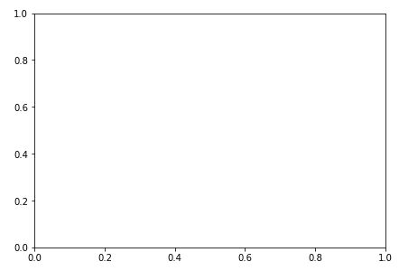
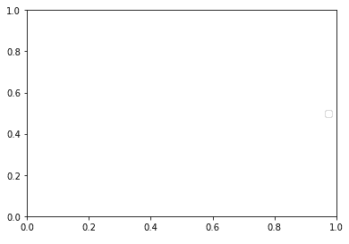
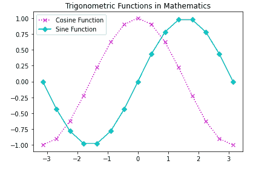

> 哎哎哎:# t0]https://www . studytonight . com/matplot lib/matplot lib-axes-class[


# Matplotlib Axes 类

在本教程中，我们将介绍 Matplotlib 库中基于**状态的界面** (pyplot 模块)中的 **Axes 类**。

带有数据空间的**图像区域通常被称为轴对象。创建子地块的**灵活的**和**基本的**单位是轴线。**

*   借助**轴，可以在图**中的任意位置绘图；因此，它为您提供了**以灵活的方式创建子情节**。

*   **任何给定的图形都可能包含许多轴**，但是给定的**轴对象只能在一个图形中。**

*   在**二维**的情况下，t **轴包含两个轴对象**，在**三维的情况下，轴包含三个轴对象**。

*   要在图形中添加**一个 Axes 对象，您只需要调用`add_axes()`方法。**

*   `add_axes()`方法将返回轴对象，并在**矩形【左、底、宽、高】**的位置添加轴，所有这些量都以图形**宽度**和**高度**的分数表示。

## `axes()`功能

该功能主要用于**创建一个带参数**的坐标轴对象。

*   参数主要是 4 个元素的列表**【左、底、宽、高**】

下面给出了这个函数的基本**语法**:

```
axes([left, bottom, width, height])
```

让我们看一个最简单的例子，我们将使用 axes()函数:

```
import matplotlib.pyplot as plt 

fig = plt.figure() 
#[left, bottom, width, height] 
ax = plt.axes([0.2, 0.2, 0.9, 0.9]) 
```

其输出如下:



上面例子的解释:

*   在上面的代码中，`axes([0.2, 0.2, 0.9, 0.9])`，其中第一个*‘0.2’*表示**左侧轴到图形窗口**边框的距离，即图形窗口**总宽度**的 **20%** 。

*   第二个*‘0.2’*表示的是**底侧轴线与图窗边框**的距离，即图窗总高度的 **20%** 。

*   另外，第一个*‘0.9’***表示从左到右的轴宽**为 **90%** 并且

*   后者*‘0.9’*表示**自下而上的轴线高度**为 **80%** 。

## 轴类中的成员函数

在下一节中，我们有 axes 类的成员函数，用于向图中添加不同的元素:

### 1.`ax.legend()`功能

使用轴类的`legend()`方法为绘图添加图例。

**语法如下:**

```
ax.legend(handles, labels, loc)
```

**参数:**

该函数采用三个参数:

1.  **参数标签用于指示字符串的序列**，它主要处理 Line2D 的序列。

2.  参数 **loc 可以是字符串，也可以是整数**，主要指定图例位置。

| 位置字符串 | 位置代码 |
| 最好的 | Zero |
| 右上方 | one |
| 左上角 | Two |
| 左下角 | three |
| 右下角 | four |
| 对吧 | five |
| 中间偏左 | six |
| 中间偏右 | seven |
| 下死点 | eight |
| 上中心 | nine |
| 中心 | Ten |

下面我们有一个使用`legend()`方法的基本例子:

```
import matplotlib.pyplot as plt 

fig = plt.figure() 

#[left, bottom, width, height] 
ax = plt.axes([0.2, 0.2, 0.8, 0.8]) 

ax.legend(labels = ('label1', 'label2'), loc = 'center right') 
```

该代码的输出如下:



### 2.`add_axes()`功能

如果有需要，您也可以通过调用**`add_axes()`**方法(因此这是一种替代方法)将斧子对象添加到图形中。

该方法将**返回轴对象，并在**【左侧、底部、宽度、高度】位置添加轴，所有这些量都是图形宽度和高度的分数。

**语法如下:**

```
add_axes([left, bottom, width, height])
```

让我们介绍一个使用这种方法的例子:

```
import matplotlib.pyplot as plt 

fig = plt.figure() 

#[left, bottom, width, height] 
ax = fig.add_axes([1, 1, 1, 1]) 
```

上述代码示例的输出如下:


### 3.`ax.plot()`功能

轴类最基本的**方法是使用**将一个数组的值与另一个数组的值绘制成线或标记**。**

该方法可以有一个**可选格式字符串参数**，主要用于**指定颜色**、**样式**和**线的大小和标记**。

## 使用颜色代码:

要指定颜色，我们将使用颜色代码:

| 性格；角色；字母 | 颜色 |
| ' b ' | 蓝色 |
| g′ | 格林（姓氏）；绿色的 |
| r′ | 红色 |
| ' b ' | 蓝色 |
| c′ | 蓝绿色 |
| m′ | 品红 |
| 你好 | 黄色 |
| k′ | 黑色 |
| ' b ' | 蓝色 |
| w ' | 白色的 |

## 使用标记代码:

要指定标记的样式，我们将使用:

| 性格；角色；字母 | 描述 |
| '.' | 点标记 |
| 的 | 圆形标记 |
| x ' | X 标记 |
| d′ | 钻石标记 |
| ' h ' | 六边形标记 |
| s | 正方形制造者 |
| '+' | 加记号 |

## 使用线条样式:

您可以使用的各种线型如下:

| 性格；角色；字母 | 描述 |
| '-' | 实线 |
| '—' | 短划线 |
| '-.' | 点划线 |
| ':' | 点线 |
| ' h ' | 六边形标记 |

**语法如下:**

```
plt.plot(X, Y, ‘CLM’)
```

**参数:**

**X:** 该参数表示 X 轴。

**Y:** 该参数表示 Y 轴

**CLM:** 代表颜色、线条和标记。

让我们来看一个上面解释的函数的例子:

```
import matplotlib.pyplot as plt 
import numpy as np 

X = np.linspace(-np.pi, np.pi, 15) 
C = np.cos(X) 
S = np.sin(X) 

# [left, bottom, width, height] 
ax = plt.axes([0.1, 0.1, 0.8, 0.8]) 

ax1 = ax.plot(X, C, 'mx:') 

ax2 = ax.plot(X, S, 'cD-') 

ax.legend(labels = ('Cosine Function', 'Sine Function'),loc = 'upper left') 

ax.set_title("Trigonometric Functions in Mathematics") 

plt.show() 
```

上述代码片段的输出如下所示:



## 总结:

在本教程中，我们介绍了 matplotlib Axes 类，以及如何在代码示例和输出中使用它。我们还介绍了这个类的各种不同功能以及如何使用它们。

* * *

* * *