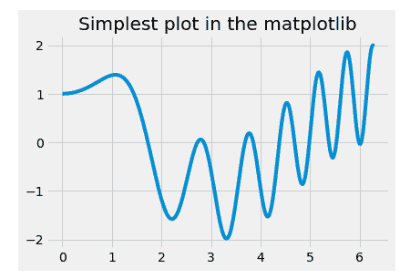
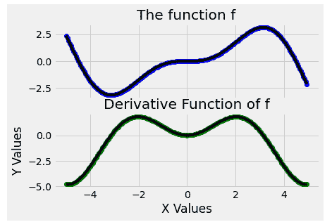

# Matplotlib 使用`subplots()`函数的多图

> 原文：<https://www.studytonight.com/matplotlib/matplotlib-multiplots-with-subplots-function>

在本教程中，我们将介绍**如何在 matplotlib 中在单个图形中绘制多个图**。

你一定在想，为什么我们要在一个图中有多个图。那只会导致混乱和混乱。但是如果你需要**要么在两条曲线**之间做比较，要么你想在图中显示一些**渐变(相对于彼此)等等。在这种情况下，多个图是有用的。**

在 matplotlib 中，我们可以使用**支线剧情**来实现。

`subplots()`功能在 matplotlib 库的 **pyplot 模块**中，用于以有效的方式创建子剧情/多剧情。

## `subplots()`功能

该功能将**创建一个图形和一组支线剧情**。它基本上是**一个包装函数**，用于在一次调用中创建**子场景**(包括包围图对象)的通用布局。

*   该函数主要返回一个**图形**和一个**轴对象**或者一个**轴对象数组**。

*   如果在没有任何参数的情况下使用此功能**，那么它将返回一个**图形对象和一个轴对象**。**

### `suplots()`函数的语法:

下面给出了使用该函数的语法:

```py
subplots(nrows, ncols, sharex, sharey, squeeze, subplot_kw, gridspec_kw, **fig_kw)
```

### 参数:

让我们讨论一下这个函数使用的参数:

*   **非政府组织，ncls**

    参数**显示**表示**行数**，参数**显示**表示**表示子图网格的列数**。两个参数都有默认值 **1** 。

*   **sharex，sharey**

    为了控制 x ( `sharex`)轴之间的**属性共享或 y** ( `sharey`)轴之间的**属性共享，使用这些参数。**

*   **挤压**

    该可选参数通常**包含布尔值**，默认值为**真**。

*   **支线剧情 _kw**

    该参数用于用传递给`add_subplot`调用的关键字指示字典，该调用用于创建每个子图。

*   **电网规格 _kw**

    此参数用于指示带有传递给`GridSpec`构造器的关键字的字典，该构造器用于创建放置子情节的网格。

*   *** *图 _kw**

    传递给`.pyplot.figure`调用的所有附加关键字参数都是该参数的一部分。

现在我们将介绍一些例子，以便所有的概念对您来说变得清晰。

## 示例 1:用一个图形和一个轴绘图

该示例的代码如下:

```py
import numpy as np
import matplotlib.pyplot as plt

x = np.linspace(0, 2*np.pi, 400)
y = np.sin(x**2) + np.cos(x)

fig, ax = plt.subplots()
ax.plot(x, y)
ax.set_title('Simplest plot in the matplotlib')
```

现在该看看代码的输出了:


在本例中，我们使用了`subplots()`函数，但是我们没有向图中添加两个图。所以`subplots()`功能通常也可以用来创建一个单独的图表。

## 示例 2:堆叠图

让我们举一个堆叠图的例子。我们将通过**将一个叠加在另一个**上来尝试绘制一系列的图(这里是图 2)。由于有地块的堆叠，所以行数(即`nrows`)会发生变化，也就是说`ncols`保持不变 **1** 。此外，每个子剧情由**索引参数**标识。

这方面的代码片段如下:

```py
import numpy as np
import matplotlib.pyplot as plt

plt.figure(figsize=(6, 4))

def f(x):
    return np.sin(x) - x * np.cos(x)

def fp(x):
    """ The derivative function of f """
    return x * np.sin(x)

X = np.arange(-5, 5.0, 0.05)

fig, ax = plt.subplots(2, 
           sharex='col', sharey='row')

ax[0].plot(X, f(X), 'bo', X, f(X), 'k')
ax[0].set(title=' function f')

ax[1].plot(X, fp(X), 'go', X, fp(X), 'k')
ax[1].set(xlabel='X Values', ylabel='Y Values',
       title='Derivative Function of f')

plt.show()
```

下面是上面代码的输出:



正如您在上面的输出中看到的，两个地块一个堆叠在另一个之上。情节也可以是其他类型的。但是当你想在情节之间做一些比较时，这是一个很好的方法。

## 示例 3:在另一个图中绘制

对于这个代码示例。让我们举一个活生生的例子。

您也可以使用上面的终端运行其他示例并查看输出。也尝试制作不同的情节。

## 总结:

在本教程中，我们讲述了如何使用`subplots()`函数在 matplotlib 中创建多个图。我们还在一张图中介绍了多个地块的不同布局。

* * *

* * *