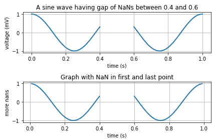
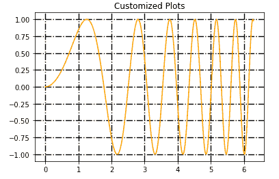

> 哎哎哎:# t0]https://www . studytonight . com/matplot lib/matplot lib-grids


# Matplotlib Grids

在本教程中，我们将介绍**图中的网格**是什么，以及如何使用 Matplotlib 中的`grid()`函数对其进行定制。

### 什么是网格？

在任何图表或任何数据集的图形表示中，制作网格是为了让您更好地理解整个图形/图表，并将绘图上的点与比例值相关联，因为背景中有网格线。网格使图形/图表的内部基本上**由直线**(垂直、水平和角度)或主要用于表示数据的**曲线相交而成。**

*   借助 matplotlib 中的**网格，您可以更好地**理解图形**。**

*   您可以很容易地**获得数据点**的参考。

*   `matplotlib.pyplot.grid()`是**用来轻松创建网格的功能**，你也可以**自定义，因为**有很多选项。

## Matplotlib `grid()`函数

这个函数基本上用于创建网格。

*   在轴对象中，`grid()`功能用于**设置图形内网格的可见性**。它可以开也可以关。

*   **线型和线宽**属性可以在`grid()`功能中设置。

*   您可以根据自己的需求定制网格，因为有许多可用的选项。

### `Matplot` lib `grid()`语法

下面我们有使用函数`matplotlib.pyplot.grid()`函数的基本语法:

```py
matplotlib.pyplot.grid(b, which, axis, **kwargs)
```

让我们讨论一下这个函数中使用的参数:

*   **b**

    该参数表示**布尔值**，用于指定是否显示网格线。该参数的默认值为**真**。

*   **哪个**

    此参数用于指示需要应用更改的网格线。这个值有三个:主**、**次**或**两个**。**

***   **轴**

    此参数用于表示需要应用更改的轴。该值为 **x** 、 **y** 或两者。

    *   ****kwargs**

    此参数用于指示可选的线属性。** 

 **## 示例 1

让我们看一个例子，我们将在图中创建一个网格:

```py
import numpy as np
import matplotlib.pyplot as plt

t = np.arange(0.0, 1.0 + 0.01, 0.01)
s = np.cos(2 * 2*np.pi * t)
t[41:60] = np.nan

plt.subplot(2, 1, 1)
plt.plot(t, s, '-', lw=2)

plt.xlabel('time (s)')
plt.ylabel('voltage (mV)')
plt.title('A sine wave having gap of NaNs between 0.4 and 0.6')
plt.grid(True)

plt.subplot(2, 1, 2)
t[0] = np.nan
t[-1] = np.nan
plt.plot(t, s, '-', lw=2)
plt.title('Graph with NaN in first and last point')

plt.xlabel('time (s)')
plt.ylabel('more nans')
plt.grid(True)

plt.tight_layout()
plt.show()
```

上述代码片段的输出如下:


在上面的函数中，我们所做的只是添加了`plt.grid(True)`，它显示了最终图形中的网格。

## 例 2

现在，在下面给出的示例中，我们将向您展示如何使用各种选项自定义图表:

```py
import matplotlib.pyplot as plt 
import numpy as np 

x = np.linspace(0, 2 * np.pi, 400) 
y = np.sin(x ** 2) 

plt.plot(x, y, 'orange') 

plt.title("Customized Plots") 

# customize grids
plt.grid(True, color = "black", linewidth = "1.4", linestyle = "-.") 

plt.show() 
```

以上代码的输出如下:



在上图中，可以看到网格线是由 **-。**我们已经使用`linestyle`参数指定了，线的宽度被指定为 **1.4** 来控制线的宽度。我们还指定了**地块颜色为橙色**，可以在输出中看到。

## 总结:

`grid()`功能可用于在图形中制作更好的网格。您可以尝试网格线的不同样式、颜色和宽度，以使您的图形在视觉上更好。

* * *

* * ***