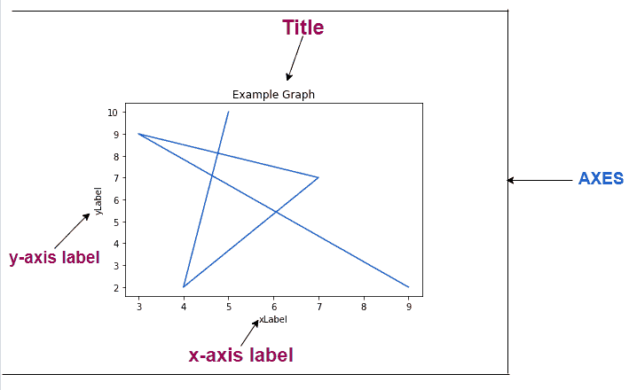
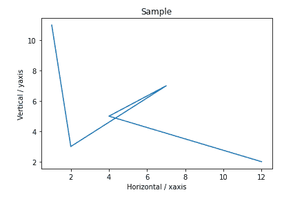
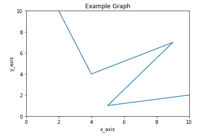
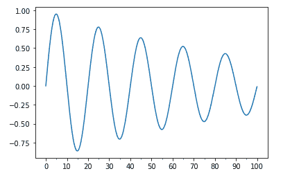

# 在 Matplotlib 中格式化轴域

> 原文：<https://www.studytonight.com/matplotlib/formatting-the-axes-in-matplotlib>

在本教程中，我们将介绍如何在 Matplotlib 中格式化轴。让我们先来学习一下 Matplotlib 中什么是 Axes。

## Matplotlib 定线

包含**数据空间**的图像区域主要称为轴。

*   Matplotlib 中的“轴”主要包含双轴(如果是**【2D】**对象)或三轴**(如果是 **3D** 对象)，然后负责数据限制。**

 **让我们向您展示包含图表的图的不同部分:



您可以根据自己的需求更改 Axes 的不同方面，在本教程的后续章节中，我们将学习如何做到这一点。

## 1.x 轴和 y 轴的标签

在本节中，我们将介绍如何在 Matplotlib 中标记 x 轴和 y 轴。

以下是 x 轴和 y 轴标注的**语法**:

### 对于 x 轴:

```py
Axes.set_xlabel(self, xlabel, fontdict=None, labelpad=None, \*\*kwargs)
```

### 对于 y 轴:

```py
Axes.set_ylabel(self, ylabel, fontdict=None, labelpad=None, \*\*kwargs)
```

这样，借助上述两个函数，您可以轻松命名 x 轴和 y 轴。

### 标记 x 轴和 y 轴示例:

现在让我们看一个例子，我们将利用上面两个函数来命名 x 轴和 y 轴。

```py
import matplotlib.pyplot as plt 
import numpy as np 

a = [1, 2, 7, 4, 12] 
b = [11, 3, 7, 5, 2] 

# below function will create a figure and axes 
fig,ax = plt.subplots() 

# setting title to graph 
ax.set_title('Sample') 

# label x-axis and y-axis 
ax.set_ylabel('Vertical / yaxis') 
ax.set_xlabel('Horizontal / xaxis') 

# function to plot and show graph 
ax.plot(a, b) 
plt.show() 
```

而输出:



## 2.设置 x 轴和 y 轴的极限

在本节中，我们将介绍如何在 Matplotlib 中设置 x 轴和 y 轴的限制。

以下是 x 轴和 y 轴标注的**语法**:

### 对于 x 轴:

```py
Axes.set_xlim(self, left=None, right=None, emit=True, auto=False, \*, xmin=None, xmax=None)
```

**功能参数:**

*   **左****右**

    这两个参数在**浮动**并且是**可选的**

    数据坐标中的**左 xlim** 为起点，**右 xlim** 为终点。如果您将`None`传递给它，那么它将保持限制不变。

*   **自动**

    该参数在`bool`中，也是**可选的**。

    如果要开启 x 轴的**自动缩放，那么这个参数的值应该是**真**，这个参数的**假**值表示关闭自动缩放(这是默认动作)`None`值保持不变。**

*   **xmin， xmax**

    这两个参数**分别相当于左和右**，如果您将**将值传递给两个** xmin 和 left 或 xmax 和 right，它**会导致错误**。

**返回值:**

这将返回**右侧**和**左侧**值，即(浮动，浮动)

### 对于 y 轴:

```py
Axes.set_ylim(self, bottom=None, top=None, emit=True, auto=False, \*, ymin=None, ymax=None)
```

**功能参数:**

*   **底部**和**顶部**

    这两个参数在**浮动**并且是**可选的**。

    数据坐标中的**底部叶立德**(即起点)和**顶部叶立德**(即终点)。如果您将`None`传递给它，那么它将保持限制不变。

*   **自动**

    该参数在`bool`中，可选。

    如果要打开 y 轴的**自动缩放，那么这个参数的值应该是**真**，这个参数的**假**值意味着关闭自动缩放，`None`值保持不变。**

*   **ymin，ymax**

    这两个参数**分别相当于底部和顶部**，如果您将值传递给 xmin 和底部或 xmax 和顶部，则会导致错误。

**返回值:**

这将返回**底部**和**左侧**值，即(浮动，浮动)

### 设置 x 轴和 y 轴的限制示例:

现在让我们看一个例子，我们将利用以上两个函数来设置 x 轴和 y 轴的极限。

```py
import matplotlib.pyplot as plt 
import numpy as np 

x = [2, 4, 9, 5, 10] 
y = [10, 4, 7, 1, 2] 

# create a figure and axes 
fig, ax = plt.subplots() 

ax.set_title('Example Graph') 

ax.set_ylabel('y_axis') 
ax.set_xlabel('x_axis') 

# set x, y-axis limits  
ax.set_xlim(0, 10) 
ax.set_ylim(0, 10) 

# function to plot and show graph 
ax.plot(x, y) 
plt.show() 
```

以下是输出:

### 

## 3.主要和次要刻度

在 Matplotlib 中，**记号**基本上是 x 轴和 y 轴的**值。基本上**次要刻度**是**主要刻度**的划分(像厘米和毫米，其中 CM 可以是主要刻度，MM 可以是次要刻度)。**

我们有两个类`Locator`和`Formatter`来控制滴答声:

*   `Locator`类确定刻度将显示在哪里。

*   而`Formatter`类主要控制刻度的格式。

您必须从 matplotlib 导入这两个类:

**1 .多重定位符()**

该函数有助于在某个基数的倍数上放置刻度。

**2。格式化器**

它将使用一种**字符串格式**，例如:‘**% d**’或‘**% 1.2f**’或‘**% 1.1f cm**’来格式化刻度标签。

<u>**注意:**</u> 这里需要注意的是**次要刻度默认为关闭**，它们可以在没有标签的情况下打开，只需设置次要定位器，而次要刻度标签可以在次要格式化程序的帮助下打开。

### 主要和次要刻度示例:

让我们看一个例子，

```py
import matplotlib.pyplot as plt
import numpy as np
from matplotlib.ticker import (MultipleLocator, FormatStrFormatter,
                               AutoMinorLocator)

t = np.arange(0.0, 100.0, 0.1)
s = np.sin(0.1 * np.pi * t) * np.exp(-t * 0.01)

fig, ax = plt.subplots()
ax.plot(t, s)

# Make a plot with major ticks that are multiples of 10 and minor ticks that
# are multiples of 5\.  Label major ticks with '%d' formatting but don't label
# minor ticks.
ax.xaxis.set_major_locator(MultipleLocator(10))
ax.xaxis.set_major_formatter(FormatStrFormatter('%d'))

# For the minor ticks, use no labels; default NullFormatter.
ax.xaxis.set_minor_locator(MultipleLocator(5))

plt.show()
```

以下是输出:



## 总结:

在本教程中，我们介绍了在 matplotlib 图形中格式化坐标轴的各种方法，包括为坐标轴添加标签、为坐标轴设置限制以及添加主要/次要刻度。

* * *

* * ***