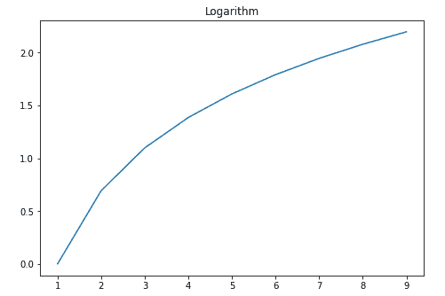
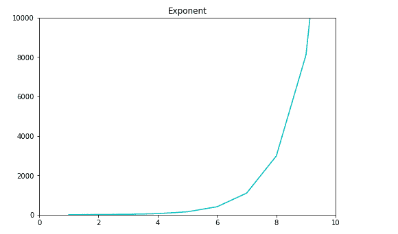

# 在 Matplotlib 中设置轴限制

> 原文：<https://www.studytonight.com/matplotlib/setting-limits-for-axis-in-matplotlib>

在本教程中，我们将介绍如何在 matplotlib 中设置 X 轴和 Y 轴值的限制。

Matplotlib 库**自动设置沿绘图的 x、y(和 z 轴，如果是三维绘图)**轴显示的变量的最小值和最大值**。**

*   但是你也可以**明确设置限制**。

*   有两种功能可以让您轻松明确地设置限制:

    *   `set_xlim()`用于设置 x 轴的极限

    *   `set_ylim()`用于设置 y 轴的极限

现在我们将介绍两个例子，在第一个例子中，限制由 matplotlib 库自动设置，而在第二个例子中，我们将显式设置限制。

## Matplotlib 默认限制:

在下面给出的例子中，限制由 matplotlib 库自动设置。

```py
import matplotlib.pyplot as plt

fig = plt.figure()
a1 = fig.add_axes([0,0,1,1])

import numpy as np

x = np.arange(1,10)
a1.plot(x, np.log(x))
a1.set_title('Logarithm')
plt.show()
```

以下是输出:



## 在 Matplotlib 中设置自定义限制

现在在这个例子中，我们将使用上面讨论的函数**显式地设置限制**。让我们看看代码:

```py
import matplotlib.pyplot as plt

fig = plt.figure()
a1 = fig.add_axes([1,1,1,1])

import numpy as np

x = np.arange(1, 100)
a1.plot(x, np.exp(x),'c')
a1.set_title('Exponent')

# to set the y axis limits
a1.set_ylim(0, 10000)
# to set the x axis limits
a1.set_xlim(0, 10)

plt.show()
```

以下是输出:



## 总结:

在本教程中，我们学习了如何设置 x 轴和 y 轴的限制以正确显示数据。默认情况下，matplotlib 也很好地管理这一点，但是如果您希望明确提及这些限制，您可以使用`set_xlim()`和`set_ylim()`函数。

* * *

* * *