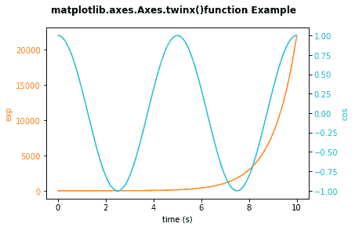

# Matplotlib 双轴

在本教程中，我们将介绍 matplotlib 中**双轴/双轴**的概念。

在[轴类](https://www.studytonight.com/matplotlib/matplotlib-axes-class)中，有很多**图形元素**存在，如**轴**、**勾**、**线 2D** 、**文字**、**多边形**等。，用于设置坐标系。

当我们说**双轴**时，它意味着一个图形可以有**双 x 轴或 y 轴**。同样，当用不同的单位一起绘制曲线时，双轴也是非常有用的。

在 Matplotlib 中，`twinx`和`twiny`功能支持该任务。

## Matplotlib `twinx()`和`twiny()`功能

在轴模块中，有一个名为`Axes.twinx()`的函数，用于创建共享 x 轴的双轴。同样，功能`twiny()`用于在您的图形中创建第二个 x 轴，这意味着双轴共享 y 轴。

使用此函数的语法如下:

```py
# for x axis
Axes.twinx(self)
# for y axis
Axes.twiny(self)
```

<u>**注意:**</u> 这个函数**不取任何参数**，如果你要这样做的话就会产生错误。

该方法返回的**值如下:**

**ax_twin:** 表示将返回新创建的 Axes 实例。

现在是时候深入研究一些使用这个函数的例子了，

## 例 1:

下面是 matplotlib 中双轴绘图的示例:

```py
import numpy as np 
import matplotlib.pyplot as plt 

t = np.arange(0.01, 10.0, 0.001) 
data1 = np.exp(t) 
data2 = np.cos(0.4 * np.pi * t) 

fig, ax1 = plt.subplots() 

color = 'tab:orange'
ax1.set_xlabel('time (s)') 
ax1.set_ylabel('exp', color = color) 
ax1.plot(t, data1, color = color) 
ax1.tick_params(axis ='y', labelcolor = color) 

ax2 = ax1.twinx() 

color = 'tab:cyan'
ax2.set_ylabel('cos', color = color) 
ax2.plot(t, data2, color = color) 
ax2.tick_params(axis ='y', labelcolor = color) 

fig.suptitle('matplotlib.axes.Axes.twinx()function Example\n\n', fontweight ="bold") 

plt.show() 
```

上述代码的输出如下:



在上面的代码中，我们使用了`twinx()`函数，得到了共享 x 轴的双轴。

## 总结:

当您想要在一个图形中显示数据的多个比例或者想要在一个图形中有多个图时，使用`twinx()`和`twiny()`功能。

* * *

* * *