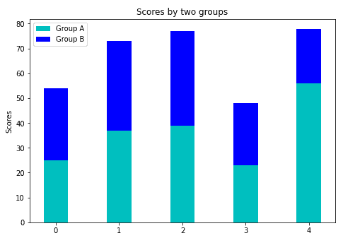

# Matplotlib 条形图绘图条()函数

> 原文：<https://www.studytonight.com/matplotlib/matplotlib-bar-plot-bar-function>

在本教程中，我们将介绍 Matplotlib 中的条形图以及如何创建它。

**条形图或条形图**通常是一种图形/图表，主要用于用**矩形条**表示数据类别，矩形条的长度和高度与其所代表的值成比例。

*   您可以垂直或水平绘制这些条形**。**

***   我们使用条形图主要显示离散类别数据之间的比较。

    *   在柱状图中，图的一个轴用于表示**被比较的特定类别**，而另一个轴通常表示与那些类别对应的**测量值。**** 

 **## Matplotlib `bar()`函数

`bar()`功能用于创建**条形图**，该条形图以**矩形**为边界，具体取决于该功能的**给定参数**。在 Matplotlib API 中，这个**函数可以在 MATLAB** 风格中使用，以及**作为面向对象 API** 。

### Matplotlib `bar()`函数语法

将该函数用于[轴对象](https://www.studytonight.com/matplotlib/matplotlib-axes-class)所需的语法如下:

```py
ax.bar(x, height, width, bottom, align)
```

该功能的参数描述如下:

*   **x**

    该参数用于表示标量值的**序列，该序列表示条**的**x 坐标。`align`参数控制**x 是条中心(默认)还是左边缘****

*   **高度**

    该参数是标量**或标量值序列**，代表构成 y 轴值的条的高度**。**

*   **宽度**

    该参数为**标量或类数组**，可选**。该参数的**默认值**为 **0.8****

***   **底部**

    这也是一个**标量或者类似数组的**，并且是**可选的**。默认值为**无**。

    *   **对齐**

    该参数取值为{' **中心**'、'**边缘** '}、**可选**，该参数默认值为'**中心**** 

 **`bar()`函数返回一个包含所有条的 **Matplotlib 容器对象**。

现在是时候深入研究这个概念的一些例子了。

## 简单条形图:

下面给出了一个简单的条形图示例，它代表了研究所提供的书籍数量:

```py
import numpy as np 
import matplotlib.pyplot as plt 

data = {'Computer Networks':20, 'DBMS':15, 'Java':30,'C':35} 
courses = list(data.keys()) 
values = list(data.values()) 
fig = plt.figure(figsize = (10, 5)) 

plt.bar(courses, values, color ='magenta',width = 0.4) 

plt.xlabel("Books offered") 
plt.ylabel("No. of books provided") 
plt.title("Books provided by the institute") 
plt.show() 
```

### 代码解释:

这里`plt.bar(courses, values, color='magenta')`基本上是指定要绘制的条形图，以“提供的书籍”(学院提供)列为 X 轴，以“书籍数量”为 Y 轴。

`color`属性基本上用于设置条的颜色(**洋红色**)。

语句`plt.xlabel("Books offered")`和`plt.ylabel("books provided by the institute")`用于标注对应的轴。`plt.title()`功能用于制作图形的**标题**。`plt.show()`功能用于**显示图形**作为之前命令的输出。

上述代码显示的输出如下:


## 自定义条形图:堆叠图

**堆叠条形图**用于表示不同组的数据**相互叠加**。条形的高度主要取决于各组结果组合的结果高度。高度从底部到数值，而不是从零到数值

现在让我们创建一个堆叠图，代码如下:

```py
import numpy as np
import matplotlib.pyplot as plt

N = 5
group_a = (25, 37, 39, 23, 56)
group_b = (29, 36, 38, 25, 22)

ind = np.arange(N) # the x locations for the groups
width = 0.39

fig = plt.figure()
ax = fig.add_axes([0,0,1,1])
ax.bar(ind, group_a, width, color='c')
ax.bar(ind, group_b, width,bottom=group_a, color='b')

ax.set_ylabel('Scores')
ax.set_title('Scores by two groups')
ax.set_xticks(ind, ('G1', 'G2', 'G3', 'G4', 'G5'))
ax.set_yticks(np.arange(0, 81, 10))
ax.legend(labels=['Group A', 'Group B'])
plt.show()
```

如果您将在自己的系统中运行此代码，则输出如下:



## 时间就是活生生的例子！

让我们看一下实时示例:

* * *

* * *****