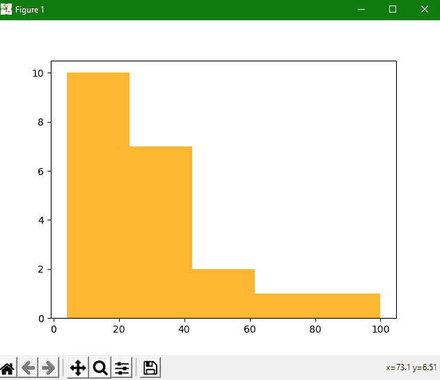
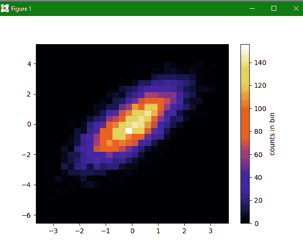

# Matplotlib 历史程序-历史()函数

> 原文：<https://www.studytonight.com/matplotlib/matplotlib-histrograms-hist-function>

在本教程中，我们将介绍如何使用 matplotlib 库在 Python 中创建直方图。

### 什么是直方图？

在深入研究如何在 matplotlib 中创建直方图之前，让我们首先了解什么是直方图？

所以直方图是数值数据的**分布的**精确表示**。**

*   所以直方图**是条形图**的一种，是由**卡尔·皮尔逊**发明的

*   直方图主要用于表示某些组中提供的数据**。**

*   直方图通常**由数据仓(变量的连续和非重叠间隔)**组成，其中每个**仓由最小值和最大值**组成。

*   为了估计连续变量的概率分布，使用直方图。

## 创建直方图

创建直方图时，应记住以下几个步骤:

1.  第一步是**创建范围**的箱。

2.  第二步是**将数值**的整个范围分配到一个**对应的区间序列中。**

3.  第三步**是统计每个区间**的数值。

### `matplotlib.pyplot.hist()`功能

该函数用于创建直方图。

让我们讨论直方图的参数，详细描述如下:

*   **x**

    此参数指示数组或数组序列。

*   **箱柜**

    此参数指示一个整数或序列或任何字符串。

*   **密度**

    这是一个由布尔值组成的可选参数。

*   **范围**

    这是一个可选参数，用于指示箱的上限和下限，也是一个可选参数。

*   标签

    这是一个可选参数，用于在对数刻度上设置直方图轴。

*   **颜色**

    这是用于设置颜色的可选参数。

*   **累计**

    如果该选项的值设置为**真**，则计算直方图，其中每个箱给出该箱中的计数加上较小值的所有箱。

*   **组态型**

    这是一个可选参数，用于指定直方图的类型[即**条形**、**条形堆积**、**台阶**、**台阶填充** ]。该参数的默认值为“**栏**”。

*   **对齐**

    这是一个可选参数，用于控制数值为[ **左**、**右**、**中** ]的直方图的绘制。

让我们看几个例子来理解直方图的概念。

### 简单直方图示例:

下面我们有一个创建直方图的简单示例:

```py
import numpy as np
import matplotlib.mlab as mlab
import matplotlib.pyplot as plt

x = [21,22,23,4,5,6,77,8,9,10,31,32,33,34,35,36,37,18,49,50,100]
num_bins = 5
n, bins, patches = plt.hist(x, num_bins, facecolor='orange', alpha=0.8)
plt.show()
```

直方图形式的输出如下:



### 一个图形示例中的两个直方图:

让我们一起试试**两个直方图的两个图**。在下面给出的代码片段中，我们试图将两个直方图绘制在一起:

### 2D 直方图示例:

让我们尝试创建一个二维直方图。2D 直方图的代码片段如下:

```py
import numpy as np
import matplotlib.pyplot as plt
mean = [0, 0]
cov = [[1, 1], [1, 2]]
x, y = np.random.multivariate_normal(mean, cov, 10000).T # x and y are array that are drawn from a multivariate Gaussian distribution

plt.hist2d(x, y, bins=30, cmap='CMRmap') #plt.hist2d is used to draw histogram for 2D
cb = plt.colorbar()
cb.set_label('counts in bin')
plt.show()
```

输出直方图如下:



* * *

* * *