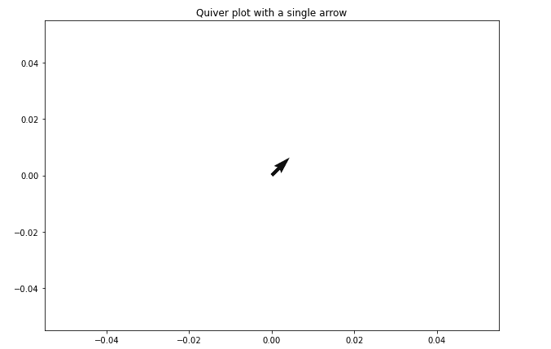
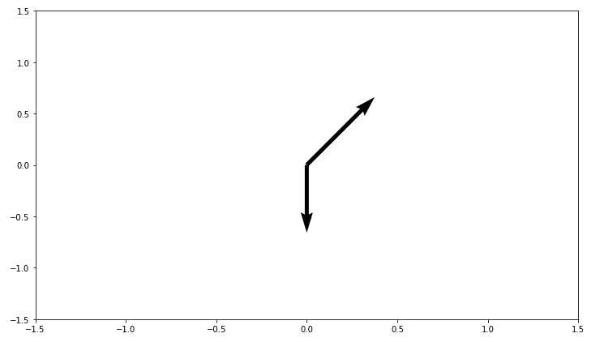

# Matplotlib 颤图-颤图()函数

> 原文：<https://www.studytonight.com/matplotlib/matplotlib-quiver-plot-quiver-function>

在本教程中，我们将使用 **Matplotlib 库**来讲述**颤图**。

要绘制箭头的 **2D 场，我们使用 matplotlib 库中的**颤图**。**

*   该图主要有助于将**速度矢量显示为箭头**，该箭头在点 **`(x,y)`** 处具有分量 **`(u,v)`** 。
*   颤图对于**电气工程师**到**可视化电势**和对于**机械工程师**到**显示应力梯度**是有用的。

## 创建 Matplotlib 颤图

为了创建颤图，使用了`ax.quiver()`功能。

使用该功能所需的**语法**如下:

```
ax.quiver(x_pos, y_pos, x_dir, y_dir, color) 
```

下面是这个函数的**参数**，你可以在上面的语法中看到:

*   **x_pos** 和 **y_pos**

    该功能的这两个参数用于指示箭头的**起始位置。**

*   **x_dir** 和 **y_dir**

    该功能的这两个参数用于指示箭头的**方向。**

*   **颜色**

    该参数用于指定颤图的**颜色**。

现在让我们深入探讨一些与此相关的例子。

## 简单颤图示例:

在下面给出的例子中，我们将介绍如何用一个**单箭头**绘制颤图:

```
import numpy as np 
import matplotlib.pyplot as plt 

x_pos = 0
y_pos = 0
x_direct = 1
y_direct = 1

fig, ax = plt.subplots(figsize = (10, 7)) 
ax.quiver(x_pos, y_pos, x_direct, y_direct) 
ax.set_title('Quiver plot with a single arrow') 

plt.show() 
```

以下是输出:

****

## 双箭头颤图示例:

在下面给出的例子中，我们将介绍如何用**两个箭头**绘制颤图:

```
import numpy as np 
import matplotlib.pyplot as plt 

x_pos = [0, 0] 
y_pos = [0, 0] 
x_direct = [1, 0] 
y_direct = [1, -1] 

fig, ax = plt.subplots(figsize = (12, 7)) 
ax.quiver(x_pos, y_pos, x_direct, y_direct,scale = 8) 

ax.axis([-1.5, 1.5, -1.5, 1.5]) 

plt.show() 
```

以下是输出:



## 是时候活出榜样了！

现在我们将介绍一个使用**网格**绘制颤图的实时示例:

在上面的实时示例中，您甚至可以更改代码并尝试运行其他代码，以查看不同的颤图输出。

* * *

* * *