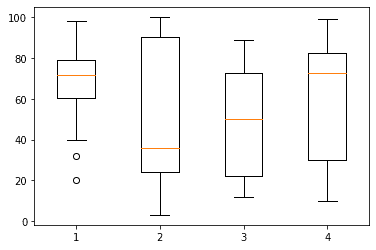
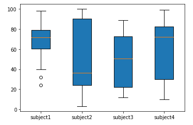
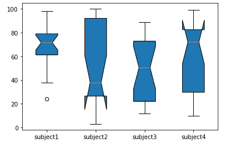

# Matplotlib 盒子图-盒子图()函数

> 原文：<https://www.studytonight.com/matplotlib/matplotlib-box-plot-boxplot-function>

在本教程中，我们将介绍**方块图**以及使用`boxplot()`功能在 matplotlib 库中创建方块图。

matplotlib 中的箱线图主要用于显示一组数据的**摘要，这些数据具有最小值、第一个四分位数、中值、第三个四分位数和最大值等属性。**

*   方框图也被称为**触须图**。

*   在方框图中，方框是从**第一个四分位数**到**第三个四分位数创建的，在中间位置**也有一条**垂直线穿过方框。**

*   在箱线图中， **x 轴表示要绘制的数据**，而 **y 轴表示频率分布**。

## 创建方框图

matplotlib 库中的**方块图**通常是借助`boxplot()`功能创建的。

*   在箱线图中`numpy.random.normal()`用于**创建一些随机数据**，它以平均值、标准偏差和所需的数值数作为参数。

*   为`ax.boxplot()`方法**提供的数据值可以是 Numpy 数组或 Python 列表，也可以是数组元组**

`boxplot()`函数所需的**语法**如下:

```py
matplotlib.pyplot.boxplot(data, notch, vert, patch_artist, widths)
```

以下是该函数的参数:

*   **数据**

    该参数表示绘制所需的**阵列或阵列序列。**

*   **槽口**

    这是一个可选的**参数，接受布尔值。**将其`None`设为**默认值**。

*   绿色

    这是一个**可选参数**，接受**布尔值**，即水平图为**假**，垂直图为**真**。

*   **patch_artist**

    这是一个**可选参数**，其**布尔**值以`None`作为其**默认值**

*   **宽度**

    这是一个可选参数**，接受一个数组**，用于设置盒子的宽度。**默认值**为`None`。

现在我们将深入研究一些创建 Box 图的例子。

## 创建方框图示例:

在 Matplotlib 库中创建简单方框图的代码如下:

```py
import matplotlib.pyplot as plt

value1 = [84,77,20,40,67,62,75,78,71,32,98,89,78,67,72,82,87,66,56,52]
value2=[62,5,91,25,35,32,96,99,3,90,95,34,27,55,100,15,71,11,37,21]
value3=[23,89,12,78,72,89,25,69,68,86,19,48,15,16,16,75,65,31,25,52]
value4=[59,73,73,16,81,61,88,98,10,87,29,72,16,23,72,88,78,99,75,30]

box_plot_data=[value1,value2,value3,value4]
plt.boxplot(box_plot_data)
plt.show()
```

以下是输出:



## 创建带有填充和标签的方框图:

在下面给出的代码片段中，我们将为箱线图提供一个**标签，并将**填充箱线图**。让我们看看示例的代码:**

```py
import matplotlib.pyplot as plt

value1 = [82,76,24,40,67,62,75,78,71,32,98,89,78,67,72,82,87,66,56,52]
value2=[62,5,91,25,36,32,96,95,3,90,95,32,27,55,100,15,71,11,37,21]
value3=[23,89,12,78,72,89,25,69,68,86,19,49,15,16,16,75,65,31,25,52]
value4=[59,73,70,16,81,61,88,98,10,87,29,72,16,23,72,88,78,99,75,30]

box_plot_data=[value1,value2,value3,value4]
plt.boxplot(box_plot_data,patch_artist=True,labels=['subject1','subject2','subject3','subject4'])
plt.show()
```

以下是输出:



## 创建带凹口的方框图:

在这个例子中，我们将绘制一个有凹口的方框图。

```py
import matplotlib.pyplot as plt

value1 = [84,76,24,46,67,62,78,78,71,38,98,89,78,69,72,82,87,68,56,59]
value2=[62,5,91,25,39,32,96,99,3,98,95,32,27,55,100,15,71,11,37,29]
value3=[23,89,12,78,72,89,25,69,68,86,19,49,15,16,16,75,65,31,25,52]
value4=[59,73,70,16,81,61,88,98,10,87,29,72,16,23,72,88,78,99,75,30]

box_plot_data=[value1,value2,value3,value4]
plt.boxplot(box_plot_data,notch='True',patch_artist=True,labels=['subject1','subject2','subject3','subject4'])
plt.show()
```

以下是输出:



## 时间就是活生生的例子！

在这个实时示例中，我们将绘制一个具有不同颜色的水平方框图。

### 代码说明

*   在上例中，`boxplot()`函数接受参数 **vert=0** ，因为我们**想要绘制水平方框图**。

*   上例中的`colors`数组将**占用四种不同的颜色**，并借助`patch.set_facecolor()`功能传递给**箱线图**的四个不同的盒子。

* * *

* * *