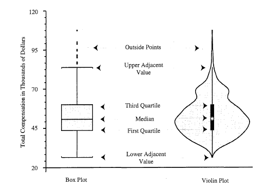
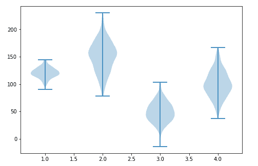

# Matplotlib 小提琴剧情-小提琴剧情()函数

> 原文：<https://www.studytonight.com/matplotlib/matplotlib-violin-plot-violinplot-function>

在本教程中，我们将介绍**小提琴剧情**以及如何使用 Matplotlib 库中的`violinplot()`功能创建小提琴剧情。

小提琴图用于表示不同数值下数据的**概率密度，与 **[马特洛特利布盒图](https://www.studytonight.com/matplotlib/matplotlib-box-plot-boxplot-function)** 十分相似。**

*   这些图主要是箱线图和直方图的**组合**。

*   小提琴图通常描绘**数据的分布、中位数、四分位数范围**。

*   其中，**四分位数和中位数**是**统计信息**，由**箱线图**提供，而**分布由直方图**提供。

*   小提琴图也用于表示不同“类别”之间可变分布的**比较；就像盒子图。**

*   小提琴图**的信息量更大**，因为它们显示了数据的完整分布**。**

下图显示了盒式情节和小提琴情节的常见组成部分:

****

## 小提琴情节的创作

`violinplot()`法用于小提琴剧情的创作。

该方法所需的**语法**如下:

```py
violinplot(dataset, positions, vert, widths, showmeans, showextrema,showmedians,quantiles,points=1, bw_method, *, data)
```

### 因素

该功能的参数描述如下:

*   **数据集**

    This parameter denotes the array or sequence of vectors. It is the **input data**.
*   **位置**

    This parameter is used to set the positions of the violins. In this, the ticks and limits are set automatically in order to match the positions. It is an array-like structured data with the **default as = [1, 2, …, n]**.
*   绿色

    This parameter contains the boolean value. If the value of this parameter is set to **true** then it will create a vertical plot, otherwise, it will create a horizontal plot.
*   **显示方式**

    This parameter contains a `boolean` value with false as its default value. If the value of this parameter is True, then it will toggle the rendering of the means.
*   **表现极端**

    This parameter contains the boolean values with false as its default value. If the value of this parameter is True, then it will toggle the rendering of the extrema.
*   **显示中间值**

    This parameter contains the boolean values with false as its default value.If the value of this parameter is True, then it will toggle the rendering of the medians.
*   量词

    This is an array-like data structure having None as its default value.If value of this parameter is not None then,it set a list of floats in interval [0, 1] for each violin,which then stands for the quantiles that will be rendered for that violin.
*   **分**

    It is scalar in nature and is used to define the number of points to evaluate each of the Gaussian kernel density estimations.
*   **bw_method**

    This method is used to calculate the estimator bandwidth, for which there are many different ways of calculation. The default rule used is **Scott's Rule**, but you can choose ‘silverman’, a scalar constant, or a callable.

现在是时候深入一些例子来澄清概念了:

## 小提琴剧情基本示例:

下面我们有一个简单的例子，我们将为不同的数据集合创建小提琴图。

```py
import matplotlib.pyplot as plt
import numpy as np

np.random.seed(10)
collectn_1 = np.random.normal(120, 10, 200)
collectn_2 = np.random.normal(150, 30, 200)
collectn_3 = np.random.normal(50, 20, 200)
collectn_4 = np.random.normal(100, 25, 200)

data_to_plot = [collectn_1, collectn_2, collectn_3, collectn_4]

fig = plt.figure()

ax = fig.add_axes([0,0,1,1])

bp = ax.violinplot(data_to_plot)
plt.show()
```

输出如下:



## 时间就是活生生的例子！

让我们来看看小提琴情节的真实例子:

总结:

在本教程中，我们通过几个例子介绍了如何创建一个小提琴图，以及`violinplot()`方法的各种参数。

* * *

* * *