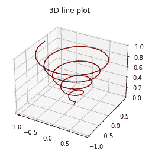
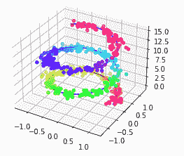

# Matplotlib 三维绘图——折线和散点图

> 原文：<https://www.studytonight.com/matplotlib/matplotlib-3d-plotting-line-and-scatter-plot>

在本教程中，我们将介绍 Matplotlib 中的**三维绘图。**

需要注意的是，Matplotlib 最初设计时只考虑了二维绘图。但是后来，一些**三维绘图工具**被建立在 matplotlib 的二维显示之上，这为 Matplotlib 中的三维数据可视化提供了一套工具。

此外，2D 图用于显示单对轴之间的关系，即 **x 和 y** ，而 3D 图则允许我们探索 **3 对轴之间的关系**，即 **x-y、x-z 和 y-z**

## 三维绘图

在 Matplotlib 中的三维绘图可以通过启用**实用工具包**来完成。可以通过**导入** `mplot3d`库来启用实用工具工具包，该库是通过 **pip** 与您的标准 Matplotlib 安装一起提供的。

在**导入该子模块**后，可以通过将关键字`projection="3d"`传递到 Matplotlib 中的任意**常规轴创建功能来创建 3D 图。**

让我们介绍一些在 matplotlib 中使用这个子模块进行三维绘图的例子。

## 三维折线图

以下是绘制三维折线图的语法:

```py
Axes3D.plot(xs, ys, *args, **kwargs)
```

通过下面给出的代码片段，我们将介绍 Matplotlib 中的三维折线图:

```py
from mpl_toolkits import mplot3d
import numpy as np
import matplotlib.pyplot as plt

fig = plt.figure()
ax = plt.axes(projection='3d')
z = np.linspace(0, 1, 100)
x = z * np.sin(30 * z)
y = z * np.cos(30 * z)

ax.plot3D(x, y, z, 'maroon')
ax.set_title('3D line plot')
plt.show()
```

以下是它的输出:



## 三维散点图

以下是三维散点图的语法:

```py
Axes3D.scatter(xs, ys, zs=0, zdir='z', s=20, c=None, depthshade=True, *args, **kwargs)
```

### 争论

| 争吵 | 描述 |
| --- | --- |
| **xs** 、 **ys** | 这两个参数指示数据点的位置。 |
| **zs** | 它可以是长度与 *xs* 和 *ys* 相同的数组，也可以是将所有点置于同一平面的单个值。该参数的**默认值为 **0** 。** |
| 【T0 是】T1 | 此参数用于指示在绘制 2D 集时使用哪个方向作为 z(“x”、“y”或“z”)。 |
| **s** | 此参数用于以磅为单位指示大小。它可以是标量，也可以是长度与 *x* 和 *y* 相同的数组。 |
| **c** | 此参数用于指示颜色。 |
| **深度阴影** | 此参数用于告诉是否要为散点图着色，以给出深度的外观。该参数的默认值为*真*。 |

通过下面给出的代码片段，我们将介绍 Matplotlib 中的三维散点图:

```py
fig = plt.figure()
ax = plt.axes(projection="3d")

z_line = np.linspace(0, 15, 500)
x_line = np.cos(z_line)
y_line = np.sin(z_line)
ax.plot3D(x_line, y_line, z_line, 'blue')

z_points = 15 * np.random.random(500)
x_points = np.cos(z_points) + 0.1 * np.random.randn(500)
y_points = np.sin(z_points) + 0.1 * np.random.randn(500)
ax.scatter3D(x_points, y_points, z_points, c=z_points, cmap='hsv');

plt.show()
```

输出结果是:



## 总结:

在本教程中，我们学习了 Matplotlib 中三维绘图的基础知识，以及如何通过代码示例进行线和散点图。

* * *

* * *