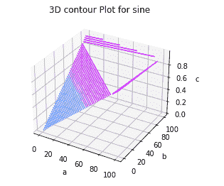

# Matplotlib 3D 等高线图- contour3d()函数

> 原文：<https://www.studytonight.com/matplotlib/matplotlib-3d-contour-plot-contour3d-function>

在本教程中，我们将使用 Matplotlib 库介绍三维中的**等高线图。**

要绘制或启用 3d 绘图，您只需导入 **mplot3d** 工具包。

有一个名为`ax.contour3D()`的函数，用于创建**三维等高线图**。

该功能要求所有**输入数据**都是二维规则网格的**形式，其 **Z 数据在每个点**进行评估。**

## 三维等高线图示例

在下面给出的例子中，我们将为**正弦函数**创建一个三维等高线图。代码片段如下所示:

```py
from mpl_toolkits import mplot3d 
import numpy as np 
import matplotlib.pyplot as plt 
from matplotlib import cm 
import math 

x = [i for i in range(0, 200, 100)] 
y = [i for i in range(0, 200, 100)] 

X, Y = np.meshgrid(x, y) 
Z = [] 
for i in x: 
    t = [] 
    for j in y: 
        t.append(math.sin(math.sqrt(i*2+j*2))) 
    Z.append(t) 

fig = plt.figure() 
ax = plt.axes(projection='3d') 
ax.contour3D(X, Y, Z, 50, cmap=cm.cool) 
ax.set_xlabel('a') 
ax.set_ylabel('b') 
ax.set_zlabel('c') 
ax.set_title('3D contour Plot for sine') 
plt.show() 
```

上述代码中使用的函数解释如下:

*   **网格网格**

    这是 NumPy 库的一个功能，用于从两个给定的一维数组中创建一个**矩形网格**，表示**笛卡尔或矩阵索引**。

*   **plt.axes()**

    该功能用于创建轴的对象。

*   **ax . 3d 轮廓**

    该功能用于创建轮廓

*   ax . set _ xlabel

    该功能用于设置 x 轴的标签

*   **ax.set_title()**

    该功能用于为地块提供标题

以下是上述代码的**输出**:



## 总结:

在上一个教程中，我们介绍了三维线图和散点图，并介绍了 matplotlib 中的三维图。在本教程中，我们介绍了 matplotlib 中的三维等高线图。

* * *

* * *