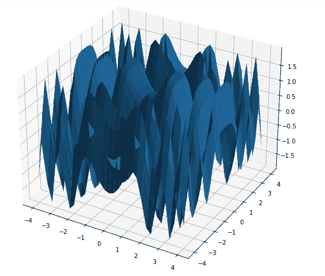

# Matplotlib 三维曲面绘图-绘图 _ 曲面()函数

> 原文：<https://www.studytonight.com/matplotlib/matplotlib-3d-surface-plot-plot_surface-function>

在本教程中，我们将介绍如何在 matplotlib 库中创建**三维曲面图**。

在 Matplotlib 的 **mpl_toolkits.mplot3d** 工具包中有`axes3d`提供必要的功能，这些功能在创建 **3D 曲面图**时非常有用。

三维数据集的表示主要称为**表面图**。

*   有一点需要注意的是，表面图提供了 X 和 Z 两个自变量和指定的**因变量 Y** 之间的关系**，而不仅仅是显示单个数据点。**

*   曲面图是等高线图的**伴生图，与**线框图**相似，但也有区别，它是**每个线框基本上是一个填充多边形**。**

*   借助于此，**曲面的拓扑可以非常容易地可视化**。

## 三维曲面图的创建

为了创建三维表面图，在 matplotlib 中使用`ax.plot_surface()`函数。

该功能所需的**语法**如下所示:

```
ax.plot_surface(X, Y, Z)
```

在上面的语法中，X 和 Y 主要表示点 X 和 Y 的 2D 数组，而 Z 用于表示高度的 2D 数组。

### `plot_surface()`属性

该功能的一些属性如下:

**1。遮阳**

该属性用于给面部颜色着色。

**2 .面色〔t1〕**

此属性用于指示单个曲面的面颜色

**3。vmax**

该属性指示地图的最大值。

**4 .虚拟机**

该属性指示地图的最小值。

**5。定额**

该属性作为一个实例来规范化颜色映射的值

**6。颜色**

该属性指示表面的颜色

**7\. cmap**

该属性指示表面的颜色映射

**8 .rcunt〔t1〕**

该属性用于指示要使用的行数**该属性的默认**值为 **50**

**9 .账户**

该属性用于指示要使用的列数**该属性的默认**值为 **50**

**10。rstride**

该属性用于指示行步幅的数组(即步长)

**11 时。cstride**

此属性用于指示列跨度的数组(即步长)

## 三维表面绘图基本示例

下面我们有一个代码，我们将使用上述功能创建一个三维表面图:

```
from mpl_toolkits import mplot3d 
import numpy as np 
import matplotlib.pyplot as plt 

x = np.outer(np.linspace(-4, 4, 33), np.ones(33)) 
y = x.copy().T
z = (np.sin(x **2) + np.cos(y **2) ) 

fig = plt.figure(figsize =(14, 9)) 
ax = plt.axes(projection ='3d') 

ax.plot_surface(x, y, z) 

plt.show() 
```

上述代码的输出如下:



## 梯度表面图

该图结合了**三维表面图和 2D 等高线图**。在“渐变”曲面图中，三维曲面的颜色与 2D 等高线图相同。表面高的部分包含不同的颜色，而不是表面低的部分。

所需的语法是:

```
ax.plot_surface(X, Y, Z, cmap, linewidth, antialiased)
```

其中`cmap`用于设置表面的**颜色。**

## 渐变表面绘图示例

现在是时候覆盖渐变表面图了。其代码片段如下所示:

```
from mpl_toolkits import mplot3d 
import numpy as np 
import matplotlib.pyplot as plt 

x = np.outer(np.linspace(-3, 3, 32), np.ones(32)) 
y = x.copy().T 
z = (np.sin(x **2) + np.cos(y **2) ) 

fig = plt.figure(figsize =(14, 9)) 
ax = plt.axes(projection ='3d') 

my_cmap = plt.get_cmap('cool') 

surf = ax.plot_surface(x, y, z, cmap = my_cmap, edgecolor ='none') 

fig.colorbar(surf, ax = ax, shrink = 0.7, aspect = 7) 

ax.set_title('Surface plot') 

plt.show() 
```

上述代码的输出如下:


* * *

* * *