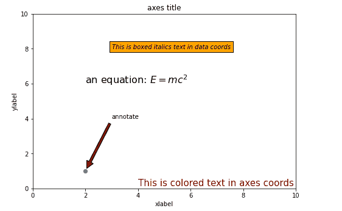

# 在 Matplotlib 中使用文本

> 原文：<https://www.studytonight.com/matplotlib/working-with-text-in-matplotlib>

在本教程中，我们将介绍如何使用 Matplotlib 中的文本。

Matplotlib 中有广泛的文本支持，包括对数学表达式的支持**、对栅格**的 **Truetype 支持、**矢量输出**，还有任意旋转的换行符分隔文本， **Unicode 支持**。**

## 使用文本

Matplotlib 库有自己的`matplotlib.font_manager`，用于实现跨平台、符合 W3C 标准的字体查找算法。

*   在这种情况下，用户对文本属性有很大的**控制，如字体大小、字体粗细、文本位置和颜色等。**

*   Matplotlib 库实现了大量的 TeX 数学符号和命令，为图形中任何地方的数学表达式提供支持。

下面给出了用于在 **Pyplot 界面**以及面向对象界面中创建文本的命令列表:

| **pyplot 界面** | **面向对象界面** | **描述** |
| 文本 | 文本 | 该命令用于在轴的任意位置添加文本。 |
| 给…作注解 | 给…作注解 | 该命令用于在任意位置添加带有可选箭头的注释。 |
| xlabel(电缆) | set_xlabel | 该命令用于向轴的 x 轴添加标签。 |
| 伊兰贝尔 | set _ ylabel-设定值 | 此命令用于向轴的 y 轴添加标签。 |
| 标题 | 设置标题 | 此命令用于向轴添加标题。 |
| fittext | 文本 | 该命令用于在图形的任意位置添加文本。 |
| 小标题 | 小标题 | 该命令用于向图形添加标题。 |

所有这些函数都创建并返回一个`Text`实例，该实例可以配置各种字体和其他相关属性。

## 比如时间！！

现在我们来看一个例子，在这个例子中，我们将以不同的风格向图中添加不同的文本信息:

```py
import matplotlib.pyplot as plt
fig = plt.figure()

ax = fig.add_axes([0,0,1,1])

ax.set_title('axes title')
ax.set_xlabel('xlabel')
ax.set_ylabel('ylabel')

ax.text(3, 8, 'This is boxed italics text in data coords', style='italic', 
bbox = {'facecolor': 'orange'})

ax.text(2, 6, r'an equation: $E = mc^2$', fontsize = 16)

ax.text(4, 0.05, 'This is colored text in axes coords',
verticalalignment = 'bottom', color = 'maroon', fontsize = 15)

ax.plot([2], [1], 'o')
ax.annotate('annotate', xy = (2, 1), xytext = (3, 4),
arrowprops = dict(facecolor = 'maroon', shrink = 0.05))
ax.axis([0, 10, 0, 10])
plt.show()
```

以下是上述代码的输出:



* * *

* * *