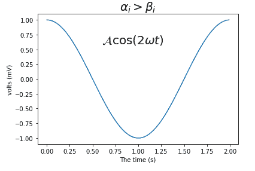

# matplotlib 中的数学表达式

> 原文：<https://www.studytonight.com/matplotlib/mathematical-expressions-in-matplotlib>

在本教程中，我们将介绍如何在绘制任何数据集时用 matplotlib 编写数学表达式。

## 写数学表达式

子集 **TeX 标记**可以用于任何 matplotlib 文本字符串，只需将其放入一对**美元符号($)** 中即可。

*   为了制作下标和上标，分别使用`_`和`^`符号。

*   要创建分数、二项式和堆叠数，可以分别使用`\frac{}{}`、`\binom{}{}`和`\genfrac{}{}{}{}{}{}`命令。

*   此外，可以通过`\sqrt[]{}`命令产生部首。

*   对于数学符号，默认字体是斜体。

让我们举个例子来更清楚地理解。

## 使用数学表达式:

在下面给出的例子中，我们将表示**下标**和**上标**:

```py
r'$\alpha_i> \beta_i$'

import numpy as np
import matplotlib.pyplot as plt
t = np.arange(0.0, 2.0, 0.01)
s = np.cos(1*np.pi*t)

plt.plot(t,s)
plt.title(r'$\alpha_i> \beta_i$', fontsize=20)

plt.text(0.6, 0.6, r'$\mathcal{A}\mathrm{cos}(2 \omega t)$', fontsize = 20)
plt.xlabel('The time (s)')
plt.ylabel('volts (mV)')
plt.show()
```

以下是上述代码的输出:



* * *

* * *