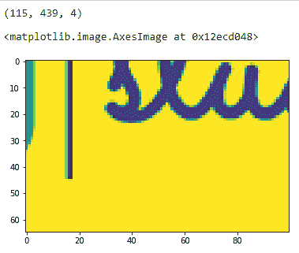

# 在 Matplotlib 中使用图像

> 原文：<https://www.studytonight.com/matplotlib/working-with-images-in-matplotlib>

在本教程中，我们将介绍如何在 Matplotlib 库中处理图像。

在 Matploltlib 库中，`image`模块用于在图和图形中添加图像。

*   matplotlib 只支持 **PNG 图像**。

*   图像模块`imread(`有两种有用且重要的方法，分别用于读取图像 **)** 和`imshow`(用于显示图像)。

**现在我们将介绍一些展示如何使用图像的示例:**

## 例 1:

在代码片段中，我们将使用`imread()`读取图像，然后使用`imshow()`显示图像:

```py
import matplotlib.pyplot as plt 
import matplotlib.image as img 

testImage = img.imread('C:\\Users\\StudyTonight\\Desktop\\logoo.png') 

plt.imshow(testImage) 
```

以下是输出:


## 例 2:

在下面给出的代码示例中，我们使用`imread()`读取图像，然后以数组的形式表示它:

```py
import matplotlib.pyplot as plt 
import matplotlib.image as img 

testImage = img.imread('C:\\Users\\StudyTonight\\Desktop\\logoo.png') 

print(testImage) 
```

[[[1。1.1.1.】
【1。1.1.1.】
【1。1.1.1.】
...
【1。1.1.1.】
【1。1.1.1.】
【1。1.1.1.】】

【【1】。1.1.1.】
【1。1.1.1.】
【1。1.1.1.】
...
【1。1.1.1.】
【1。1.1.1.】
【1。1.1.1.】】

【【1。1.1.1.】
【1。1.1.1.】
【1。1.1.1.】
...
【1。1.1.1.】
【1。1.1.1.】
【1。1.1.1.】】

...

【【1。1.1.1.】
【1。1.1.1.】
【1。1.1.1.】
...
【1。1.1.1.】
【1。1.1.1.】
【1。1.1.1.】】

【【1。1.1.1.】
【1。1.1.1.】
【1。1.1.1.】
...
【1。1.1.1.】
【1。1.1.1.】
【1。1.1.1.】

【【1】。1.1.1.】
【1。1.1.1.】
【1。1.1.1.】
...
【1。1.1.1.】
【1。1.1.1.】
【1。1.1.1.]]]

## 例 3:

在下面给出的示例中，我们将修改图像的所有参数:

```py
import matplotlib.pyplot as plt 
import matplotlib.image as img 

testImage = img.imread('C:\\Users\\StudyTonight\\Desktop\\logoo.png') 

print(testImage.shape) 

modifiedImage = testImage[50:200, 100:200, 1] 

plt.imshow(modifiedImage) 
```

在上面的代码中，图像的高度是 150 像素(从第 50 个像素开始显示)，宽度是 100 像素(从第 100 个像素开始显示)，模式值是 1。

以下是上述代码的输出:



## 结论:

至此，我们的 Matplotlib 教程到此结束。我们将继续向本教程添加更多的教程页面和指南，以及一些 Matplotlib 图和图形的应用程序。

* * *

* * *