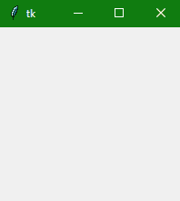
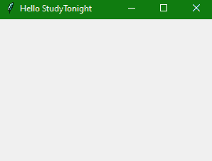

> 哎哎哎:# t0]https://www . studytonight . com/tkinter/tkinter-windows


# Tkinter Windows

在本教程中，我们将学习 Python 中的 Tkinter 窗口，这是图形用户界面应用程序的主窗口，其他所有组件都在其中运行。我们已经介绍了基本的 Tkinter GUI 应用程序组件，其中我们解释了 Tkinter 窗口、小部件和框架是如何构成 Tkinter 应用程序的。

## Tkinter Windows

Tkinter 窗口是 Tkinter 图形用户界面的**基础元素**。Tkinter 窗口是一个**容器，所有其他图形用户界面元素(小部件)都位于其中**。

以下是创建基本 Tkinter 窗口的**语法**:

```py
win = Tk()
```

是的，我们使用 Tk()函数来创建我们的 Tkinter 应用程序窗口，其中添加了所有其他组件。

### Tkinter 窗口示例:

这里有一个简单的例子，

```py
from tkinter import *

win = Tk()

# run the app window
win.mainloop()
```



在上例中，`mainloop()`功能用于运行 GUI 应用程序。

## Tkinter 自定义窗口

现在让我们来看一个基本的例子，我们将使用像**标题**和**几何图形**这样的属性来创建一个基本的图形用户界面应用程序。

这里我们有代码来演示在创建定制的 Tkinter 窗口时使用的步骤:

```py
from tkinter import *

window = Tk()
# You can add your widgets here

window.title('Hello StudyTonight')
window.geometry("300x200+10+20")
window.mainloop()
```



下面是我们在代码中所做的工作:

*   第一步是导入代码中的 **Tkinter 模块。**

*   导入后，第二步是通过调用`Tk()`函数设置应用对象。这将创建一个顶层窗口(根)，该窗口具有一个带有**标题栏**和**控制框**的框架，带有最小化和关闭按钮，以及一个**客户端区域来保存其他小部件**。

*   之后，您可以在代码中添加您可能想要添加的小部件，如按钮、文本框、滚动条、标签等等。

*   `window.title()`功能用于向用户界面提供标题，如您在输出中所见。

*   行内`window.geometry("300x200+10+20)`；`geometry()`方法以同样的方式定义帧左上角**的**宽度**、**高度、**和**坐标**(所有值一般以像素为单位)。以下是语法:**

    ```py
    window.geometry("widthxheight+XPOS+YPOS")
    ```** 
***   之后，应用对象通过调用`mainloop()`方法进入**事件监听循环**。这样，应用程序现在就在**上不断地等待在其中的元素上生成的任何事件**。可以有类似于在文本字段中输入的**文本、从下拉菜单**或单选按钮中进行的**选择、鼠标的单/双击动作等事件。**** 

 **应用程序的功能包括**响应特定类型的事件执行适当的回调函数**。

一旦点击标题栏上的**关闭按钮，事件循环将终止。**

## 总结:

在本教程中，我们学习了如何创建一个 Tkinter 窗口来创建一个 GUI 应用程序。that 窗口包含构成应用程序的所有小部件。

* * *

* * ***