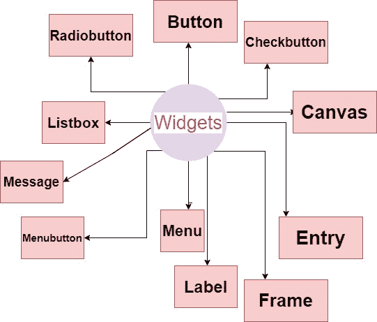

> 哎哎哎:# t0]https://www . studytonight . com/tkinter/python-tkinter widget

# python tkinter widgets

在本教程中，我们将概述 Python 中的 Tkinter 小部件。这些小部件是任何 Tkinter GUI 应用程序上的功能单元。

## tkinter widgets

有各种控件，如图形用户界面应用程序中使用的**按钮**、**标签**、**滚动条**、**单选按钮**和**文本框**。这些**小组件**或**图形用户界面(GUI)** 的控件在 Tkinter 中被称为**小部件**。

这些是 Python Tkinter 模块中提供的 **19 小部件**。下面我们列出了所有的小部件和基本描述:

| **小部件名称** | **描述** |
| --- | --- |
| [按钮](http://studytonight.com/tkinter/python-tkinter-button-widget) | 如果您想在应用程序中添加一个按钮，那么将使用**按钮部件**。 |
| [帆布](http://studytonight.com/tkinter/python-tkinter-canvas-widget) | 绘制复杂的布局和图片(如图形、文本等。)**将使用画布小部件**。 |
| [检查按钮](http://studytonight.com/tkinter/python-tkinter-checkbutton-widget) | 如果你想显示一些选项作为复选框，那么使用**检查按钮部件**。它允许您一次选择多个选项。 |
| [条目](http://studytonight.com/tkinter/python-tkinter-entry-widget) | 显示从用户**输入部件**接受值的**单行文本字段**将被使用。 |
| [框架](http://studytonight.com/tkinter/python-tkinter-frame-widget) | 为了分组和组织另一个小部件，将使用框架小部件。基本上，它充当了**一个容纳其他小部件**的容器。 |
| 标签 | 要为另一个小部件提供**单行标题**，将使用标签小部件。它也可以**包含图像**。 |
| [列表框](http://studytonight.com/tkinter/python-tkinter-listbox-widget) | 要向用户提供选项列表，将使用**列表框小部件**。 |
| 菜单 | 将使用向用户提供命令的**菜单部件**。基本上这些**命令在菜单按钮**中。这个小部件主要创建应用中需要的**各种菜单**。 |
| [菜单按钮](http://studytonight.com/tkinter/python-tkinter-menubutton-widget) | **菜单按钮部件**用于向用户显示菜单项。 |
| [消息](http://studytonight.com/tkinter/python-tkinter-message-widget) | **消息小部件**主要向用户显示一个消息框。基本上是不可编辑的**多行文本。** |
| [单选按钮](http://studytonight.com/tkinter/python-tkinter-radiobutton-widget) | 如果您希望选项的数量显示为单选按钮，那么将使用**单选按钮部件**。您可以一次选择一个。 |
| [刻度](http://studytonight.com/tkinter/python-tkinter-scale-widget) | **刻度小部件**主要是一个**图形滑块**，允许你从刻度中选择数值。 |
| [滚动条](http://studytonight.com/tkinter/python-tkinter-scrollbar-widget) | 要上下滚动窗口，将使用 python 中的**滚动条小部件**。 |
| [文字](http://studytonight.com/tkinter/python-tkinter-text-widget) | **文本小部件**主要为用户提供一个**多行文本字段**，用户可以在其中输入或编辑文本，与 Entry 不同。 |
| [上一层](http://studytonight.com/tkinter/python-tkinter-toplevel-widget) | **顶层小部件**主要是给我们提供一个单独的窗口容器 |
| [旋转盒](http://studytonight.com/tkinter/python-tkinter-spinbox-widget) | **旋转框**作为“**入口小部件**的入口，在该小部件中，只要**选择一个固定数值**就可以输入数值。 |
| [平板式窗口](http://studytonight.com/tkinter/python-tkinter-panedwindow-widget) | **窗格**也是**容器小部件**，主要用于**处理不同的窗格**。放置在其内部的窗格可以**水平或垂直** |
| [标签框架](http://studytonight.com/tkinter/python-tkinter-labelframe-widget) | **LabelFrame 小部件**也是一个容器小部件，主要用来处理复杂的小部件。 |
| [消息框](http://studytonight.com/tkinter/python-tkinter-messagebox) | **消息框** **小部件**主要用于在桌面应用程序中显示消息。 |

使用上面提到的所有小部件，我们可以创建令人惊叹的图形用户界面应用程序。

## 总结:

因此，在本教程中，我们获得了对小饰品的基本介绍。在接下来的教程页面中，我们将详细介绍每个小部件及其各自的代码示例。

* * *

* * *