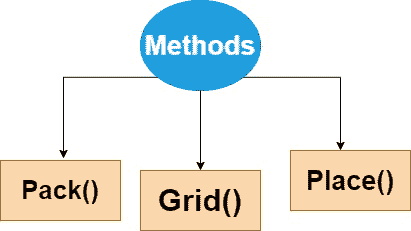
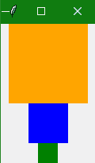
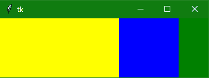
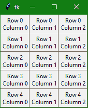
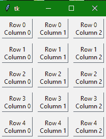
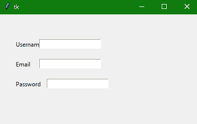

# Tkinter 几何管理器

> 原文：<https://www.studytonight.com/tkinter/python-tkinter-geometry-manager>

在本教程中，我们将学习如何在 Tkinter **几何管理器**的帮助下控制应用程序的**布局。**

## 控制 Tkinter 应用程序布局

为了**组织或排列或放置父窗口中的所有小部件**，Tkinter 为我们提供了小部件的**几何配置**。图形用户界面应用程序布局主要由 Tkinter 的几何管理器控制。

这里需要注意的是，应用程序中的每个窗口和`Frame`只能使用一个几何管理器。此外，**不同的框架**可以使用不同的几何图形管理器，即使它们已经使用另一个几何图形管理器分配给一个框架或窗口。

几何管理器中主要有三种方法:



让我们逐一详细讨论每种方法。

## 1.Tkinter `pack()`几何图形管理器

`pack()`方法主要使用**打包算法**，以便按照指定的顺序在`Frame`或窗口中放置小部件。

这种方法主要用于**将小部件组织在一个块**中。

### 打包算法:

打包算法的步骤如下:

*   首先，该算法将**计算一个矩形区域**，称为**包裹**，该区域足够高(或宽)以容纳小部件，然后它将使用**空白空间**填充窗口中的剩余宽度(或高度)。

*   它将使小部件居中，直到指定了任何不同的位置。

这种方法很强大，但很难想象。

以下是使用`pack()`函数的**语法**:

```py
widget.pack(options) 
```

下面给出了作为该方法参数的可能选项:

*   **fill**

    该选项的默认值设置为**无**。此外，我们可以将其设置为 **X 或 Y** ，以确定**小部件是否包含任何额外空间**。

*   **side**

    该选项指定将小部件包装在的哪一侧。如果要垂直打包**小部件**，使用 **TOP** ，这是默认值。如果要水平打包**小部件**，使用**左键**。

*   **expand**

    该选项用于**指定是否应该扩展小部件以填充几何主图形中的任何额外空间**。其默认值为`false`。如果是`false`，则**小部件不展开**，否则小部件会展开以填充额外的空间。

### Tkinter `pack()`几何图形管理器示例:

让我们讨论一个例子，在这个例子中，我们将看到当您将三个彩色的小部件(这里是 [Tkinter Frame 小部件](https://www.studytonight.com/tkinter/python-tkinter-frame))放入一个窗口时会发生什么:

```py
import tkinter as tk

win = tk.Tk()

# add an orange frame
frame1 = tk.Frame(master=win, width=100, height=100, bg="orange")
frame1.pack()

# add blue frame
frame2 = tk.Frame(master=win, width=50, height=50, bg="blue")
frame2.pack()

# add green frame
frame3 = tk.Frame(master=win, width=25, height=25, bg="green")
frame3.pack()

window.mainloop()
```



根据上面代码的输出，`pack()`方法只是默认将每个`Frame`放置在**前面的**下面，按照它们被分配到窗口的相同**顺序。**

### 带参数的 Tkinter `pack()`

让我们再举几个使用此函数参数的代码示例，如`fill`、`side`和`expand`。

您可以设置 **`fill`** 参数，以指定您希望帧填充的**方向。如果要填充**水平**方向，则选项为`tk.X`，反之，`tk.Y` 用于**垂直填充**，双向填充`tk.BOTH`。**

让我们举另一个例子，我们将堆叠三个框架，使每个框架水平填充整个窗口:

```py
import tkinter as tk

win= tk.Tk()

frame1 = tk.Frame(master=win, height=80, bg="red")
# adding the fill argument with 
# horizontal fill value
frame1.pack(fill=tk.X)

frame2 = tk.Frame(master=win, height=50, bg="yellow")
frame2.pack(fill=tk.X)

frame3 = tk.Frame(master=win, height=40, bg="blue")
frame3.pack(fill=tk.X)

win.mainloop()
```


在上面的输出中，您可以看到帧填满了应用程序窗口的整个宽度，因为我们使用了`fill`参数的`tk.X`值。

现在让我们举另一个代码示例，我们将使用所有选项，即`fill`、`side`和`pack()`方法的`expand`选项:

```py
import tkinter as tk

win = tk.Tk()

frame1 = tk.Frame(master=win, width=200, height=100, bg="Yellow")
# setting fill, side and expand
frame1.pack(fill=tk.BOTH, side=tk.LEFT, expand=True)

frame2 = tk.Frame(master=win, width=100, bg="blue")
frame2.pack(fill=tk.BOTH, side=tk.LEFT, expand=True)

frame3 = tk.Frame(master=win, width=50, bg="green")
frame3.pack(fill=tk.BOTH, side=tk.LEFT, expand=True)

win.mainloop()
```



如果您将在系统中运行上面的代码，那么您可以看到这个输出能够双向扩展。

## 2.Tkinter `grid()`几何图形管理器

最常用的几何管理器是`grid()`，因为它提供了`pack()`功能的所有功能，但方式更简单、更易维护。

`grid()`几何管理器主要用于将窗口或框架拆分为行和列。

*   只需调用`grid()`函数，并将**行**和**列索引**分别传递给`row`和`column`关键字参数，即可**轻松指定小部件**的位置。

*   行和列的索引都从`0`开始，所以 **2** 的行索引和 **2** 的列索引告诉`grid()`函数在第三行的**第三列放置一个小部件(0 表示第一，1 表示第二，2 表示第三)。**

以下是`grid()`函数的**语法**:

```py
widget.grid(options) 
```

下面给出了作为该方法参数的可能选项:

*   **栏**

    此选项指定要放置小部件的列号。**最左侧**列的索引为 **0** 。

*   **行**

    此选项指定要放置小部件的行号。最上面的**行由 **0** 表示。**

*   **柱跨**

    此选项指定小部件的宽度。它主要表示列扩展到的列数。

*   **行跨度**

    此选项指定小部件的高度。它主要表示行扩展到的行数。

*   **帕德克斯，帕德**

    该选项主要表示要添加到小部件边框外的**小部件的填充像素数量。**

*   **ipad，ipad**

    该选项主要用于表示小部件边框内要添加到小部件**的填充像素数量。**

*   **粘性**

    如果任意单元格大于一个小部件，那么粘性主要是**用来指定小部件在单元格内的位置。**基本上是代表小部件位置的粘性字母的串联。可能是北、东、西、南、东北、西北、南北、东西、东南。

### Tkinter `grid()`几何图形管理器示例:

下面的代码脚本将帮助您创建一个由框架组成的 **5 × 3 网格**，其中包含`Label`小部件:

```py
import tkinter as tk

win = tk.Tk()

for i in range(5):
    for j in range(3):
        frame = tk.Frame(
            master = win,
            relief = tk.RAISED,
            borderwidth = 1
        )
        frame.grid(row=i, column=j)
        label = tk.Label(master=frame, text=f"Row {i}\nColumn {j}")
        label.pack()

win.mainloop()
```



如果您想要**添加一些填充**，那么您可以使用以下代码片段来完成:

```py
import tkinter as tk

win = tk.Tk()

for i in range(5):
    for j in range(3):
        frame = tk.Frame(
            master=win,
            relief=tk.RAISED,
            borderwidth=1
        )
        frame.grid(row=i, column=j, padx=5, pady=5)
        label = tk.Label(master=frame, text=f"Row {i}\nColumn {j}")
        label.pack()

win.mainloop()
```



正如您在上面的代码示例中看到的，我们使用了`padx`和`pady`参数，因为这些参数在小部件外部应用了填充。要在框架小部件中添加填充，请在代码中使用参数`ipadx`和`ipady`。

同样，也要尝试为`grid()`几何图形管理器使用其他参数。

## 3.韦小宝`place()`几何经理

`place()`几何管理器组织小部件，按照程序员的指示将它们放置在特定位置。

*   这个方法基本上是**按照其 **x 和 y 坐标**来组织小部件**。x 和 y 坐标都以**像素**为单位。

*   因此原点(其中`x`和`y`都是`0`)是`Frame`的**左上角**或者窗口。

*   因此，`y`参数指定了距离窗口顶部的空间的**像素数，以放置小部件，`x`参数指定了距离窗口左侧**的**像素数。**

以下是`place()`方法的**语法**:

```py
widget.place(options)
```

下面给出了作为该方法参数的可能选项:

*   **x，y**

    该选项以像素为单位指示**水平和垂直**偏移。

*   **高、宽**

    该选项以像素为单位表示小部件的**高度和重量**。

*   **锚**

    该选项主要表示小部件在容器内的**精确位置**。默认值(方向)是**西北**即(左上角)。

*   **妓院模式**

    该选项表示边框类型的**默认值为`INSIDE`，也是指忽略边框内的父元素。另一种选择是`OUTSIDE`。**

*   **relx，依靠**

    该选项用于表示 0.0 到 1.0 之间的浮动，是水平和垂直方向上的**偏移量。**

*   继电器高度，继电器宽度

    该选项用于表示 0.0 到 1.0 之间的浮点值，表示**父代的高度和宽度**的分数。

### Tkinter `place()`几何图形管理器示例:

下面给出了这方面的代码片段:

```py
from tkinter import *
top = Tk()  
top.geometry("400x250")  
Username = Label(top, text = "Username").place(x = 30,y = 50)  
email = Label(top, text = "Email").place(x = 30, y = 90)  
password = Label(top, text = "Password").place(x = 30, y = 130)  
e1 = Entry(top).place(x = 80, y = 50)  
e2 = Entry(top).place(x = 80, y = 90)  
e3 = Entry(top).place(x = 95, y = 130)  
top.mainloop() 
```



在上面的代码示例中，我们使用了 [Tkinter 标签](http://studytonight.com/tkinter/python-tkinter-label)和 [Tkinter 输入小部件](http://studytonight.com/tkinter/python-tkinter-entry)，我们将在接下来的教程中详细介绍它们。

## 总结:

在本教程中，我们学习了如何在图形用户界面应用程序的框架或窗口中定位小部件。我们了解了三个 Tkinter 几何管理器，即 pack()，grid()和 place()。

从下一个教程开始，我们将开始介绍不同的 Tkinter 小部件。

* * *

* * *