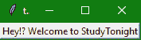
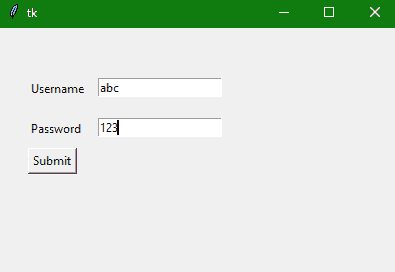

> 哎哎哎:# t0]https://www . studytonight . com/tkinter/python-tkinter label widget


# Python Tkinter Label Widget

在本教程中，我们将介绍 Python 中的 Tkinter **标签小部件**，它用于在 GUI 应用程序中创建一个标签，我们可以在其中显示任何文本或图像。

Tkinter 中的**标签小部件**用于**显示框****可以放置图片和文字**。

*   **标签小部件**主要用于**向用户**提供关于 Python 应用**中使用的**其他小部件**的消息**。

*   您可以随时在标签小部件中更改或更新 tex t。

*   这个小部件在显示一些文本时，只使用**一种字体。**

*   您可以执行其他任务，如**给文本的某个部分加下划线**，也可以**将文本跨到多行**。

*   在**标签**中显示的文本或文本的**部分有各种选项**可以配置。****

## Tkinter Label Widget

标签小部件的**语法**如下所示，

```py
W = Label(master,options) 
```

在上面的语法中，`master`参数表示**父窗口。**您可以使用许多`options`来配置文本，这些选项被写成**逗号分隔的键值对**。

### Tkinter Label Widget 选项

以下是标签小部件使用的选项:

| **选项名称** | **描述** |
| --- | --- |
| `anchor` | 该选项主要用于控制文本在提供的小部件尺寸中的**位置。默认值为**中心，用于对齐所提供空间中**中心的文本。** |
| `bd` | 该选项用于**小部件**的边框宽度。它的默认值是 2 像素。 |
| `bitmap` | 该选项用于将**位图设置为指定的图形对象**，以便现在标签可以表示图形而不是文本。 |
| `bg` | 该选项用于小部件的背景**颜色。** |
| `cursor` | 该选项用于指定当鼠标在标签上移动时**显示什么类型的光标。**该选项默认使用**标准光标**。 |
| `fg` | 该选项用于指定写在小部件内的**文本的前景色。** |
| `font` | 该选项**指定标签内文字**的字体类型。 |
| `height` | 该选项指示部件的**高度** |
| `image` | 该选项表示显示为标签的图像**。** |
| `justify` | 该选项指定标签中多条线的**对齐。默认值为**中心**。其他值为右、左；你可以根据你的要求来证明** |
| `padx` | 该选项表示文本的**水平填充**。该**选项的默认值为 1** 。 |
| `pady` | 该选项指示文本的**垂直填充**。该**选项的默认值为 1** 。 |
| `relief` | 该选项指示**边框的类型。**该选项的默认值为**平** |
| `text` | 此选项设置为字符串变量，它可能包含一行或多行文本 |
| `textvariable` | 该选项与带有标签的**Tinter 变量**相关联。如果你改变这个变量的值，那么标签内的**文本将被更新**。 |
| `underline` | 该选项用于**给文本的特定部分加下划线。**该选项的默认值=-1(无下划线)；您可以**将其设置为 n** 以内的任意整数值，计数从 0 开始。 |
| `width` | 该选项**表示小部件**的宽度。 |
| `wraplength` | 不要让**只有一行作为标签文本**，你可以把它分成任意多行，每一行都有这个选项指定的**字符数。** |

## Tkinter 标签小部件示例

现在让我们看看标签小部件的一个基本示例，下面给出了代码片段:

```py
import tkinter
from tkinter import *

win = Tk()

var = StringVar()
label = Label( win, textvariable=var, relief=RAISED )

# set label value
var.set("Hey!? Welcome to StudyTonight")

label.pack()
win.mainloop()
```

## 

在上面的代码中，我们创建了一个简单的变量`StringVar()`，然后给它赋值，这个变量被赋值给 Label 小部件的`textvariable`选项。

## Tkinter 标签小部件-另一个例子

下面我们有另一个代码片段，以便更清楚地理解。让我们看看下面给出的代码片段:

```py
from tkinter import *   

win = Tk()  

win.geometry("400x250")  

#creating a label  
username = Label(win, text = "Username").place(x = 30,y = 50)  

#creating second label  
password = Label(win, text = "Password").place(x = 30, y = 90)  

submitbutton = Button(win, text = "Submit",activebackground = "red", activeforeground = "blue").place(x = 30, y = 120)  

e1 = Entry(win,width = 20).place(x = 100, y = 50)  

e2 = Entry(win, width = 20).place(x = 100, y = 90)    

win.mainloop() 
```

无论何时运行上述代码，在用户名和密码标签中输入**值后，当您点击提交按钮时，其**颜色变为红色**。**



不要担心上面代码中使用的按钮小部件和入口小部件，我们将在接下来的教程中很快介绍它们。这个例子是为了让你了解如何使用 Tinter 小部件为你的 Tinter 应用程序创建用户界面。

## 总结:

在本教程中，我们介绍了 Tkinter Label Widget，它用于在 Tkinter GUI 应用程序中显示文本和图像，或者添加带有表单输入字段的文本，就像我们在上面的示例中所做的那样。

* * *

* * *