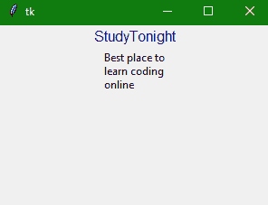

> 哎哎哎:# t0]https://www . studytonight . com/tkinter/python-tkinter-message widget


# Python Tkinter Message Widget

在本教程中，我们将学习 Python 中的 Tkinter **消息小部件**，它用于在您使用 Tkinter 创建的 GUI 应用程序上显示一些文本消息。

Python 中的 Tkinter **消息小部件**主要用于**向使用应用程序的用户显示一些消息**。

*   Tkinter **消息小部件**显示的消息为**不可编辑类型**，可以是多行中的**。**
*   Tkinter **消息小部件**显示的**消息**包含**单字体文本**。

*   这个小部件的**功能非常**类似于[的](https://www.studytonight.com/tkinter/python-tkinter-label-widget)**Tkit Label 小部件、**但是有一个区别**，那就是消息小部件可以**自动换行**。**

## Tkinter Message Widget

Tkinter 消息小部件的**语法**如下所示:

```py
W = Message(master,options) 
```

在上面的语法中，`master`参数表示**父窗口**。您可以使用许多`options`来更改消息的**外观，这些选项被写成**逗号分隔的键值对**。**

### Tkinter Message Widget 选项:

以下是 Tkinter 消息小部件使用的各种选项:

| **选项名称** | **描述** |
| --- | --- |
| `anchor` | 主要用于确定**文本**在所提供空间内的准确位置。该选项的默认值为**中心**。 |
| `bg` | 该选项表示小部件的**背景颜色。** |
| `bd` | 该选项用于**指示小部件**的边框宽度。这个**的默认值是 2 像素**。 |
| `bitmap` | 为了在小部件上**显示图形**，将使用该选项。您可以将其设置为**任何图形或图像对象**。 |
| `cursor` | 在此选项的帮助下，**鼠标指针将变为特定的光标类型**，如**箭头、圆点等**。 |
| `fg` | 该选项用于**指示小部件文本**的字体颜色。 |
| `font` | 该选项用于**指示小部件文本**的字体类型。 |
| `height` | 该选项用于**指示消息小部件**的垂直尺寸。 |
| `image` | 该选项用于**指示小部件**上的图像。 |
| `justify` | 该选项用于小部件上文本的**对齐。可以是**中心，左，右**** |
| `padx` | 该选项用于小部件的**水平填充。** |
| `pady` | 该选项用于小部件的**垂直填充。** |
| `relief` | 该选项用于**指定边框类型**。它的默认值是 FLAT |
| `underline` | 该选项可以按顺序设置为现有数字，以指定字符串的第 n 个字母**将带有下划线**。其默认值为 **-1** ，表示无下划线。 |
| `text` | 如果您想在标签小部件中显示**一行或多行文本，您需要将此**选项设置为包含文本的字符串**。您可以在**中使用“\n”来输入多行**** |
| `textvariable` | 该选项用于**控制小部件**所代表的文本。`textvariable`可以设置为需要在小部件上显示的文本。 |
| `width` | 该选项用于**以字符数而非像素**表示小部件的水平尺寸。 |
| `wraplength` | 该**选项用于将文本**换行到所需的行数，只需将**选项设置为所需的行数，使得每行仅包含该数量的字符**。 |

## Tkinter 消息小部件示例

下面我们有一个 Tkinter 消息小部件的基本示例:

```py
from tkinter import *

win = Tk() 
win.geometry("300x200") 

w = Label(win, text ='StudyTonight', font = "90",fg="Navyblue") 
w.pack() 

msg = Message(win, text = "Best place to learn coding online") 

msg.pack() 

win.mainloop() 
```

## 

在上面的代码示例中，我们创建了一个简单的标签小部件和一个包含一些文本消息的消息小部件。

## 总结:

至此，我们已经介绍了用于在 Tkinter GUI 应用程序中显示消息的 Tkineter 消息小部件。我们还可以动态创建消息小部件来显示 Tkinter 应用程序中的错误或成功消息。

* * *

* * *