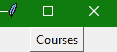
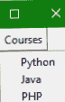

# Tkinter `Menubutton`小部件

在本教程中，我们将介绍 Python 中的 Tkinter **菜单按钮小部件**，该小部件用于创建**下拉菜单**，用户可以点击该菜单查看

*   这个小部件用于在 Python 应用程序中提供**各种类型的菜单**。

*   需要注意的是，应用程序中的每个菜单按钮**都与一个**菜单小部件**相关联，作为回报**可以在用户点击该菜单按钮**时显示该菜单按钮的选项。**

*   Tkinter Menubutton 小部件为**用户提供了一个选项**，以选择应用程序中存在的**适当选项**。

## Tkinter Menubutton Widget

Tkinter 菜单按钮小部件的语法如下:

```py
W = Menubutton(master, options) 
```

在上面的语法中，`master`参数表示**父窗口。**您可以使用许多`options`来更改菜单按钮的**外观，这些选项被写成**逗号分隔的键值对**。**

### Tkinter Menubutton Widget 选项:

以下是 Tkinter 菜单按钮小部件使用的各种选项:

| **选项名称** | **描述** |
| --- | --- |
| `activebackground` | 该选项指示鼠标悬停在菜单按钮上时**菜单按钮的背景颜色。** |
| `bd` | 该选项用于**以像素为单位表示边框**的宽度。默认值为 2 像素。 |
| `bitmap` | 该选项将被设置为图形内容**，该图形内容将被显示给小部件**。 |
| `bg` | 该选项用于**表示小部件**的背景颜色。 |
| `cursor` | 当鼠标悬停在菜单按钮上时，该选项指示光标**。** |
| `activeforeground` | 该选项主要**表示小部件处于焦点**时**小部件的字体颜色** |
| `fg` | 该选项代表微件的**前景色。** |
| `direction` | 借助该选项，您可以指定方向，以便菜单可以**显示到按钮**的指定方向。您可以使用**左、右或上方**相应地放置小部件。 |
| `disabledforeground` | 该选项指示小部件禁用时小部件的**文本颜色** |
| `height` | 该选项指示菜单按钮的高度。该高度在**文本行**的情况下表示**文本行数**，在图像的情况下表示**像素数**。 |
| `image` | 该选项指示菜单按钮上显示的图像。 |
| `higlightcolor` | 此选项指示按钮上有焦点时的高亮颜色 |
| `justify` | 该选项用于指示多条文本行的表示方式**。**左对齐设置为左对齐，右对齐设置为右对齐，中心对齐设置为中心。 |
| `padx` | 该选项指示小部件在**水平方向**的附加填充。 |
| `pady` | 该选项指示小部件在**垂直方向**的附加填充。 |
| `menu` | 该选项用于**指示与菜单按钮**相关联的菜单 |
| `width` | 此选项指定小部件的宽度。对于文本按钮，它以若干字母的形式存在；对于图像按钮，它表示像素 |
| `Wraplength` | 在这种情况下，如果该选项的值是**设置为正数**，文本行将被包裹**，以便适合该长度**。 |
| `state` | 由于**菜单按钮的正常状态为启用**。可以将**设置为禁用，使菜单按钮无响应**。 |
| `text` | 该选项用于在小部件上指示**文本。** |
| `textvariable` | 类**字符串变量**的控制变量可以与该菜单按钮相关联。如果您将**设置控制变量**，那么它将改变显示的文本。 |
| `underline` | 此**选项主要用于表示小部件的**文本中的字符的索引**，该字符将被加下划线**。**索引通常从文本**中的零开始。 |
| `relief` | 该选项用于**指定边框类型**。它的默认值是 REGISTED |

## Tkinter 菜单按钮小部件示例

现在让我们看一下 Tkinter 菜单按钮小部件的代码片段:

```py
from tkinter import *
import tkinter

win = Tk()

mbtn = Menubutton(win, text="Courses", relief=RAISED)
mbtn.grid()
mbtn.menu = Menu(mbtn, tearoff = 0)
mbtn["menu"] = mbtn.menu

pythonVar = IntVar()
javaVar = IntVar()
phpVar = IntVar()

mbtn.menu.add_checkbutton(label="Python", variable=pythonVar)
mbtn.menu.add_checkbutton(label="Java", variable=javaVar)
mbtn.menu.add_checkbutton(label="PHP", variable=phpVar)

mbtn.pack()
win.mainloop()
```

上述代码的输出如下:



你可以自己试试上面的例子。每当您执行上述代码时，您会看到一个窗口上有一个名为**课程**的 Tkinter **菜单按钮**，当您点击它时，它会显示一个如下所示的**下拉菜单**:



总结:

在本教程中，我们介绍了用于在 Tkinter 应用程序中创建下拉菜单的 Tkinter Menubutton 小部件。

* * *

* * *