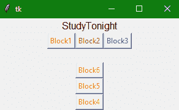

# Python Tkinter Frame Widget

> 原文：<https://www.studytonight.com/tkinter/python-tkinter-frame-widget>

Tkinter **框架小部件**用于**以更好更友好的方式分组和组织**小部件。**框架小部件**基本上是一个**容器**(一个不可见的容器)，其任务是容纳**其他小部件**和**相对于彼此排列**。Tkinter 框架部件在屏幕上组成一个**矩形区域**。

它基本上充当一个**基础类**，然后**实现复杂的小部件**。这就像[的 HTML div 标签](https://www.studytonight.com/html5-references/html-div-tag)，它只是用来定义网页上有其他 HTML 元素的部分。

## Tkinter Frame Widget

框架小部件的**语法**如下:

```
W = Frame(master, options) 
```

在上面的语法中，`master`参数表示**父窗口。**您可以使用许多`options`来更改框架的**外观，这些**选项**被写成**逗号分隔的键值对**。**

### Tkinter 框架小部件选项:

以下是框架小部件使用的各种选项:

| **选项名称** | **描述** |
| `bd` | 该选项用于表示边框的**宽度。其默认值为 **2 像素**。** |
| `bg` | 该选项用于指示小部件的**正常背景颜色**。 |
| `cursor` | 借助该选项，可以将鼠标指针更改为光标类型，即**设置为不同的值，如箭头、点等。** |
| `height` | 该选项用于指示框架的**高度。** |
| `width` | 该选项用于指示框架的**宽度。** |
| `highlightbackground` | 该选项表示**背景色在对焦时的颜色。** |
| `highlightthickness` | 该选项用于指定小部件处于焦点下时边框周围的**厚度。** |
| `relief` | 该选项指定框架边框的**类型。其默认值为**平板**** |
| `highlightcolor` | 该选项主要用于表示**框**有**焦点**时**焦点高亮**的颜色。 |

## Tkinter 框架小部件示例

下面我们有一个基本的例子，我们将在一个框架小部件中组织不同的按钮小部件。让我们看看下面给出的代码片段:

```
from tkinter import *

root = Tk() 
root.geometry("300x150") 

w = Label(root, text ='StudyTonight', font = "80") 
w.pack() 

frame = Frame(root) 
frame.pack() 

bottomframe = Frame(root) 
bottomframe.pack(side = BOTTOM) 

button1 = Button(frame, text ="Block1", fg ="red") 
button1.pack(side = LEFT) 

button2 = Button(frame, text ="Block2", fg ="brown") 
button2.pack(side = LEFT) 

button3 = Button(frame, text ="Block3", fg ="blue") 
button3.pack(side = LEFT) 

button4 = Button(bottomframe, text ="Block4", fg ="orange") 
button4.pack(side = BOTTOM) 

button5 = Button(bottomframe, text ="Block5", fg ="orange") 
button5.pack(side = BOTTOM) 

button6 = Button(bottomframe, text ="Block6", fg ="orange") 
button6.pack(side = BOTTOM) 

root.mainloop()
```

### 

在上面的代码示例中，我们创建了两个框架小部件，然后在这些框架中添加了 3 个按钮，并使用 Tkit 几何管理器在应用程序窗口中排列按钮，

## 摘要

在本教程中，我们了解了 Tkinter Frame 小部件，以及如何使用它来管理其他 Tkinter 小部件并正确定位它们。

* * *

* * *