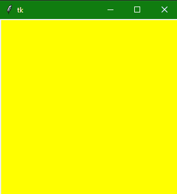
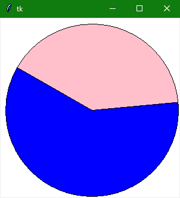

> 哎哎哎:# t0]https://www . studytonight . com/tkinter/python-tkinter-canvas widget


# Python Tkinter Canvas Widget

**Tkinter Canvas widget** 主要作为**通用** widget，也就是**用来在 Tkinter 中的应用窗口上绘制**任何东西。

*   这个小部件主要用于绘制图形和**图、图纸、图表和显示图像**。

*   可以借助画布绘制**多种复杂布局**，如**多边形**、**矩形**、**椭圆形**、**文字**、**弧形位图**、**图形**等。

*   画布小部件也用于**创建图形编辑器**。

*   有许多选项可用于配置和控制**画布小部件**。

## Tkinter Canvas Widget

**画布小部件**的**语法**如下所示:

```py
w = Canvas(master, option=value)
```

在上面的语法中，`master`参数表示**父窗口**。您可以使用许多选项来更改画布的布局，这些**选项**被写成**逗号分隔的键值**。

### Tkinter Canvas Widget 选项:

以下是画布小部件使用的各种选项:

| **选项名称** | **描述** |
| `bd` | 该选项主要用于设置边框的**宽度，单位为像素。**默认值 0px 表示无边框，1px 表示细线边框，可以增加边框宽度。 |
| `bg` | 该选项用于设置**背景色**。 |
| `cursor` | 光标是否使用**画布上的箭头、圆点或圆圈，可以使用该选项。** |
| `confine` | 该选项设置为使画布**在滚动区域**外不可滚动。 |
| `height` | 该选项用于控制画布的**高度。** |
| `width` | 该选项用于**设置小部件**的宽度。 |
| `highlightcolor` | 当**有焦点在按钮**上时，该选项指示高亮颜色 |
| `xscrollcommand` | 在这种情况下，如果画布是可滚动类型的，那么这个属性应该作为水平滚动条的`set()` **方法** |
| `yscrollcommand` | 在这种情况下，如果画布是可滚动类型的，那么这个属性应该作为垂直滚动条的`set()` **方法** |
| `scrollregion` | 这个选项主要用于表示指定为包含画布区域的元组的坐标 |
| `xscrollincrement` | 如果该选项的值设置为正值，则**画布仅放置为该值的倍数。** |
| `yscrollincrement` | 主要用于垂直运动，其工作方式与`xscrollincrement`选项相同。 |

## Tkinter 画布小部件基本示例

让我们借助画布小部件创建一个简单的画布:

```py
from tkinter import *   

# window named top
top = Tk()  
# set height and width of window 
top.geometry("300x300")  

#creating a simple canvas with canvas widget  
cv = Canvas(top, bg = "yellow", height = "300")  

cv.pack()  

top.mainloop()
```

 

上面的代码会创建一个**简单画布**，背景颜色**黄色**，你可以在上面画任何东西。

## 使用弧线的饼图

让我们在下面给出的代码片段的帮助下，创建一个画布，然后在其上绘制一个**弧**:

```py
import tkinter

# init tk
root = tkinter.Tk()

# creating canvas
mCanvas = tkinter.Canvas(root, bg="white", height=300, width=300)

# drawing two arcs
coord = 10, 10, 300, 300
arc1 = mCanvas.create_arc(coord, start=0, extent=150, fill="pink")
arc2 = mCanvas.create_arc(coord, start=150, extent=215, fill="blue")

# adding canvas to window and display it
mCanvas.pack()
root.mainloop() 
```



上面的代码会打开一个窗口，然后**添加一个画布，然后在上面画两个弧线**。由**粉色**和**蓝色**绘制的两条弧线共同组成一个圆，如上图所示。

## 总结:

在本教程中，我们了解了 Tkinter 画布小部件，它可以用来在画布上绘制任何东西，可能是图表、图像或一些动态形状。

* * *

* * *