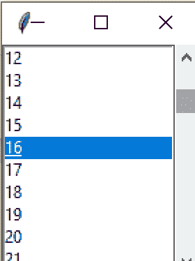
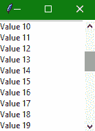

> 哎哎哎:# t0]https://www . studytonight . com/tkinter/python-tkinter scroll widget


# python tkinter scrollbar widget

在本教程中，我们将介绍 Python 中的 Tkinter **Scrollbar 小部件**，使用它我们可以在我们的 Tkinter 应用程序的用户界面中添加一个滚动条。

要在 Python 桌面应用程序中向上或向下或向右或向左滚动**内容**，需要使用 Tkinter **滚动条小部件**。

*   要滚动**列表框**、**画布**等其他小部件的内容，我们使用这个小部件。

*   **水平和垂直滚动条**都可以在[饰品入口小部件](https://www.studytonight.com/tkinter/python-tkinter-entry-widget)中创建。

下面我们有一张图片，显示了与列表框一起使用的滚动条小部件:



## tkinter scrollbar widget

**滚动条部件**的**语法**如下所示:

```py
W = Scrollbar(master, options) 
```

在上面的语法中，`master`参数表示**父窗口**。您可以使用许多**选项**来配置滚动条部件，这些**选项**被写成**逗号分隔的键值对**。

### tkinter scrollbar widget 选项:

以下是 Tkinter Scrollbar 小部件使用的各种选项:

| **选项名称** | **描述** |
| --- | --- |
| `activebackground` | 该选项表示**小部件处于焦点**时的背景颜色。 |
| `bg` | 该选项代表小部件的**背景颜色** |
| `bd` | 该选项**代表小部件**的边框大小。默认值为 2 像素。 |
| `cursor` | 借助该选项，**鼠标指针将变为特定的光标类型，可以是箭头、点等**。 |
| `command` | 每次移动滚动条时，该选项将被**设置为相关的程序，称为**。 |
| `elementborderwidth` | 此选项主要表示箭头和滑块周围的边框宽度。该选项的默认值为-1。 |
| `highlightthickness` | 该选项**代表聚焦高光的厚度** |
| `highlightbackground` | 当**部件不在焦点**下时，该**选项指示高亮颜色** |
| `highlightcolor` | 当**部件处于焦点**下时，该**选项指示高亮颜色** |
| `jump` | 该选项是**用来控制滚动跳转**的行为。如果该选项设置为 1，则在用户释放鼠标按钮时**调用回调。** |
| `orient` | 根据滚动条的方向，该选项可以设置为水平或垂直。 |
| `width` | 该选项**代表滚动条**的宽度。 |
| `troughcolor` | 该选项用于**设置波谷**的颜色 |
| `takefocus` | 默认情况下**可以通过这个小部件**来定位焦点。如果您不想要此行为，可以将此选项设置为 0。 |
| `repeatdelay` | 该选项主要用于**在滑块开始在该方向上重复移动**之前**告知按钮被按下的持续时间**。其默认值为 **300 毫秒** |
| `repeatinterval` | **该选项的默认值为 100** |

### Tkinter 滚动条小部件方法:

Tkinter Scrollbar 小部件使用的几种方法是:

*   `get()`:

    这个方法返回两个数字，假设`a`和`b`(T2)代表滚动条的当前位置。

*   `set(first, last)`:

    此方法用于将滚动条连接到任何其他小部件。也就是其他小部件的`yscrollcommand`或者`xscrollcommand`到这个方法。

## Tkinter 滚动条小部件示例

下面我们有一个滚动条小部件的基本例子。

```py
from tkinter import *  

win= Tk()  
sbb = Scrollbar(win)  
sbb.pack(side = RIGHT, fill = Y)  

mylist = Listbox(win, yscrollcommand = sbb.set)  

for line in range(45):  
    mylist.insert(END, "Value " + str(line))  

mylist.pack(side = LEFT)
sbb.config(command = mylist.yview)

mainloop()
```



从上面的代码中可以看到，我们已经创建了一个[列表框小部件](http://www.studytonight.com/tkinter/python-tkinter-listbox-widget)，其中的列表项是数字。然后我们创建了一个滚动条小部件，并使用列表框小部件的`yscrollcommand`选项来设置滚动条小部件。我们在这里使用了滚动条部件的`set`功能。

## 总结:

因此，我们已经介绍了 Tkinter Scrollbar 小部件。当我们有一个长列表的 Tkinter 应用程序或者一些太长而不适合应用程序窗口的小部件时，这非常有用。然后，我们可以将滚动条小部件用于此类应用程序。

* * *

* * *