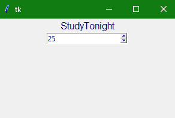

> 哎哎哎:# t0]https://www . studytonight . com/tkinter/python-tkinter-spinbox 小部件


# Python Tkinter Spinbox 小部件

在本教程中，我们将介绍 Python 中的 Tkinter **Spinbox 小部件**及其语法和几个示例。Python 中 Tkinter 的 Spinbox 小部件用于**从指定的给定值范围**中选择一个值。

它与**[Tkinter Scale widget](https://www.studytonight.com/tkinter/python-tkinter-scale-widget)**(Scale widget 更时尚)在风格上有所不同，但或多或少实现了相同的目的。

例如，当您希望有一个数值下拉列表，如出生年份(从 1950 年到 2020 年)或一个下拉列表供用户选择他们的年龄时，我们可以使用 Tkinter Spinbox 小部件。

*   当我们希望用户输入一个特定范围内的数值时，这个小部件是条目小部件的替代。

*   该小部件仅在用户需要从给定的选择范围中进行选择的情况下使用。

## Tkinter Spinbox 小部件

**自旋盒小部件**的语法如下:

```py
w = Spinbox(master, option=value)
```

在上面的语法中，`master`参数表示**父窗口**。您可以使用许多**选项**来配置您的 spinbox 小部件，这些**选项**被写成**逗号分隔的键值对**。

### Tkinter Spinbox 小部件选项:

以下是 Tkinter Spinbox 小部件使用的各种选项:

| **选项名称** | **描述** |
| --- | --- |
| `bg` | 该选项用于小部件的背景**颜色。** |
| `bd` | 该选项用于小部件的**边框宽度** |
| `command` | 该选项用于指示小部件的**关联功能**，每次小部件状态改变时都会调用该功能。 |
| `cursor` | 借助该选项，您的**鼠标指针类型可以更改**为分配给该选项的光标类型。 |
| `activebackground` | 该选项表示微件在**焦点**下时的**背景色** |
| `disabledbackground` | 当**禁用**时，该选项用于指示小部件的**背景颜色**。 |
| `disabledforeground` | 此选项用于指示小部件禁用时的**前景色**。 |
| `font` | 该选项指定小部件内文本的**字体类型。** |
| `fg` | 该选项指定小部件的**前景色。** |
| `format` | 该选项主要用于**格式字符串**。此选项没有默认值。 |
| `from_` | 该选项用于指示小部件的**起始范围** |
| `justify` | 该选项指定标签中多条线的**对齐。默认值为**左**。其他值为右和中。** |
| `relief` | 该选项表示边框的**类型。该选项的默认值为**下沉**。** |
| `state` | 该选项用于表示小部件的**状态。该选项的默认值为**正常**。其他值有“禁用”、“只读”等。** |
| `validate` | 该选项用于控制**如何验证小部件**的值 |
| `to` | 该选项代表小部件值的**最大限值。另一个值由来自 _** 选项的**指定** |
| `repeatdelay` | 该选项主要用于**控制自动重复按钮**。这里的值**以毫秒为单位。** |
| `repeatinterval` | 该选项类似于**重复延时选项**。这里的值也是以毫秒为单位给出的**。** |
| `validatecommand` | 该选项与**函数回调**的相关联，该函数用于对小部件的内容进行**验证。** |
| `xscrollcommand` | 该选项主要与[滚动条小部件](https://www.studytonight.com/tkinter/python-tkinter-scrollbar-widget)的`set()`方法一起使用，使该**小部件可水平滚动** |
| `wrap` | 该选项主要用于**收拢旋转盒**的上下按钮 |
| `width` | 该选项指示小部件的**宽度。** |
| `vcmd` | 该选项**类似于 validatecommand** 。 |
| `values` | 该选项表示包含部件的**值的**元组**** |
| `textvariable` | 它是一个控制变量，用于**控制小部件**的文本 |

### Tkinter Spinbox 小部件方法:

以下是 Tkinter Spinbox 小部件使用的各种方法:

| **方法名称** | **描述** |
| --- | --- |
| `invoke(element)` | 该方法用于**调用与小部件相关联的回调**。 |
| `insert(index,string)` | 我们使用这个方法主要是在给定的指定索引处插入字符串 |
| `index(index)` | 要获取给定索引的绝对值，将使用此方法 |
| `identify(x,y)` | 该方法用于**识别指定范围内的小部件元素** |
| `get(startindex, endindex)` | 此方法用于获取指定范围内的字符 |
| `delete(startindex, endindex)` | 此方法用于删除指定范围内的字符 |

## Tkinter Spinbox Widget 示例

下面我们有一个 Spinbox 小部件的基本例子。让我们看看下面给出的代码片段:

```py
from tkinter import *

win = Tk() 
win.geometry("300x200") 

w = Label(win, text ='StudyTonight', fg="navyblue",font = "50") 
w.pack() 

sp = Spinbox(win, from_= 0, to = 50) 
sp.pack() 

win.mainloop() 
```



在上面的代码中，我们创建了一个简单的应用程序窗口，有一个[标签小部件](https://www.studytonight.com/tkinter/python-tkinter-label-widget)和一个范围从 **0** 到 **50** 的 Spinbox 小部件。

## 总结:

这就是 TKinter Spinbox 小部件的工作原理。它用于为用户可以选择的指定数值范围创建输入。如果我们有一个定义的数字范围，那么最好使用自旋盒小部件，而不是使用 [Tkinter Entry 小部件](https://www.studytonight.com/tkinter/python-tkinter-entry-widget)。

* * *

* * *