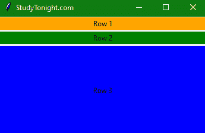
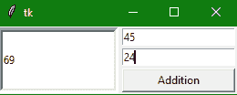
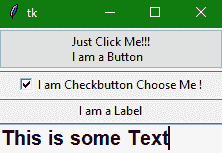

> 哎哎哎:# t0]https://www . studytonight . com/tkinter/python-tkinter-panel dwindw 小部件


# python tkinter panedwindow widget

在本教程中，我们将介绍 Tkinter **PanedWindow 小部件**，它主要是一个包含一个或多个子小部件的**容器小部件，也称为 **Panes** 。**

*   该小部件以垂直的**或水平的**方式排列子小部件。****

*   它也被称为 [**几何管理器**](https://www.studytonight.com/tkinter/python-tkinter-geometry-manager) 小部件。

*   这个小部件用于在使用 Tkinter 模块创建的 Python 桌面应用程序中实现不同的布局。

*   用户可以通过鼠标移动分隔线**和边框**来调整**面板窗口小部件**内的**子小部件**的大小。

*   您可以使用**面板插件**实现多个面板**。**

这是一个简单的 Tkit 应用程序窗口，三个小部件垂直堆叠在一个 PanedWindow 小部件中。

****

## tkinter panedwindow widget

PanedWindow 小部件的**语法**如下所示:

```
W = PanedWindow(master, options) 
```

在上面的语法中，`master`参数表示**父窗口**。您可以使用许多选项来更改面板的**外观，这些选项被写成逗号分隔的**。

### tkinter panedwindow widget 选项:

以下是 PanedWindow 小部件使用的各种选项:

| **选项名称** | **描述** |
| --- | --- |
| `bd` | 该选项用于**表示小部件**的 3D 边框尺寸。该选项的默认值表示**槽不包含边框，箭头和滑块包含 2 像素边框尺寸**。 |
| `bg` | 该选项代表小部件的**背景颜色。** |
| `cursor` | 该选项将鼠标指针转换为指定的光标类型**，并可设置为**箭头、点等。 |
| `borderwidth` | 该选项用于**指示小部件**的边框宽度。该选项的默认值为 **2 像素**。 |
| `handlepad` | To 表示手柄和窗扇末端之间的**距离**我们使用这个选项。在水平方向，它是窗扇顶部和把手之间的**距离。该选项的默认值为 **8 像素**** |
| `height` | 该选项代表小部件的**高度。如果我们没有指定高度，那么**高度将通过子部件**的高度来计算。** |
| `handlesize` | 该选项代表手柄的**大小，默认值为 8 像素。此外，**手柄将始终处于方形**** |
| `orient` | 如果我们想将**和子窗口**并排放置，该选项的值将被设置为**水平**。如果我们想从上到下放置子窗口**，那么**这个选项的值将被设置为垂直**。** |
| `sashpad` | 该选项用于表示围绕每个窗扇进行的**填充。该选项的**默认值**为 **0** 。** |
| `sashwidth` | 该**选项指示窗扇**的宽度。**这个选项的默认值是 2 像素**。 |
| `sashrelief` | 该选项用于表示每个窗扇周围的**类型的边框。该选项的默认**值为平面**** |
| `showhandle` | 要显示**手柄，该选项的值应设置为真**。该选项的默认值为**假**。 |
| `width` | 该选项**代表小部件**的宽度。如果我们没有指定高度，那么高度将通过子部件的**高度来计算。** |
| `relief` | 该选项**表示边框类型**。**这个选项的默认值是 FLAT** 。 |

### Tkinter PanedWindow 小部件方法:

以下是 PanedWindow 小部件使用的一些方法:

| **方法名称** | **描述** |
| --- | --- |
| `config(options)` | 这种方法主要用于配置任何带有指定选项的小部件。 |
| `get(startindex,endindex)` | 此方法用于获取指定给定范围内的文本。 |
| `add(child,options)` | 此方法用于将窗口添加到父窗口。 |

## Tkinter PanedWindow 小部件示例

下面我们有一个理解 PanedWindow 小部件的基本例子。让我们看看下面给出的代码片段:

```
from tkinter import *  

# event handler for button
def addition():  
    x = int(e1.get())  
    y = int(e2.get())  
    leftdata = str(x+y)  
    leftinput.insert(1, leftdata)  

# first paned window
w1 = PanedWindow()  
w1.pack(fill=BOTH, expand=1)  

leftinput = Entry(w1, bd=5)  
w1.add(leftinput)  

# second paned window
w2 = PanedWindow(w1, orient=VERTICAL)  
w1.add(w2)  

e1 = Entry(w2)
e2 = Entry(w2)

w2.add(e1)  
w2.add(e2)  

bottomBtn = Button(w2, text="Addition", command=addition)  
w2.add(bottomBtn)  

mainloop()
```



如上图所示，在输出中，我们有一个应用程序窗口，其中有 3 个 [tkinter Entry 小部件](https://www.studytonight.com/tkinter/python-tkinter-entry-widget)和 1 个 [tkinter button 小部件](https://www.studytonight.com/tkinter/python-tkinter-button-widget)，使用 2 个 PanedWindow 小部件**堆叠在一起，相互垂直排列**。

如果您愿意，在右侧输入小部件中提供两个数字，然后单击加法按钮，右侧数字相加的结果，将显示在左侧的输入小部件中。

## Tkinter PanedWindow 小部件-多个窗格示例

让我们看看下面给出的这个小部件的另一个代码片段:

```
from tkinter import * 
from tkinter import tk 

win = Tk() 

pw = PanedWindow(orient ='vertical') 
#creating Button widget 
top = tk.Button(pw, text ="Just Click Me!!!\nI am a Button") 
top.pack(side=TOP) 

#Adding button widget to the panedwindow 
pw.add(top) 

#Creating Checkbutton Widget 
bot = Checkbutton(pw, text="I am Checkbutton Choose Me!") 
bot.pack(side=TOP) 
pw.add(bot) 

label = Label(pw, text="I am a Label") 
label.pack(side=TOP) 

pw.add(label) 

string = StringVar() 

entry = Entry(pw, textvariable=string, font=('arial', 15, 'bold')) 
entry.pack() 

# This is used to force focus on particular widget 
# that means widget is already selected for some operations 
entry.focus_force() 

pw.add(entry) 
pw.pack(fill = BOTH, expand = True) 

# To show sash 
pw.configure(sashrelief = RAISED) 

mainloop() 
```



在上面的代码示例中，我们已经在 panedwindow 小部件中创建了多个小部件。我们还使用了`StringVar()`变量，并使用了`focus_force()`函数在加载应用程序时使入口小部件处于焦点位置。

## 总结:

在本教程中，我们了解了 PanedWindow 小部件，如果您想在应用程序中创建多列网格状的小部件排列，这是一个很好的小部件。

* * *

* * *