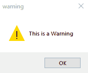
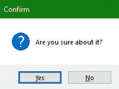
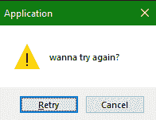
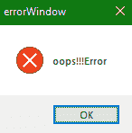

# Tkinter 消息框

在本教程中，我们将介绍如何在开发桌面应用时创建和使用 **Tkinter MessageBox** 。

为了在桌面应用中显示消息框，我们使用了 **Tkinter** 中的**消息框**模块。

*   该模块中存在各种功能**，有助于**根据**的要求**提供合适类型的消息**。**

***   借助这个模块，我们可以创建**弹出消息框，接受用户输入**。

    *   消息框模块的功能如下:`showError()`、`askretrycancel()`、`showwarning()`等。，所有这些都用于创建消息框。** 

 **## tkinter messagebox-tkinter 信使信箱

要使用 messagebox 模块，我们首先需要在 python 脚本中导入它:

```py
from tkinter import messagebox
```

下面是使用消息框的**基本语法**:

```py
messagebox.function_name(title, message [, options]) 
```

在上面的语法中，我们使用了以下内容:

*   **功能 _ 名称**

    这用于指示相应消息框函数的名称。

*   **标题**

    这用于指示要在相应消息框的标题栏中显示的文本。

*   **消息**

    这用于指示要在消息框中显示为消息的文本。

*   **选项**

    它用于指示各种选项，以便配置消息框。它有两个值，分别是**默认**和**父**。

    *   **默认:**用于指定一个默认按钮，如 ABORT、RETRY、IGNORE。

    *   **父级:**用于指定一个窗口，我们将在该窗口的顶部显示消息框。

**消息框模块**中的功能使用相同的语法，但每个功能的功能不同。

让我们看看 Tkinter MessageBox 模块的几个功能。

## Tkinter MessageBox - `showwarning()`

该方法用于在 Python 应用中向用户显示任何警告。

下面是相同的代码:

```py
from tkinter import *  

from tkinter import messagebox  

win = Tk()  
win.geometry("200x200")  
messagebox.showwarning("warning","This is a Warning")  

win.mainloop() 
```



## Tkinter MessageBox - `askquestion()`

MessageBox 中的这种方法主要用于**向用户**提问，可以在**是**或者**否**中回答。

此方法的代码如下:

```py
from tkinter import *  
from tkinter import messagebox  

win = Tk()  
win.geometry("100x100")  
messagebox.askquestion("Confirm","Are you sure about it?")  
win.mainloop() 
```



## Tkinter MessageBox - `askretrycancel()`

如果你想**要求用户做任何特定的任务**或者不做，那么将使用这个方法。

让我们看看相同的代码:

```py
from tkinter import *  
from tkinter import messagebox  

win= Tk()  
win.geometry("100x100")  
messagebox.askretrycancel("Application"," wanna try again?")  

win.mainloop() 
```



## Tkinter MessageBox - `showerror()`

要显示**错误信息**，将使用该方法。

让我们看看下面给出的代码片段:

```py
from tkinter import *  
from tkinter import messagebox  

top = Tk()  
top.geometry("100x100")  
messagebox.showerror("errorWindow","oops!!!Error")  
top.mainloop() 
```



## 总结:

在本教程中，我们学习了不同类型的消息框，我们可以创建这些消息框来向用户显示信息或接受用户的输入，如确认任何操作等。消息框就像弹出窗口，我们可以在其中显示错误、警告等。给用户。

* * *

* * ***