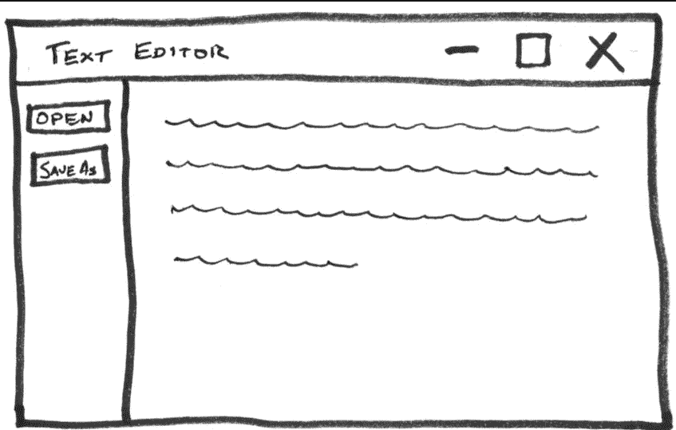
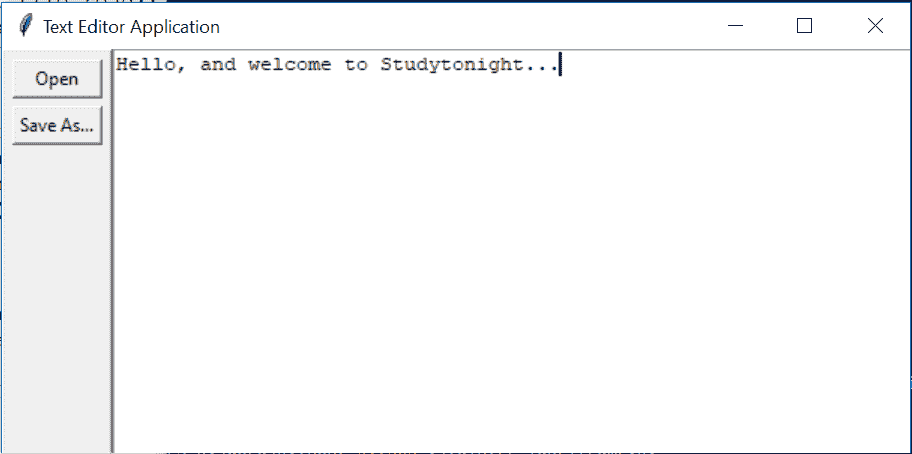

# 使用 Tkinter 的文本编辑器应用程序(Python 项目)

> 原文：<https://www.studytonight.com/tkinter/text-editor-application-using-tkinter>

在本教程中，我们将帮助您使用 Tkinter 构建一个简单的文本编辑器应用程序，这对于 Tkinter 来说是一个非常好的初学者项目。

文本编辑器应用程序是一个应用程序，你可以写你的文本，打开任何文本文件，你可以编辑任何文本文件，你也可以保存一个文件，如果你想。在本教程中，我们将从头开始构建一个文本编辑器应用程序。

文本编辑器应用程序的基本元素如下:

*   有一个名为 **`btn_open`** 的**按钮小部件** ，用于打开文件进行编辑

*   第二个是一个名为 **`btn_save`** 的按钮小部件，用于保存文件

*   第三，有一个名为 **`txt_edit`** 的**文本小部件** ，用于创建和编辑任何文本文件。

三个小部件的排列方式是，两个按钮在窗口的左侧，文本框在右侧。整个窗口的最小高度应为 900 像素，`txt_edit`的最小宽度应为 900 像素。如果调整窗口大小，整个布局应该是响应的，然后`txt_edit`也调整大小。握住按钮的`Frame`的宽度不应改变。

让我们向您展示一下这个文本编辑器的大致轮廓:



文本编辑器应用程序的所需布局可以使用`.grid()`几何管理器来实现。这个布局包含一行和两列:

1.  **左侧有一个窄栏**用于按钮

2.  **在右侧，文本框有一个更宽的栏**

为了设置窗口和`txt_edit`的最小尺寸，您只需要将窗口方法`.rowconfigure()`和`.columnconfigure()`的`minsize`参数设置为 900 即可。为了处理尺寸调整，这些方法的`weight`参数将被设置为 1。

如果你希望两个按钮都在同一个列中，那么你需要创建一个名为`fr_buttons`的`Frame`部件。根据上面显示的草图，两个按钮应垂直堆叠在此框架内，顶部有`btn_open`。这可以由`.grid()`或`.pack()`几何经理完成。现在，您只需要坚持使用`.grid()`，因为使用它更容易。

让我们从构建应用程序的代码开始:

## 1.创建所有需要的小部件

使用的代码片段如下:

```py
import tkinter as tk

window = tk.Tk()
window.title("Text Editor Application")

window.rowconfigure(0, minsize=900, weight=1)
window.columnconfigure(1, minsize=900, weight=1)

txt_edit = tk.Text(window)
fr_buttons = tk.Frame(window)
btn_open = tk.Button(fr_buttons, text="Open")
btn_save = tk.Button(fr_buttons, text="Save As...")
```

## 上述代码的解释:

*   **第一个命令用于**导入`tkinter`。

*   **然后接下来的两行用来**创建一个标题为`"Text Editor Application"`的新窗口。

*   **接下来的两行代码用于**设置行和列配置。

*   **然后从 9 到 12 的行**将为文本框、框架以及打开和保存按钮创建您需要的四个小部件。

```py
window.rowconfigure(0, minsize=900, weight=1)
```

代码中的上一行表示`.rowconfigure()`的`minsize`参数设置为`900`、`weight`设置为`1.`第一个参数为`0`，用于将第一行的高度设置为`900`像素，并确保该行的高度与窗口的高度成比例增长。应用程序布局中只有一行，因此这些设置应用于整个窗口。

然后看看代码中的这一行:

```py
window.columnconfigure(1, minsize=900, weight=1)
```

在上面的代码中`.columnconfigure()`将索引为`1`的列的`width`和`weight`属性分别设置为`900`和`1`。请记住，行和列索引是从零开始的，因此这些设置仅适用于第二列。通过配置第二列，当调整窗口大小时，文本框将自然展开和收缩，而包含按钮的列将始终保持固定宽度。

## 2.创建应用程序布局

```py
btn_open.grid(row=0, column=0, sticky="ew", padx=5, pady=5)
btn_save.grid(row=1, column=0, sticky="ew", padx=5)
```

以上两行代码将**创建一个网格**，在`fr_buttons`框架中有两行一列，因为`btn_open`和`btn_save`都将其`master`属性设置为`fr_buttons`。`btn_open`放在第一排，`btn_save`放在第二排，这样布局中`btn_open`出现在`btn_save`上方，如上图所示。

*   `btn_open`和`btn_save`都将其`sticky`属性设置为`"ew"`，这将强制按钮**在两个方向上水平扩展**，以便填充整个框架。它确保两个按钮大小相同。

*   只需将`padx`和`pady`参数设置为 5，即可在每个按钮周围放置 5 像素的**填充**。`btn_open`有垂直衬垫。因为它在顶部，垂直填充使按钮从窗口顶部向下偏移一点，并确保这和`btn_save`之间有一个小间隙。

现在`fr_buttons`已经布局好了，可以开始了，现在可以为窗口的其余部分设置网格布局了:

```py
fr_buttons.grid(row=0, column=0, sticky="ns")
txt_edit.grid(row=0, column=1, sticky="nsew")
```

以上两行代码用于**为`window`创建一行两列的网格**。您可以将`fr_buttons`放在第一列，将`txt_edit`放在第二列，这样`fr_buttons`就会出现在窗口布局中`txt_edit`的左侧。

`fr_buttons`的`sticky`参数将被设置为`"ns"`，这将迫使整个框架垂直扩展**，并填充其柱的整个高度。`txt_edit`用于填充整个网格单元，因为您将其`sticky`参数设置为`"nsew"`，这将迫使其**向各个方向**扩展。**

 **现在我们刚刚创建了按钮，但是这些按钮在我们添加功能之前不会工作，所以让我们开始添加按钮的功能:

## 1.打开文件的功能

open_file 的代码片段如下:

```py
def open_file():
    """Open a file for editing."""
    filepath = askopenfilename(
        filetypes=[("Text Files", "*.txt"), ("All Files", "*.*")]
    )
    if not filepath:
        return
    txt_edit.delete(1.0, tk.END)
    with open(filepath, "r") as input_file:
        text = input_file.read()
        txt_edit.insert(tk.END, text)
    window.title(f"Text Editor Application - {filepath}")
```

### 解释:

*   **第 3 行至第 5 行**使用`tkinter.filedialog`模块的`askopenfilename`对话框显示文件打开对话框，并将选择的文件路径存储至`filepath`。

*   **第 6 行和第 7 行**检查用户是否关闭对话框或点击**取消**按钮。如果是，那么`filepath`将是`None`，函数将是`return`，不执行任何代码来读取文件和设置`txt_edit`的文本。

*   **第 8 行**使用`.delete()`清除`txt_edit`当前内容。

*   **第 9 行和第 10 行**用于在将`text`存储为字符串之前打开所选文件及其内容。

*   **第 11 行**使用`.insert()`将字符串`text`分配给`txt_edit`。

*   **第 12 行**设置窗口标题，使其包含打开文件的路径。

## 2.保存文件的功能

save_file 的代码片段如下:

```py
def save_file():
    """Save the current file as a new file."""
    filepath = asksaveasfilename(
        defaultextension="txt",
        filetypes=[("Text Files", "*.txt"), ("All Files", "*.*")],
    )
    if not filepath:
        return
    with open(filepath, "w") as output_file:
        text = txt_edit.get(1.0, tk.END)
        output_file.write(text)
    window.title(f"Text Editor Application - {filepath}")
```

### 解释:

*   **第 3 行至第 6 行**使用`asksaveasfilename`对话框从用户处获取所需的保存位置。选择的文件路径存储在`filepath`变量中。

*   **第 7 行和第 8 行**检查用户是否关闭对话框或点击**取消**按钮。如果是，那么`filepath`将是`None`，该函数将返回，而不执行任何将文本保存到文件中的代码。

*   **第 9 行**在选定的文件路径创建一个新文件。

*   **第 10 行**使用`.get()`方法从`txt_edit`中提取文本，并将其分配给变量`text`。

*   **第 11 行**将`text`写入输出文件。

*   **第 12 行**更新窗口标题，使新文件路径显示在窗口标题中。

**完整源代码为:**

```py
import tkinter as tk
from tkinter.filedialog import askopenfilename, asksaveasfilename

def open_file():
    """Open a file for editing."""
    filepath = askopenfilename(
        filetypes=[("Text Files", "*.txt"), ("All Files", "*.*")]
    )
    if not filepath:
        return
    txt_edit.delete(1.0, tk.END)
    with open(filepath, "r") as input_file:
        text = input_file.read()
        txt_edit.insert(tk.END, text)
    window.title(f"Text Editor Application - {filepath}")

def save_file():
    """Save the current file as a new file."""
    filepath = asksaveasfilename(
        defaultextension="txt",
        filetypes=[("Text Files", "*.txt"), ("All Files", "*.*")],
    )
    if not filepath:
        return
    with open(filepath, "w") as output_file:
        text = txt_edit.get(1.0, tk.END)
        output_file.write(text)
    window.title(f"Text Editor Application - {filepath}")

window = tk.Tk()
window.title("Text Editor Application")
window.rowconfigure(0, minsize=800, weight=1)
window.columnconfigure(1, minsize=800, weight=1)

txt_edit = tk.Text(window)
fr_buttons = tk.Frame(window, relief=tk.RAISED, bd=2)
btn_open = tk.Button(fr_buttons, text="Open", command=open_file)
btn_save = tk.Button(fr_buttons, text="Save As...", command=save_file)

btn_open.grid(row=0, column=0, sticky="ew", padx=5, pady=5)
btn_save.grid(row=1, column=0, sticky="ew", padx=5)

fr_buttons.grid(row=0, column=0, sticky="ns")
txt_edit.grid(row=0, column=1, sticky="nsew")

window.mainloop() 
```



正如你在输出中看到的，我们有一个基本的文本编辑器应用程序，在其中**我们可以写**一些东西，然后**将文本保存在一个新的文件**中，或者使用**打开按钮在编辑器中打开一个文件**然后编辑它。

* * *

* * ***