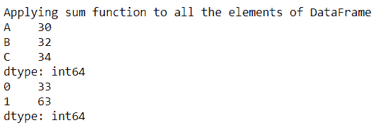
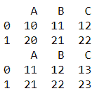
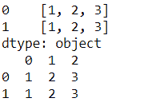
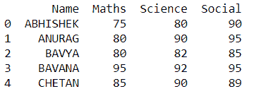
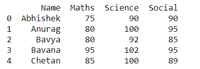

# Pandas 数据帧`apply()`方法

> 原文：<https://www.studytonight.com/pandas/pandas-dataframe-apply-method>

在本教程中，我们将学习 Pandas`DataFrame.apply()`方法。使用这种方法，我们可以在数据帧的行和列上应用不同的[功能](https://www.studytonight.com/python/modules-and-functions)。传递给方法的对象是 Series 对象，其索引是数据帧的索引(`axis=0`)或数据帧的列(`axis=1`)。

应用该方法后，沿数据帧的给定轴返回`Series`或`DataFrame`。当我们想要在不影响其他列的情况下更改特定列时，可以使用该函数。

下图显示了`DataFrame.apply()`方法的语法。

### 句法

```py
DataFrame.apply(func, axis=0, raw=False, result_type=None, args=(), **kwds)
```

### 因素

**函数:**表示应用于每一列或每一行的函数。

**轴:**表示应用函数的轴，0 或“index”:将函数应用于每一列，1 或“columns”:将函数应用于每一行。

**result_type:** 包括‘展开’、‘缩小’、‘广播’、‘无’，默认值为无。

这些仅在`axis=1`(列)时起作用:

*   “扩展”:类似列表的结果将变成列。

*   ' reduce ':这与' expand '相反，如果可能的话，它会返回一个 Series，而不是扩展类似列表的结果。

*   “广播”:结果将广播到数据帧的原始形状，原始索引和列将被保留。

### 示例 1:使用`DataFrame.apply()`方法将`np.sum`函数应用于数据帧的所有元素

下面的例子展示了我们如何将函数应用于数据帧的所有元素。这里，在这个例子中，我们选择作为`np.sum`的函数，用`default axis(axis=0)`和`axis=1`。

```py
import pandas as pd
import numpy as np
df=pd.DataFrame([[10,11,12],[20,21,22]],columns=['A','B','C'])
print("Applying sum function to all the elements of DataFrame")
print(df.apply(np.sum))
print(df.apply(np.sum,axis=1))
```

一旦我们运行该程序，我们将获得以下输出。

### 

### 示例 2:使用`DataFrame.apply()`方法将用户定义的函数应用于数据帧

我们可以将用户定义的函数作为参数传递给`DataFrame.apply()`函数。下面的例子显示了同样的情况。

```py
import pandas as pd
df=pd.DataFrame([[10,11,12],[20,21,22]],columns=['A','B','C'])
print(df)
def add(x):
    return x+1
print(df.apply(add))
```

一旦我们运行该程序，我们将获得以下输出。



### 示例 3:使用`DataFrame.apply()`方法将 lambda 函数应用于数据帧的所有元素

我们可以将 lambda 函数传递给`DataFrame.apply()` 方法。在这里，我们选择作为`lambda function`、`axis=1`、`result_type='expand'`的函数，这个参数将类似列表的结果转换为列。下面的例子显示了有和没有`result_type`参数。

```py
df=pd.DataFrame([[10,11,12],[20,21,22]],columns=['A','B','C'])
print(df.apply(lambda x: [1,2,3], axis=1)) 
print(df.apply(lambda x: [1,2,3], axis=1, result_type='expand')) 
```

一旦我们运行该程序，我们将获得以下输出。



### 示例 4:使用`DataFrame.apply()`方法将特定函数应用于选定的列

如果我们想在不影响其他人的情况下更改某个特定的列，可以使用这样的`DataFrame.apply()`方法。在下面的例子中，我们通过将 lambda 函数传递给`DataFrame.apply()`方法并打印输出，只改变了`'Name'`列。

```py
import pandas as pd
df1 = pd.DataFrame([['Abhishek',75,80,90], ['Anurag',80,90,95],['Bavya',80,82,85],['Bavana',95,92,95],['Chetan',85,90,89]], columns=['Name','Maths','Science','Social'])
df1['Name'] = df1['Name'].apply(lambda x: x.upper())
print(df1)
```

一旦我们运行该程序，我们将获得以下输出。



### 示例 5:使用`DataFrame.apply()`方法将特定函数应用于选定的列

在本例中，我们将通过`lambda function` 的`'Science'`列更改为`DataFrame.apply()`方法。

```py
import pandas as pd
df1 = pd.DataFrame([['Abhishek',75,80,90], ['Anurag',80,90,95],['Bavya',80,82,85],['Bavana',95,92,95],['Chetan',85,90,89]], columns=['Name','Maths','Science','Social'])
df1['Science'] = df1['Science'].apply(lambda x: x+10)
print(df1)
```

一旦我们运行该程序，我们将获得以下输出。



### 结论

在本教程中，我们学习了数据帧的 Pandas`DataFrame.apply()`方法。我们学习了语法、参数，并将不同的函数、轴和结果类型传递给`DataFrame.apply()`方法，我们解决了示例。这个函数在清理数据时非常有用，比如改变特定的列，改变格式等等。

* * *

* * *