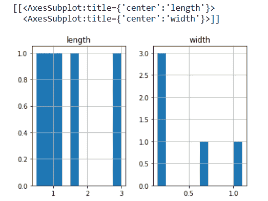
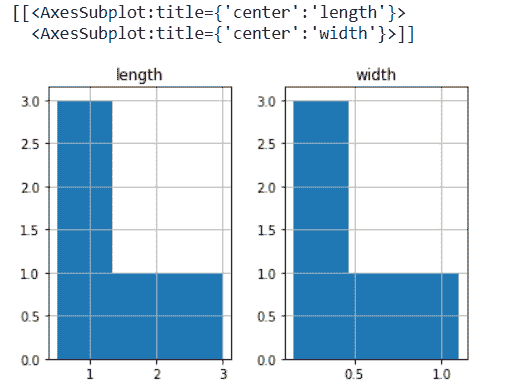
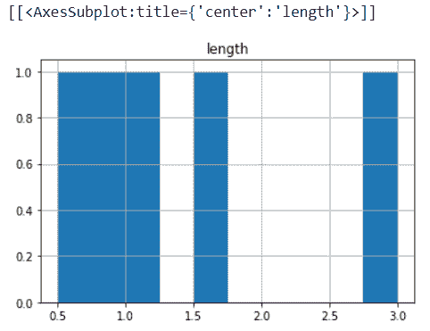

# 熊猫数据帧历史(方法)

> 原文：<https://www.studytonight.com/pandas/pandas-dataframe-hist-method>

为了获得可视化表示的汇总数据，我们使用了**直方图**，在本教程中，我们将学习 [Python](https://www.studytonight.com/python/getting-started-with-python) pandas `DataFrame.hist()`方法。该方法制作数据帧的直方图。一个[直方图](https://en.wikipedia.org/wiki/Histogram)可以定义为数据分布的表示。该方法在数据框中的每个序列上调用`matplotlib.pyplot.hist()`，得到每列一个直方图。

下面是`DataFrame.hist()`方法的语法。

### 句法

```py
DataFrame.hist(column=None, by=None, grid=True, xlabelsize=None, xrot=None, ylabelsize=None, yrot=None, ax=None, sharex=False, sharey=False, figsize=None, layout=None, bins=10, backend=None, legend=False, **kwargs)
```

### `DataFrame.hist()`方法的一些重要参数是，

**数据:**熊猫对象持有的是数据框。

**列:**代表字符串或序列。如果传递此参数，它将用于将数据限制在列的子集内。

**by:** 表示对象，可选。如果该参数被传递，则用于形成单独组的直方图。

**网格:**表示布尔(真或假)，默认值为真。它指示是否显示轴网格线。

**仓:**为 int 或序列，默认值为 10，表示要使用的直方图仓数。如果我们给出一个整数，则计算并返回 bin+1 bin 边。如果我们将面元作为一个序列给出，它会给出面元的边，包括第一个面元的左边缘和最后一个面元的右边缘。在这种情况下，容器会不加修改地返回。

## 示例:使用`DataFrame.hist()`方法创建数据框的列直方图

在下面的例子中，我们创建了一个数据框，让我们将`DataFrame.floordiv()`方法应用于数据框，并获得数据框的可视化表示。我们将基于长度和宽度的数据框列来获得图形。见下面的例子。

```py
#importing pandas as pd
import pandas as pd
df = pd.DataFrame({'length': [1.5, 0.5, 1.2, 0.9, 3],'width': [0.7, 0.2, 0.15, 0.2, 1.1]}, index=['python', 'C', 'C++', 'R', 'Pearl'])
print(df.hist())
```



## 示例:使用带箱方法的`DataFrame.hist()`方法创建数据框的列直方图。

`DataFrame.hist()`方法根据一些索引的长度和宽度绘制直方图，显示在三个面元中。见下面的例子。

```py
#importing pandas as pd
import pandas as pd
df = pd.DataFrame({'length': [1.5, 0.5, 1.2, 0.9, 3],'width': [0.7, 0.2, 0.15, 0.2, 1.1]},index=['python', 'C', 'C++', 'R', 'Pearl'])
print(df.hist(bins=3))
```



## 示例:在`DataFrame.hist()`方法中设置列=“长度”

在这里，我们将列指定为**长度**，并且`DataFrame.hist()`方法基于指定的列绘制直方图。见下面的例子。

```py
#importing pandas as pd
import pandas as pd
df = pd.DataFrame({'length': [1.5, 0.5, 1.2, 0.9, 3],'width': [0.7, 0.2, 0.15, 0.2, 1.1]},index=['python', 'C', 'C++', 'R', 'Pearl'])
print(df.hist(column="length"))
```



### 结论:

在本教程中，我们学习了 Python 熊猫`DataFrame.hist()`方法。我们学习了语法，通过在数据框上应用这个函数，我们解决了一些例子并理解了`DataFrame.hist()`方法。

* * *

* * *