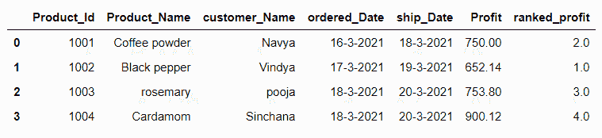
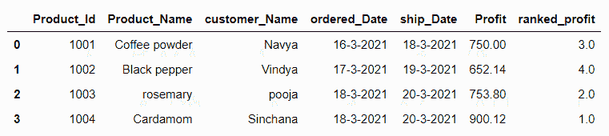
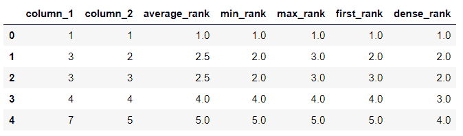

# Pandas数据帧`rank()`方法

> 原文：<https://www.studytonight.com/pandas/pandas-dataframe-rank-method>

在本教程中，我们将讨论和学习Pandas`DataFrame.rank()`的方法。这种方法简单，给数据排序。当这种方法应用于数据帧时，它沿着指定的轴给出从 1 到 n 的数字等级。

下面是`DataFrame.rank()`方法的语法。

### 句法

```py
DataFrame.rank(axis=0, method='average', numeric_only=None, na_option='keep', ascending=True, pct=False)
```

### 因素

**轴:**表示索引或列轴，索引为“0”，列为“1”。当`axis=0`方法应用于`index`轴时，以及当`axis=1`方法应用于`column`轴时。它指示直接排名的索引。

**方法:**包括‘平均’‘最小’‘最大’‘第一’‘密集’，默认方法为‘平均’

**numeric_only:** 表示 bool(真或假)，可选。

**na_optio:** 包括【守】【上】【下】，默认为【守】

**升序:**表示布尔(真或假)，默认值为真。它指示数据帧中的元素是否应该按升序排列。

**pct:** 表示 bool(真或假)，默认值为 False。它指示是否以百分比形式显示返回的排名。

## 示例 1:对Pandas中的数据帧列进行排名

让我们创建一个数据帧，并使用`DataFrame.rank()`方法获得数据帧的一列的等级。在这里，我们得到了“利润”栏的排名。见下面的例子。

如我们所见，默认情况下`DataFrame.rank()`方法以升序给出排名。在下面的示例中，在利润列中，有四个值，较小的数字得到等级“1”，最高的数字得到等级“4”。

```py
#importing pandas as pd
import pandas as pd
#creating DataFrame
df=pd.DataFrame({'Product_Id':[1001,1002,1003,1004],'Product_Name':['Coffee powder','Black pepper','rosemary','Cardamom'],'customer_Name':['Navya','Vindya','pooja','Sinchana'],'ordered_Date':['16-3-2021','17-3-2021','18-3-2021','18-3-2021'],'ship_Date':['18-3-2021','19-3-2021','20-3-2021','20-3-2021'],'Profit':[750,652.14,753.8,900.12]})
df['ranked_profit']=df['Profit'].rank()
df
```

### 输出

### 

## 示例 2:对Pandas中的数据帧列进行排名

这个例子和上一个相似。这里，我们将升序参数设置为 False。现在`DataFrame.rank()`方法按降序排列。见下面的例子。

```py
#importing pandas as pd
import pandas as pd
#creating DataFrame
df=pd.DataFrame({'Product_Id':[1001,1002,1003,1004],'Product_Name':['Coffee powder','Black pepper','rosemary','Cardamom'],'customer_Name':['Navya','Vindya','pooja','Sinchana'],'ordered_Date':['16-3-2021','17-3-2021','18-3-2021','18-3-2021'],'ship_Date':['18-3-2021','19-3-2021','20-3-2021','20-3-2021'],'Profit':[750,652.14,753.8,900.12]})
df['ranked_profit']=df['Profit'].rank(ascending=False)
df
```

### 输出

## 

## 示例 3:对Pandas中的数据帧列进行排名

如果数据帧由相同的值组成，我们可以使用`DataFrame.rank()`方法通过不同的方法对数据帧进行排序。

如果方法是`average`，则通过取两个数的平均值来提供排名。如果方法是`min`，则给出组内最低的排名。

如果方法为`max`，则给出组内最高等级。

如果方法是`first`，它会按照列在数组中出现的顺序对列进行排序。

如果方法是`dense`，类似于‘min’，但组与组之间的排名总是增加 1。

```py
#importing pandas as pd
import pandas as pd
#creating DataFrame
df=pd.DataFrame({'column_1':[1,3,3,4,7],'column_2':[1,2,3,4,5]})
df['average_rank']=df['column_1'].rank(method='average')
df['min_rank']=df['column_1'].rank(method='min')
df['max_rank']=df['column_1'].rank(method='max')
df['first_rank']=df['column_1'].rank(method='first')
df['dense_rank']=df['column_1'].rank(method='dense')
df
```

### 输出

## 

## 示例 4:对Pandas中的数据帧列进行排名

如果数据帧由空值组成，我们可以使用`**na_option**`参数对它们进行排序，如果参数设置为`keep`，它会为 NaN 值分配 NaN 等级，如果设置为`top`，它会为 NaN 值分配最小等级，如果设置为`bottom`，如果升序，它会为 NaN 值分配最高等级。

```py
#importing pandas as pd
import pandas as pd
#imporing numpy as np
import numpy as np
#creating DataFrame
df=pd.DataFrame({'column_1':[1,3,np.nan,4,np.nan],'column_2':[1,2,3,np.nan,np.nan]})
df['keep_rank_Nan']=df['column_2'].rank(na_option='keep')
df['Top_rank_Nan']=df['column_2'].rank(na_option='top')
df['Bottom_rank_Nan']=df['column_1'].rank(na_option='bottom')
df
```

* * *

* * *