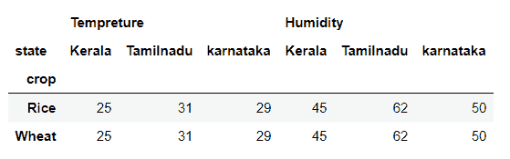
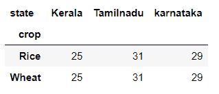
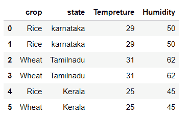

# 熊猫数据帧透视()方法

> 原文：<https://www.studytonight.com/pandas/pandas-dataframe-pivot-method>

在本教程中，我们将讨论和学习 [Python](https://www.studytonight.com/python/getting-started-with-python) 熊猫`DataFrame.pivot()` 方法，该方法帮助我们转换或重塑数据框。当此方法应用于数据框时，它返回数据框，该数据框由给定的索引和列值重新整形和组织。

下面是`DataFrame.pivot()`方法的语法。

### 句法

```py
DataFrame.pivot(index=None, columns=None, values=None)
```

### 因素

**索引:**表示字符串或对象或字符串列表，可选。它指示用于建立新框架索引的列。如果此参数为无，则使用现有索引。

**列:**表示字符串或对象或字符串列表。它指示用于制作新框架列的列。

**值:**它代表字符串、对象或之前的列表，可选。它指示用于填充新帧值的一列或多列。如果未指定此参数，将使用所有剩余的列，并且结果将具有分层索引的列。

## 示例 1:重塑熊猫的数据框架

让我们应用`DataFrame.pivot()`方法，并通过指定索引和列名来重塑它。在本例中，我们通过在`DataFrame.pivot()` 方法中传递索引和列参数，将数据框的行轴更改为“裁剪”，列轴更改为“状态”。

见下面的例子。`DataFrame.pivot()`方法返回以行和多列形式表示温度和湿度的数据帧。

```py
#importing pandas as pd
import pandas as pd
#creating the DataFrame
df=pd.DataFrame({'crop':['Rice','Wheat','Rice','Wheat','Rice','Wheat'],'state':['karnataka','karnataka','Tamilnadu','Tamilnadu','Kerala','Kerala'],'Tempreture':[29,29,31,31,25,25],'Humidity':[50,50,62,62,45,45]})
df = df.pivot(index='crop',columns='state')
print(df)
```

## 

## 示例 2:使用`DataFrame.pivot()`方法重塑数据框

在前面的例子中，我们有多个列，如果我们不想要多个列，我们可以通过传递`values`参数在`DataFrame.pivot()` 方法中指定我们想要的列名。见下面的例子。

`DataFrame.pivot()` 方法返回仅由温度列组成的数据帧。

```py
#importing pandas as pd
import pandas as pd
#creating the DataFrame
df=pd.DataFrame({'crop':['Rice','Wheat','Rice','Wheat','Rice','Wheat'],'state':['karnataka','karnataka','Tamilnadu','Tamilnadu','Kerala','Kerala'],'Tempreture':[29,29,31,31,25,25],'Humidity':[50,50,62,62,45,45]})
df = df.pivot(index='crop',columns='state',values='Tempreture')
print(df)
```

## 

## 示例:`DataFrame.pivot()` 方法提升`ValueError`

如果数据框中有任何重复项，则`DataFrame.pivot()` 方法会在重塑数据框时引发`ValueError`。见下面的例子。

```py
#importing pandas as pd
import pandas as pd
#creating the DataFrame
df=pd.DataFrame({'crop':['Rice','Rice','Wheat','Wheat','Rice','Wheat'],'state':['karnataka','karnataka','Tamilnadu','Tamilnadu','Kerala','Kerala'],'Tempreture':[29,29,31,31,25,25],'Humidity':[50,50,62,62,45,45]})
df = df.pivot(index='crop',columns='state',values='Tempreture')
print(df)
```



值错误:索引包含重复条目，无法重新整形

### 结论

在本教程中，我们学习了 Python 熊猫`DataFrame.pivot()`方法。我们通过在数据帧上应用这种方法来学习语法、参数和解决示例，并理解了这种方法。

* * *

* * *