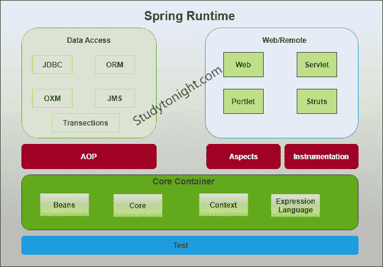

# Spring简介

> 原文：<https://www.studytonight.com/spring-framework/spring-introduction>

Spring 是一个基于 Java 的应用框架，由 Pivotal 软件公司设计和开发。

在本教程中，我们将讨论 **Spring 5** ，它是传统 Spring 框架的最新和更改进的版本。

Spring 是一个用于创建企业应用的应用框架。由于其庞大的库和工具，我们可以轻松创建基于网络的应用。

Spring 为创建 Java 企业应用提供了一个简单友好的环境。它是[功能齐全的](https://www.studytonight.com/spring-framework/spring-features)，并提供了其他各种子项目，如 **Spring Security** 、 **Spring Boot** 、 **Spring MVC** 、 **Spring Cloud** 、 **Spring Data** 等，有助于相应地构建应用。

随着时间的推移，Spring 5 得到了改进，在 Java EE 和 Spring 的早期，我们将应用部署到应用服务器上，但是现在在 Spring Boot 的帮助下，我们可以以 DevOps 和云友好的方式创建应用。

Spring 的核心和核心是一个 IOC 容器，它管理 bean 对象并允许依赖注入。我们将在后面的教程中讨论这些。

Spring 内置了多个组件(模块)与 **web** 、**数据库**、**网络**等协同工作。下面是 Spring Runtime 的图片，展示了它的内部架构。

## Spring 框架架构

在下图中，我们展示了 Spring 框架架构:

## Spring模块

Spring 框架根据其服务分为几个模块。这些模块是:

*   **Spring 核心容器:**它是 Spring 的核心模块，提供了 BeanFactory 和 ApplicationContext 这样的容器。

*   **控制反转:**又称依赖注入，用于配置应用组件和 Java 对象的生命周期管理。

*   **面向方面编程:**该模块支持在 Spring 框架内实现跨领域的关注点，如事务管理、远程访问等。

*   **数据访问:**它通过使用 Java 数据库连接(JDBC)和 ORM(对象关系映射)工具来帮助处理数据库系统。

*   **模型视图控制器:**它也被称为 MVC 模型，有助于创建基于 web 的应用和 RESTful Web 服务。

*   **认证授权:**使用 Spring Security(Spring 的子项目)在框架内配置安全流程。

*   **消息传递:** Spring 使用消息监听器对象，通过使用 JMS (Java 消息服务)来传递消息，这是对 JMS API 的改进。

*   **事务管理:**它由几个事务管理 API 组成，为 Java 对象协调事务。

*   **远程管理:**使用 Java 管理扩展(JMX)为本地或远程配置 Java 对象很有帮助。

*   **测试:**测试模块，帮助编写单元测试和集成测试。

## Spring 5 更新

*   它要求最低 Java 版本是 **Java 8** 或更高。

*   不推荐使用一些集成:平铺、加瓦瓦、速度、肖像等。

*   Spring MVC 升级为使用 **Servlet API 4.0** 。

*   支持新的反应式编程框架: **Spring WebFlux** 。

## 《春天》的历史和版本

下表包含相应年份的 Spring Framework 版本。它的第一个版本于 2002 年 10 月 1 日发布。

| 版本 | 日期(年) |
| Zero point nine | 2002 年 10 月 |
| One | 2003 年 6 月 |
| Two | 2006 年 |
| Three | 2009 年 12 月 |
| Four | 2013 年 12 月 |
| Five | 2017 年 9 月 |

* * *

* * *