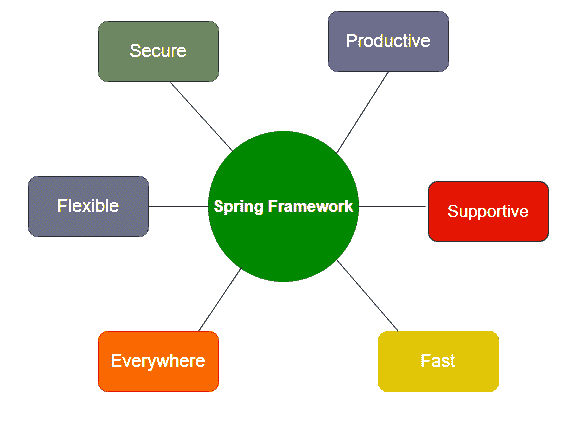

# Spring特性

> 原文：<https://www.studytonight.com/spring-framework/spring-features>

Java Spring Framework 功能丰富，提供并帮助创建基于 Java 的可扩展应用。这里，我们讨论一些特性。尽管这些并不局限于此，因为 spring 提供了数十种不同的项目，如 Spring Data、Spring Cloud、Spring Boot 等。以下是 Spring 框架的特性。

*   灵活的

*   多产的

*   快的

*   安全的

*   支持的

*   到处

**图:Spring特性**

## Spring无处不在

Spring 是全球最受欢迎的框架之一。它用于 Java 中的企业应用开发。我们可以用它来创建 web 服务、web 应用、基于云的服务等。谷歌、阿里巴巴、亚马逊、甲骨文等世界科技组织都在使用它。全世界的 Java 开发人员都信任 Spring 的库。无论是流媒体电视、连接物联网、电子商务应用、银行等，它几乎无处不在。

## Spring是柔性的

Spring 提供了灵活的第三方库和扩展，帮助开发人员构建应用。控制的**反转(IoC)** 和**依赖注入(DI)** 是 Spring 的主要特性，使其能够灵活地创建企业应用。Spring 提供了几个工具来帮助开发人员为 web 构建安全的、反应性的和基于云的微服务，甚至您可以将其用于企业应用的复杂流数据流。

## Spring是多产的

毫无疑问，Spring 是一个高效的框架，在添加了 Spring Boot 项目之后，Spring 框架已经转变为一个更高效的框架。Spring Boot 结合了所有的必需品和自动配置的设置。它有一个嵌入式 webserver，可以加快微服务的开发速度。最重要的是集成有助于连续创建应用的 spring 项目。例如，创建一个它提供框架的应用，连接它提供 Spring Data 的数据库，使用 Cloud，它提供 Spring cloud，为了安全，它提供 Spring Security性。因此，我们需要做的就是根据需求将它们放入我们的应用中，这样我们的应用就准备好了。

## Spring很快

由于其设计和架构，Spring 框架的性能是**超级**。Spring foundation 专注于为应用提供在起点快速启动、稳定执行和快速关闭的性能。为了获得更好的性能和效率，Spring 项目支持反应式编程模型。Spring 提供了 Spring Initializer 工具来快速启动应用。Spring Boot 已经配备了嵌入式网络服务器等工具，自动配置有助于开发人员轻松构建应用。在Spring开发工具中添加 **LiveReload 消除了服务器重启的问题和需要。**

## Spring是安全的

Spring 本身是安全的，Java 语言也提供了安全性，但是为了更安全，我们可以使用 **Spring Security** 。Spring Security 是 Spring 的项目之一，旨在处理任何 Spring 应用的安全性。由于它是 Spring 框架的一部分，因此很容易与应用集成。Spring 快速处理和处理安全问题并加以处理。它密切监控第三方依赖关系，并定期更新以确保我们的数据和应用的安全。

## Spring是支持的

Spring 为全球所有的开发者提供了一个庞大的、全球性的、庞大的、多样的社区。Spring 为所有人提供支持，不管你住在哪里，也不管你的知识水平如何。它有助于所有年龄和能力，从完全初学者到行业专家。Spring 社区提供了各种各样的资源，如视频、指南、教程、会议、支持，甚至是正式的培训和认证。

* * *

* * *