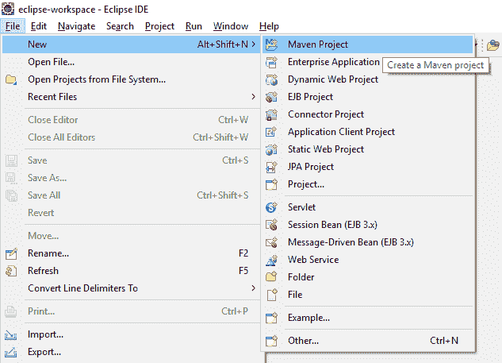
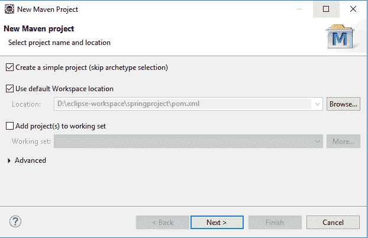
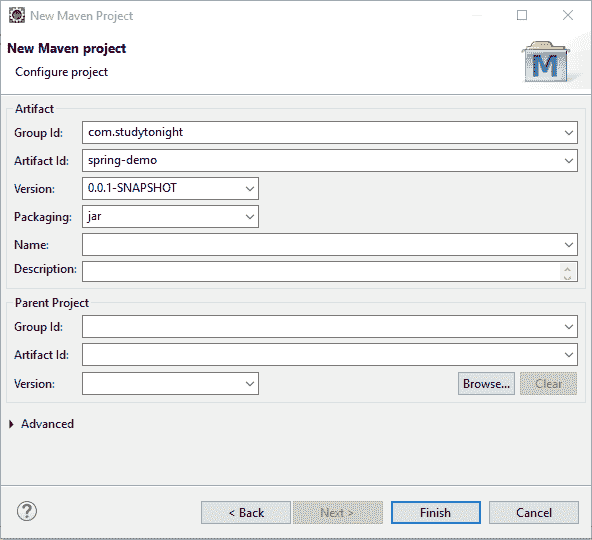
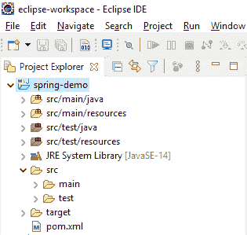

# Spring Maven 项目

> 原文：<https://www.studytonight.com/spring-framework/spring-maven-project>

在本主题中，我们将学习创建一个基于 [Spring](https://www.studytonight.com/spring-framework/spring-introduction) 项目的简单 [maven](https://www.studytonight.com/maven/) 。Maven 是一个自动化工具，它充当 Java 应用程序的依赖关系管理器。

因此，让我们从创建一个简单的项目开始，但在此之前，请确保您已经为 Spring 设置了开发环境并安装了 Eclipse、 [Java 和 Apache Tomcat 服务器。](https://www.studytonight.com/java/)

如果您还没有设置环境，那么我们建议您阅读我们的**前一个主题**。

## 步骤 1:创建 Maven 项目

打开 Eclipse，点击**文件**菜单，然后选择**新建- >马文项目**，就像我们在给定截图中所做的那样。

选择 maven 后，它会打开如下所示的窗口，并要求选择原型。在这里，我们点击复选框，然后**按下下一个**按钮。

## 步骤 2:配置项目

通过提供组 id 和工件 id 来设置项目名称。工件 id 代表项目名称，所以在此之后给你的项目取一个有意义的名称，选择指定在每个 **Maven 构建**阶段执行的插件目标的打包。之后**按完成**按钮，你的 maven 项目就准备好了。

## maven 项目结构

经过上面的步骤，Eclipse 创建了一个新项目，看起来像下面的 screeshot。该项目包含一个 **pom.xml** 文件，用于配置 maven 项目。我们将在后面的教程中讨论这个问题。

好吧，到目前为止，我们已经成功地创建了一个基于 maven 的 spring 项目。现在，在下一章**中，我们将学习创建一个简单的 hello world 应用程序**来了解应用程序的流程和结构。

* * *

* * *