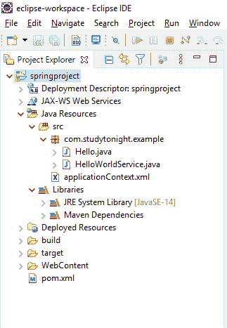

# 简单的 Hello World 应用

> 原文：<https://www.studytonight.com/spring-framework/simple-hello-world-application>

首先，让我们创建一个简单的 hello world 应用。我们正在使用我们在上一个主题中创建的基于 [maven 的 spring 项目](https://www.studytonight.com/spring-framework/spring-maven-project)。

我们已经创建了几个文件，并用 Spring 5 依赖项更新了默认的 **pom.xml** 文件。因此，首先，将这些依赖项添加到 **pom.xml** 文件中。

### Maven 项目的 Spring 5 依赖关系

在下面指定的 pom.xml 中，我们将添加所有 Spring 5 依赖项:

```java
<dependencies>
	<dependency>
		<groupId>org.springframework</groupId>
		<artifactId>spring-core</artifactId>
		<version>${spring.version}</version>
	</dependency>
	<dependency>
		<groupId>org.springframework</groupId>
		<artifactId>spring-context</artifactId>
		<version>${spring.version}</version>
	</dependency>
</dependencies>
<properties>
		<spring.version>5.2.8.RELEASE</spring.version>
</properties>
```

将这些依赖项添加到文件后。让我们创建一些 Java 文件和 XML 配置文件。这些文件是:

*   Hello.java

*   HelloWorldService.java

*   applicationContext.xml

*   pom.xml 文件

现在，让我们为我们的 spring 项目创建上面提到的所有 Java 和 XML 文件。

### Hello.java

该文件包含用于加载应用上下文文件的代码，该文件被配置为加载 bean。好奇想知道，比恩是什么？别担心，我们将在后面的教程中介绍它。现在，只需创建这个文件。

```java
package com.studytonight.example;

import org.springframework.context.support.ClassPathXmlApplicationContext;

public class Hello {

	public static void main(String[] args) {

		// loading the Bean and XML definitions from the given XML file
		ClassPathXmlApplicationContext context = new ClassPathXmlApplicationContext("applicationContext.xml");
		HelloWorldService obj = context.getBean(HelloWorldService.class);
		obj.hello();
		context.close();
	}
}
```

### HelloWorldService.java

该文件包含将向控制台打印“Hello Spring”消息的代码。用**“helloworldservice . Java”**名称创建此文件。

```java
package com.studytonight.example;

public class HelloWorldService {

	public void hello() {
		System.out.println("Hello Spring!");
	}
}
```

### applicationContext.xml

这是 Spring 项目的配置文件。我们可以给它命名任何东西，但是现在在你的 maven 项目中把它保存为 **applicationContext.xml** 。

```java
<?xml version="1.0" encoding="UTF-8"?>

<beans 
	xmlns:xsi="http://www.w3.org/2001/XMLSchema-instance" xmlns:p="http://www.springframework.org/schema/p"
	xmlns:aop="http://www.springframework.org/schema/aop" xmlns:context="http://www.springframework.org/schema/context"
	xmlns:jee="http://www.springframework.org/schema/jee" xmlns:tx="http://www.springframework.org/schema/tx"
	xmlns:task="http://www.springframework.org/schema/task"
	xsi:schemaLocation="http://www.springframework.org/schema/aop http://www.springframework.org/schema/aop/spring-aop-3.2.xsd http://www.springframework.org/schema/beans http://www.springframework.org/schema/beans/spring-beans-3.2.xsd http://www.springframework.org/schema/context http://www.springframework.org/schema/context/spring-context-3.2.xsd http://www.springframework.org/schema/jee http://www.springframework.org/schema/jee/spring-jee-3.2.xsd http://www.springframework.org/schema/tx http://www.springframework.org/schema/tx/spring-tx-3.2.xsd http://www.springframework.org/schema/task http://www.springframework.org/schema/task/spring-task-3.2.xsd">

	<context:component-scan base-package="com.studytonight.examples" />
	<bean id="helloWorldService"
		class="com.studytonight.example.HelloWorldService">
	</bean>
</beans>
```

### pom.xml 文件

这个文件是 maven 项目的一部分，用于为我们的项目添加依赖项。对于我们的项目，我们添加了 spring 依赖项。这是这个项目最晚的一次。尽管我们可以从 maven 存储库中获得这些最新的依赖项。[Spring依存关系](https://mvnrepository.com/artifact/org.springframework/spring-core)。

```java
<project  xmlns:xsi="http://www.w3.org/2001/XMLSchema-instance" xsi:schemaLocation="http://maven.apache.org/POM/4.0.0 https://maven.apache.org/xsd/maven-4.0.0.xsd">
  <modelVersion>4.0.0</modelVersion>
  <groupId>springproject</groupId>
  <artifactId>springproject</artifactId>
  <version>0.0.1-SNAPSHOT</version>
  <packaging>war</packaging>
  <dependencies>
		<dependency>
			<groupId>org.springframework</groupId>
			<artifactId>spring-core</artifactId>
			<version>${spring.version}</version>
		</dependency>
		<dependency>
			<groupId>org.springframework</groupId>
			<artifactId>spring-context</artifactId>
			<version>${spring.version}</version>
		</dependency>
	</dependencies>
	<properties>
		<spring.version>5.2.8.RELEASE</spring.version>
	</properties>
  <build>
    <sourceDirectory>src</sourceDirectory>
    <plugins>
      <plugin>
        <artifactId>maven-compiler-plugin</artifactId>
        <version>3.8.1</version>
        <configuration>
          <source>1.8</source>
          <target>1.8</target>
        </configuration>
      </plugin>
      <plugin>
        <artifactId>maven-war-plugin</artifactId>
        <version>3.2.3</version>
        <configuration>
          <warSourceDirectory>WebContent</warSourceDirectory>
        </configuration>
      </plugin>
    </plugins>

  </build>
</project>
```

## 项目结构:

在创建了以上所有文件之后，我们得到了以下目录结构。我们的 Spring 项目应该具有以下目录结构。



## 运行应用:

运行此应用(项目)并获得以下结果。由于它不是一个 web 应用，因此我们可以简单地将其作为一个 Java 应用来运行。

你好Spring！

* * *

* * *