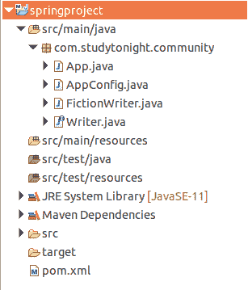

# Spring Bean 范围

> 原文：<https://www.studytonight.com/spring-framework/spring-bean-scope>

Bean Scope 指的是 Bean 的生命周期，bean 的可见性，bean 存在多长时间，创建了多少实例，bean 是如何共享的？

Bean 的默认范围是单例。spring 容器将创建 bean 的单个实例。它被缓存在内存中。对 bean 的所有请求都将返回同一个 bean 的共享引用。

Spring 提供了`@Scope` 注释来标记一个 bean 范围。

## Spring Bean 范围

以下是 Spring 应用中使用的 bean 范围的类型。

| 

范围

 | 

描述

 |
| --- | --- |
| 一个 | 这是 bean 的默认范围。它代表每个 Spring IoC 容器的单个 bean 范围。 |
| 原型 | 它用于将单个 bean 定义的范围设置为任意数量的对象实例。 |
| 请求 | 该 bean 范围是为单个 HTTP 请求设置的。 |
| 会议 | 该范围是为 HTTP 会话的单个 bean 定义设置的。 |
| 应用 | 它将 bean 范围设置为一个 ServletContext。 |
| WebSocket | 它将 bean 范围设置为一个网络套接字。 |

## 示例:Bean 单例范围(默认范围)

让我们创建一个示例，将 bean 范围标记为默认，并检查它是否有默认范围。

## 项目结构



## 项目文件源代码:

**//App.java**

该文件包含为我们的应用创建 IOC 容器的代码。AnnotationConfigApplicationContext 类用于为应用上下文创建对象。这里创建了两个 bean 对象，并检查它们是否相等。

```java
package com.studytonight.community;
import org.springframework.context.annotation.AnnotationConfigApplicationContext;
public class App {

	public static void main(String[] args) {

		AnnotationConfigApplicationContext context = new AnnotationConfigApplicationContext(AppConfig.class);
		Writer writer1 = context.getBean("fictionWriter", Writer.class);
		Writer writer2 = context.getBean("fictionWriter", Writer.class);

		boolean isSame = writer1 == writer2;
		System.out.println("Instance One :"+writer1);
		System.out.println("Instance One :"+writer2);
		System.out.println("Both bean instances are same: "+isSame);

		//writer.write();
		// Close the context
		context.close();
	}
}
```

//app config . Java

这是一个 Java 的配置文件，它是我们为基于 xml 的配置示例创建的 applicationContext.xml 文件的替代文件。`@Configuration`注释表示这不是一个简单的类，而是一个配置类，`@ComponentScan`注释用于表示我们 spring 项目中的组件位置。

```java
package com.studytonight.community;

import org.springframework.context.annotation.ComponentScan;
import org.springframework.context.annotation.Configuration;

@Configuration
@ComponentScan("com.studytonight.community")
public class AppConfig {

} 
```

**//FictionWriter.java**

```java
package com.studytonight.community;

import org.springframework.context.annotation.Scope;
import org.springframework.stereotype.Component;

@Component
@Scope
public class FictionWriter implements Writer {

	@Override
	public void write() {

		System.out.println("Write Fiction Novels...");
	}
}
```

**//Writer.java**

```java
package com.studytonight.community;

public interface Writer {

	void write();
	void getAward();
}
```

//POM . XML

这个文件包含这个项目的所有依赖项，比如 spring jars、servlet jars 等。将这些依赖项放入项目中以运行应用。

```java
<project  xmlns:xsi="http://www.w3.org/2001/XMLSchema-instance" xsi:schemaLocation="http://maven.apache.org/POM/4.0.0 https://maven.apache.org/xsd/maven-4.0.0.xsd">
  <modelVersion>4.0.0</modelVersion>
  <groupId>com.studytonight</groupId>
  <artifactId>springproject</artifactId>
  <version>0.0.1-SNAPSHOT</version>
  <dependencies>
  <!-- https://mvnrepository.com/artifact/org.springframework/spring-web -->
  <dependency>
			<groupId>org.springframework</groupId>
			<artifactId>spring-core</artifactId>
			<version>${spring.version}</version>
		</dependency>
		<dependency>
			<groupId>org.springframework</groupId>
			<artifactId>spring-context</artifactId>
			<version>${spring.version}</version>
		</dependency>
	</dependencies>
	<properties>
		<spring.version>5.2.8.RELEASE</spring.version>
	</properties>
  <build>
    <sourceDirectory>src</sourceDirectory>
    <plugins>
      <plugin>
        <artifactId>maven-compiler-plugin</artifactId>
        <version>3.8.1</version>
        <configuration>
          <source>1.8</source>
          <target>1.8</target>
        </configuration>
      </plugin>
    </plugins>

  </build>
</project>
```

实例一:com . study south . community . fiction writer @ 6a 28 FFA 4
实例一:com . study south . community . fiction writer @ 6a 28 FFA 4
两个 bean 实例都是相同的:true

## 示例:Bean 范围原型

这是另一种类型的 bean 范围，在这种情况下，同一个类的两个 bean 对象是不相等的。

**//FictionWriter.java**

```java
package com.studytonight.community;

import org.springframework.context.annotation.Scope;
import org.springframework.stereotype.Component;

@Component
@Scope("prototype")
public class FictionWriter implements Writer {

	@Override
	public void write() {

		System.out.println("Write Fiction Novels...");
	}
}
```

实例一:com . study south . community . fiction writer @ 6a 28 FFA 4
实例一:com . study south . community . fiction writer @ 48 AE 9 b55
两个 bean 实例相同:false

* * *

* * *